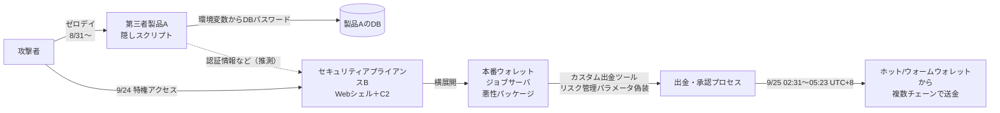

# Bitget 3億8750万ドル流出 ― 守るはずのセキュリティ製品がウォレットへの踏み台になった

## 要点

### 影響バージョン

- 悪用された第三者製セキュリティ製品の製品名・ベンダー名は公表されていない。そのため、製品やバージョンで自組織への影響を判断することは、現時点ではできない。

### 今すぐやること

- （筆者の提案）セキュリティ製品・管理系アプライアンスを「侵害されうる資産」として扱い、管理インターフェースは管理専用ネットワークからのみ到達可能にする。
- （筆者の提案）ウォレット（署名・出金）環境を分離し、ほかのゾーンからウォレットジョブサーバへの通信を必要最小限の許可リストに絞る。
- （筆者の提案）ログ保存期間を十分に取る。今回の調査では送金の約4週間前まで遡る必要があった。

## 概要

- 暗号資産取引所Bitgetのホットウォレット・ウォームウォレットから約3億8750万ドル相当が流出した。SlowMistとMandiantの中間調査によれば、攻撃者は第三者製のセキュリティ製品（アプライアンス）2台を侵害し、そこから本番のウォレットジョブサーバへ横展開した。
- 最も古い不正活動はログ上8月31日まで遡り、送金開始（9月25日 02:31 UTC+8）のほぼ4週間前から足場があったことになる。秘密鍵の漏えいは確認されておらず、コールドウォレットは無事。攻撃者はカスタムの出金ツールで、取引所自身のシステムに「正当な出金」として処理させた。
- CEOのGracy Chen氏はIPの挙動パターンとオンチェーン分析を根拠に北朝鮮の関与を示唆している。悪用された製品名・ベンダー名は公表されていない。

> この記事では、Bitget・調査会社・報道で確認できた内容を「事実」、筆者の推測や意見を「考察」として分けて書いています。報告書の時刻はUTC+8が基本で、日本時間（JST）を併記しています。

## 何が起きたか（時系列）

| 日時 | 出来事 | 出典 |
| --- | --- | --- |
| 8月31日 | ログ上で最も古い不正活動。「製品A」のノードで動くサービスがゼロデイの影響を受け、攻撃者がサービスプロセス配下で隠しスクリプトを実行し、DBパスワードを含む環境変数を読んでデータベースに接続 | SlowMist |
| 9月23日 | 製品Aの別ノードで同様の隠しスクリプト活動 | SlowMist |
| 9月24日 | 攻撃者がセキュリティアプライアンスA・Bに不正な特権アクセスを取得。Bに Webシェルを置いてC2接続を確立し、Bの永続アクセスを使って本番ウォレットジョブサーバへ横展開、悪性パッケージを展開 | Mandiant |
| 9月24日 18:31 UTC（9月25日 02:31 UTC+8 / 03:31 JST） | 不正送金開始。Bitgetのセキュリティシステムがホット・ウォームウォレットからの不正送金を検知 | Bitget, SlowMist |
| 9月25日（UTC+8） | 内部従業員のIDを使って製品Bの管理プラットフォームに不正アクセスし、システムコマンドの注入、サーバ設定の変更、悪性プログラムのアップロードを試行。製品Aの3つ目のノードでも隠しスクリプト活動 | SlowMist |
| 9月25日 05:23 UTC+8（06:23 JST） | 最後の不正送金。複数チェーンにまたがり約2時間52分 | SlowMist |
| その後 | 出金記録の改変や追加のBTC出金の試みも確認 | SlowMist（The Crypto Times経由） |
| 検知後 | ホット・ウォームウォレットからの複数の不正送金を検知し、出金を全面停止（BleepingComputerは「木曜日」と記載） | BleepingComputer |
| 9月25日 | Bitgetが、約3億8750万ドルが攻撃者のアドレスへ送られたと更新で公表。推定額は当初の3億5160万ドルから、Zcash・TRON上の資産を加えて修正された | Cointelegraph, Bitget |
| 9月30日 | SlowMist・Mandiantの中間調査結果をBitgetが公開。回収協力者に5%を支払うRecovery Bounty Programを開始 | BleepingComputer ほか |

流出資産はETH、XRP、BNB、AVAX、USDT、USDCなどで、Ethereum、XRP Ledger、Arbitrum、Avalanche、Optimism、BSC、Baseの各チェーンが関わった。Bitgetによれば、流出はすべてホット・ウォームウォレットからだった。Bitgetは脆弱性は修正済みとしている。

## 技術的な問題点（根本原因）

**事実**

- 侵入の起点は、Bitget自身のシステムではなく、第三者製のセキュリティ製品だった。BleepingComputerは、2台のアプライアンスがゼロデイで侵害されたとするBitgetの説明を伝えている。ただしSlowMistの報告を見ると、ゼロデイとして明示されているのは製品Aで、製品Bの管理プラットフォームには内部従業員のIDでアクセスしている。
- 製品Aでは、サービスの環境変数に**データベースパスワードが平文で置かれており**、攻撃者はそれを読んでDBに接続した。
- CEOのChen氏によれば、脆弱性を突いて「高位の内部認証情報」を得た攻撃者が、ウォレット基盤の重要なバックエンドシステムに侵入した。そこでトランザクションデータを偽装して取引所の承認プロセスを通し、偽の出金命令を発行した。
- 回収されたカスタム出金ツールは、ウォレットシステムの出金ロジックに合わせて作り込まれており、リスク管理パラメータを偽装して出金リクエストを組み立て、出金処理を呼び出していた。
- 秘密鍵の漏えいは確認されておらず、コールドウォレットは影響を受けていない（Mandiant、Bitget）。

**考察**

鍵を盗まずに資金を動かせたということは、署名・承認の仕組みが「上流から来た出金リクエストは正当」という前提で動いていたことを意味する。秘密鍵管理がいくら堅牢でも、署名を依頼する側（ウォレットジョブサーバ）が乗っ取られれば、システムは正規の手順で資金を送り出してしまう。2025年のBybit事件（北朝鮮による約15億ドルの窃取）でも、鍵そのものではなく署名に至る経路が狙われた点が共通している。

## 攻撃・侵入経路

製品AとBの侵害の関係（A経由で得た情報がBの侵害に使われたのか）は、報告書でも明らかにされていない。図の点線は筆者の推測である。SlowMist・Mandiantともに、システム間の正確な経路はまだ調査中としている。

## なぜ防げなかったか・構造的要因の考察

ここからは筆者の考察である。

1. **セキュリティ製品は「信頼された特権ゾーン」にいる**: 監視・アクセス制御・境界防御のための製品は、多くの場合、保護対象のネットワークに広く到達でき、強い認証情報を持つ。それ自体がゼロデイで落ちると、防御の要がそのまま攻撃者の最良の足場になる。NetScalerやSD-WAN Managerの件と同じ「エッジ・管理系機器が狙われる」構図が、暗号資産取引所でも起きた。
2. **EDRの死角**: アプライアンスには一般にEDRを入れられず、内部で隠しスクリプトが動いても気付きにくい。8月31日から約4週間、侵入が検知されなかったことがそれを示している。
3. **秘密の置き方**: 環境変数に平文のDBパスワードという構成は、サービスプロセスを乗っ取られれば即座に資格情報が漏れる。ベンダー製品の内部実装であれば、利用者側では制御しにくい。
4. **ウォレット環境とのネットワーク分離**: セキュリティアプライアンスから本番ウォレットジョブサーバへ横展開できたことは、両者の間に十分な分離や通信制限がなかった可能性を示唆する（Bitgetは詳細を公表していない）。
5. **承認プロセスが「データの真正性」を検証していない**: 偽装されたトランザクションデータで承認が通った。出金の妥当性を、リクエスト元とは独立した経路で検証する仕組み（独立した残高照合や、別系統でのユーザー出金要求との突き合わせなど）があれば、少なくとも被害規模は抑えられた可能性がある。
6. **製品名が非公表であることの影響**: 同じ製品を使う他の組織は、自分が危険かどうか判断できない。調査中の非公表には理由があるにしても、ゼロデイの悪用が確定しているなら、ベンダーによる早期の告知と修正が業界全体にとって重要になる。

## 運用者向けの具体的な対策と検知ポイント

暗号資産事業者に限らず、高価値資産を扱うシステムの運用者向けに整理する（筆者の提案を含む）。

**対策**

- **セキュリティ製品・管理系アプライアンスを「侵害されうる資産」として扱う**: 資産台帳に載せ、管理インターフェースは管理専用ネットワークからのみ到達可能にし、ベンダーの脆弱性情報を最優先で追う。
- **ウォレット（署名・出金）環境を強く分離する**: セキュリティ製品を含むほかのゾーンから、ウォレットジョブサーバへの通信を必要最小限の許可リストに絞る。
- **出金承認の多層化**: 署名側で、出金先の許可リスト、レート・金額の上限、時間帯による異常検知、ユーザーの元の出金要求と独立に突き合わせる照合を行い、上流のジョブサーバを無条件に信用しない。
- **秘密情報の管理**: 環境変数に平文の資格情報を置かず、シークレットマネージャーと短命のクレデンシャルを使う。製品ベンダーにも同等の対応を求める。
- **特権IDの保護**: 従業員IDでの管理プラットフォームへのアクセスにはフィッシング耐性のあるMFAとアクセス元制限を必須にし、深夜帯の管理操作は追加承認にする。

**検知ポイント**

- アプライアンス上での想定外のプロセス（サービスプロセスの子として動くスクリプト、シェル）、環境変数の読み取り、想定外のDB接続。
- セキュリティ製品・管理プラットフォームへのファイルのアップロードや設定変更、通常と異なる時間帯・アクセス元からの従業員IDログイン。
- アプライアンスからの外向き通信（C2）と、アプライアンスからウォレット系サーバへの通信。
- ウォレットジョブサーバでの新規パッケージ導入や、未知のバイナリの実行。
- 出金ログと元のユーザー出金要求の不一致、短時間に集中した複数チェーンでの大口出金、出金記録の改変。
- （Bitgetの事例から）ログ保存期間を十分に取る。今回の調査では送金の約4週間前まで遡る必要があった。

## 参考リンク

- BleepingComputer: [Bitget hacked via zero-day in third-party security products](https://www.bleepingcomputer.com/news/security/bitget-hacked-via-zero-day-in-third-party-security-products/)
- Bitget: [Bitget Security Incident (September 2026)](https://www.bitget.com/campaigns/bitget-security-incident-2026)
- Cointelegraph: [SlowMist traces Bitget hack activity to Aug. 31 zero-day exploit](https://cointelegraph.com/news/bitget-hack-zero-day-slowmist-investigation)
- The Crypto Times: [Bitget $387.5M Hack: SlowMist and Mandiant Say Zero-Day Attack Began Weeks Before Theft](https://www.cryptotimes.io/2026/09/30/bitget-387-5m-hack-slowmist-and-mandiant-say-zero-day-attack-began-weeks-before-theft/)
