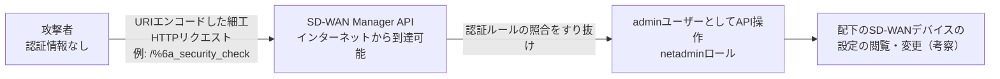

# Cisco Catalyst SD-WAN Manager 認証回避ゼロデイ CVE-2026-76504 ― 1文字のURIエンコードが管理者APIを開けた

## 要点

### 影響バージョン

- Cisco Catalyst SD-WAN Manager（旧vManage）。設定に関係なく影響し、回避策はない。
- 最初の修正版は 20.9.10.1 / 20.12.8.2 / 20.15.6.1 / 20.18.4.1 / 26.1.2.1 / 26.2.1。20.9より前のトレインは、修正版のあるトレインへ移行する。
- 5月・6月の脆弱性の修正のために更新したManagerも、今回あらためて更新が必要。
- Cisco管理のSD-WAN Cloud（Cisco Managed）はリリース 20.15.605 で修正済みで、利用者側の対応は不要とされている。

### 今すぐやること

- 更新前に `request admin-tech` を実行して証跡を保全する。
- 修正版へ更新する。更新までは、信頼できないネットワークからManagerへのアクセスを制限する。
- `serviceproxy-access.log` で未知のIPアドレスからの `j_security_check` へのアクセス（エンコードされた文字を含むもの）を、`vmanage-server.log` で `viptela-reserved-` で始まるユーザー名のエントリを確認する。

## 概要

- Cisco Catalyst SD-WAN Manager（旧vManage）に、ログインなしでAPIを **adminユーザーとして** 操作できる脆弱性 CVE-2026-76504（CVSS v3.1 9.8）があり、2026年9月に実際の悪用が確認された。
- 原因はHTTPリクエストのURIエンコード処理の不備で、特定APIエンドポイントへのアクセスを制限する認証ルールを細工リクエストですり抜けられる。設定に関係なく影響し、回避策（ワークアラウンド）はない。
- CISAは9月30日（米国時間）にKEVカタログへ追加した。SD-WANの「頭脳」である管理基盤がインターネットから届く位置にある組織は、更新と並行して侵害有無の確認が必要になる。

> この記事では、ベンダー・公的機関・報道で確認できた内容を「事実」、筆者の推測や意見を「考察」として分けて書いています。

## 何が起きたか（時系列）

| 時期 | 出来事 |
| --- | --- |
| 2026年5月 | 別件のSD-WAN脆弱性 CVE-2026-20182 が修正される |
| 2026年6月 | さらに別件の CVE-2026-20245 / CVE-2026-20262 が修正される |
| 2026年9月 | Cisco TACのサポート案件の対応中に本脆弱性が見つかり、Cisco PSIRTが実際の悪用を認識 |
| 2026-09-30（米国時間） | Ciscoがアドバイザリ `cisco-sa-sdwan-webauth-xr8beuuU`（Cisco Catalyst SD-WAN Manager API Authentication Bypass Vulnerability）を公開し、修正版をリリース |
| 2026-09-30（米国時間） | CISAが「Cisco Catalyst SD-WAN Manager Hex Encoding Vulnerability」としてKEVに追加 |
| 2026-09-30 時点 | The Hacker Newsによれば、2026年にKEVへ追加されたCisco SD-WAN関連の脆弱性は8件 |
| 2026-10-01 | Security NEXTが国内向けに報道（更新や侵害調査を呼びかけ） |

アドバイザリには、被害を受けた顧客の数、攻撃の開始時期、攻撃者、侵入後に何をしたかは書かれていない（The Hacker Newsもこの点を指摘している）。

### 修正版

| リリーストレイン | 最初の修正版 |
| --- | --- |
| 20.9 より前 | 修正版のあるトレインへ移行 |
| 20.9 | 20.9.10.1 |
| 20.12 | 20.12.8.2 |
| 20.15 | 20.15.6.1 |
| 20.18 | 20.18.4.1 |
| 26.1 | 26.1.2.1 |
| 26.2 | 26.2.1 |

Cisco管理のSD-WAN Cloud（Cisco Managed）はリリース 20.15.605 で修正済みで、利用者側の対応は不要とされている。Cisco Catalyst SD-WAN Cloud Hosted 環境には後述のアクセス制限による緩和策がすでに適用されている。

The Hacker Newsの比較によると、5月・6月の脆弱性の修正版はいずれも今回の表より古い。つまり **5月・6月の修正のために更新したManagerも、今回あらためて更新が必要** になる。また、5月のアドバイザリに載っていた 20.10 / 20.11 / 20.13 / 20.14 / 20.16 トレインや、Cloud-Pro・FedRAMP向け環境は今回の表に載っていない。これらがどう扱われるのかは、筆者が確認した範囲の資料からは読み取れなかった。該当環境の運用者はCiscoに直接確認したほうがよい。

## 技術的な問題点（根本原因）

**事実**

- 問題はManagerのAPIの「セッションベース認証の管理」部分にある。
- HTTPリクエスト中のURIエンコードの扱いが不適切で、特定のAPIエンドポイントへのアクセスを制限するための認証ルールを、細工したリクエストが迂回できてしまう（CISの解説ではCWE-177: Improper Handling of URL Encodingに分類）。
- Ciscoが示す侵害の痕跡は、セッションログインに使われるパス `j_security_check` に関わるもので、例として1文字をエンコードした `/%6a_security_check`（`%6a` は `j`）が挙げられている。エンコードされる文字はどれでもよく、`%6a` は一例にすぎない。
- adminユーザーは既定で netadmin ロールを持ち、デバイス上のすべての操作が可能。

**考察**

アドバイザリは内部実装を明かしていないが、「エンコードされたパスでルールが一致しなくなる」という説明から、典型的な **正規化の不一致**（パスを照合する層とリクエストを処理する層で、デコード前後どちらの文字列を見ているかが食い違う）が疑われる。アクセス制御は生の文字列で照合し、後段のアプリケーションはデコード後のパスでルーティングする――という構造なら、`/%6a_security_check` は前者には「知らないパス」、後者には `j_security_check` として扱われうる。Webアプリやリバースプロキシで何度も繰り返されてきたバグクラスで、パスベースのallow/denyリストに認証を依存させる設計そのものの脆さを示している。

## 攻撃・侵入経路

前提条件は「ManagerのAPIにリクエストを送れること」だけで、認証情報もユーザー操作も不要。Ciscoはインターネットに露出したManagerが侵害の危険にさらされているとしている。CISのアドバイザリは、成功すればそのManagerが管理する全SD-WANデバイスの設定を閲覧・変更できうると説明している。侵入後に攻撃者が実際に何をしたかは公表されていない。

## なぜ防げなかったか・構造的要因の考察

ここからは筆者の考察である。

1. **管理プレーンの露出**: Ciscoのハードニングガイドは、443/22/830などの管理インターフェースをインターネットに直接さらさず、ジャンプホストや管理用サブネットからのみHTTPSアクセスさせるよう求めている。それでも悪用が起きたことは、拠点やクラウドとの接続の都合でManagerを外部から到達可能にしている環境が一定数あることを示唆する。
2. **「設定に関係なく影響」「回避策なし」**: 機能を無効化して逃げる手段がないため、パッチ適用までの防御はネットワーク到達性の制限だけになる。
3. **同一製品で続く悪用**: 2026年だけでCisco SD-WAN関連の脆弱性が8件KEVに入っている。攻撃者がこの製品群を継続的に研究対象にしていると見るのが自然で、「前回パッチを当てたから大丈夫」という前提が通用しない。今回も5月・6月の修正版では不十分だった。
4. **TAC案件での発見**: 脆弱性はサポート対応中に見つかっており、悪用がベンダーの検知より先行していた可能性がある。いつから悪用されていたかは不明なので、ログを遡れる範囲で確認する必要がある。

## 運用者向けの具体的な対策と検知ポイント

**対策**

- 上の表の修正版へ更新する。20.9より古いトレインは修正版のあるトレインへ移行する。
- 更新までは、インターネットなど信頼できないネットワークからManagerへのアクセスを制限する。外部アクセスが必要なら既知の信頼済みホストだけを許可し、コントロールコンポーネントをファイアウォールの内側に置く（Ciscoは検証環境で有効性を確認したとしつつ、自環境への影響評価を求めている）。
- **更新前に `request admin-tech` を実行して証跡を保全する。** 今回のアドバイザリは更新で既存の侵入者が排除されるかに触れていないが、5月と6月（1件目）のアドバイザリは「侵害が確認された場合、更新だけでは解決しない」としてadmin-techの事前取得を求めていた。

**検知ポイント**

- `/var/log/nms/containers/service-proxy/serviceproxy-access.log` で、未知・未許可のIPアドレスからの `j_security_check` へのアクセス（エンコードされた文字を含むものに特に注意）。
- `/var/log/nms/vmanage-server.log` で、`viptela-reserved-` で始まるユーザー名（予約済みシステムサービスアカウント）に関するエントリ。
- これらのエントリは通常運用でも出るため、平常時の通信と突き合わせて誤検知を除く。
- 判断がつかない場合は、タイトルにCVE-2026-76504を入れてSeverity 3でCisco TACにケースを開ける。
- （考察）ログ確認に加え、Managerの管理ユーザー一覧、配下デバイスのテンプレート・ポリシーの変更履歴に、身に覚えのない変更がないかも確認しておきたい。

## 参考リンク

- Cisco: [Cisco Catalyst SD-WAN Manager API Authentication Bypass Vulnerability (cisco-sa-sdwan-webauth-xr8beuuU)](https://sec.cloudapps.cisco.com/security/center/content/CiscoSecurityAdvisory/cisco-sa-sdwan-webauth-xr8beuuU)
- The Hacker News: [Cisco Warns of Attackers Exploiting Critical Authentication Bypass in SD-WAN Manager](https://thehackernews.com/2026/09/cisco-warns-of-attackers-exploiting.html)
- Security NEXT: [「Catalyst SD-WAN Manager」にゼロデイ脆弱性 - 更新や侵害調査を](https://www.security-next.com/190883)
- CISA: [CISA Adds One Known Exploited Vulnerability to Catalog (2026-09-30)](https://www.cisa.gov/news-events/alerts/2026/09/30/cisa-adds-one-known-exploited-vulnerability-catalog)
- CIS: [A Vulnerability in Cisco Catalyst SD-WAN Manager Could Allow for Authentication Bypass](https://www.cisecurity.org/advisory/a-vulnerability-in-cisco-catalyst-sd-wan-manager-could-allow-for-authentication-bypass_2026-105)
