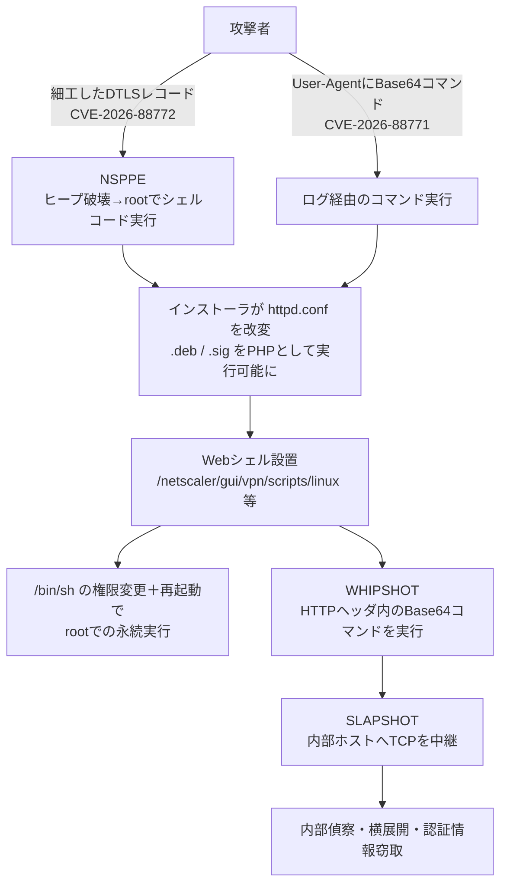

# Citrix NetScaler ADC/Gateway CVE-2026-88772/88771 悪用 ― DTLSの断片長を信じたパケットエンジンと、パッチ後に残る足場

## 要点

### 影響バージョン

- NetScaler ADC / Gateway 14.1 は 14.1-73.37 以降、13.1 は 13.1-64.23 以降が修正版。14.1-FIPS は 14.1-73.37 FIPS 以降、13.1-FIPS / 13.1-NDcPP は 13.1-37.279 以降。
- CVE-2026-88771 はデフォルト構成を含むすべての構成、CVE-2026-88772 はDTLSが有効な構成が影響を受ける（NetScaler GatewayのVPN仮想サーバーではDTLSが既定で有効）。回避策はない。
- 対象は顧客管理のアプライアンス。NetScalerを使うSecure Private Accessのハイブリッド構成も更新が必要。

### 今すぐやること

- 更新前に、ログ、設定ファイル、ファイルシステムの状態を保全する（HA構成では両ノード）。
- 修正版へ更新する。
- NetScaler ConsoleのIoCやCVE Detectionで侵害を調査し、`httpd.conf` の改変、`/netscaler/gui/vpn/scripts/linux` 配下の不審な .deb / .sig、`/bin/sh` の権限変更を確認する。

## 概要

> 追記（2026-10-05）: 9月27日のパッチ適用後も、SAMLを使う構成では別のゼロデイCVE-2026-88779の修正版（14.1-73.41／13.1-64.28など）への再更新が必要になった。詳細は[CVE-2026-88779の記事](/security-notes/notes/2026-10-05-netscaler-saml-cve-2026-88779-reboot-trigger/)を参照。

- NetScaler ADC / Gateway の認証前RCE脆弱性 CVE-2026-88772（DTLS処理のメモリオーバーフロー）と CVE-2026-88771（入力検証不備によるコマンド実行）が、2026年9月27日のパッチ公開前からゼロデイとして悪用された。CVSS v4.0はどちらも9.5。
- Mandiant / GTIGは、北米・欧州の政府、金融、テクノロジー、教育、法律・専門サービスなど数十組織への侵入を確認。root権限奪取後にPHP製WebシェルWHIPSHOTとPython製トンネラーSLAPSHOTを展開し、内部偵察や認証情報窃取に使っていた。
- watchTowrがDTLSハンドシェイクの断片長の扱いを突く認証前経路を公開し、GreyNoiseは複数の独立した攻撃者による大規模悪用への移行を報告している。日本でもJPCERT/CCとIPAが9月28日に注意喚起を出した。

> この記事では、ベンダー・公的機関・研究者・報道で確認できた内容を「事実」、筆者の推測や意見を「考察」として分けて書いています。

## 何が起きたか（時系列）

| 日時 | 出来事 |
| --- | --- |
| 2026年9月 | Mandiant Consulting / GTIGが、北米・欧州の組織を狙う悪用を観測 |
| 2026-09-24以降 | 海外のセキュリティ組織の観測で、日本国内のNetScalerを対象とした攻撃試行を確認（JPCERT/CCによる。本脆弱性を狙ったものかは不明） |
| 公開前 | オランダNCSC（NCSC-NL）の非公開の事前通知を受け、管理者がサプライヤー等からアプライアンス停止を求められたと報告（watchTowr FAQ） |
| 2026-09-26 | watchTowrが、未修正のNetScaler RCE脆弱性が複数悪用されていると公に警告 |
| 2026-09-27 | Cloud Software Group（Citrix）が速報 CTX697096 を公開し、CVE-2026-88771〜88778の8件を修正。88771/88772は悪用確認済み。CISAが同日2件をKEVに追加 |
| 2026-09-28 | JPCERT/CC（JPCERT-AT-2026-0029）とIPAが注意喚起。Censysは同日時点でNetScaler ADC / Gatewayを動かすホスト42,735件を観測（脆弱な台数は不明） |
| 2026-09-28 8:30 EDT頃（日本時間 21:30頃） | GreyNoiseが CVE-2026-88771 関連の悪性活動を観測開始。同日22:30 EDT頃（日本時間 9/29 11:30頃）に大きく急増 |
| 2026-09-30 | The Hacker Newsが、Mandiant / GTIGの分析（WHIPSHOT / SLAPSHOT）とGreyNoise、CERT-EUの情報を報道 |

MandiantのCTO、Charles Carmakal氏は、近いうちに様々な攻撃者による「広範かつ機会主義的な」悪用が起こると警告していた。GreyNoiseは、前日の大規模偵察が多数の独立した攻撃者・キャンペーンによる大規模悪用へ発展し、主にボットネットへの組み込みとアクセス販売（access brokering）目的でWebシェルやマルウェアが展開されていると述べている。

### 影響を受けるバージョンと修正版

| 系列 | 修正版 |
| --- | --- |
| NetScaler ADC / Gateway 14.1 | 14.1-73.37 以降 |
| NetScaler ADC / Gateway 13.1 | 13.1-64.23 以降 |
| NetScaler ADC 14.1-FIPS | 14.1-73.37 FIPS 以降 |
| NetScaler ADC 13.1-FIPS / 13.1-NDcPP | 13.1-37.279 以降 |

- CVE-2026-88771：デフォルト構成を含むすべての構成が影響を受ける。
- CVE-2026-88772：DTLSが有効な構成が影響を受ける。NetScaler GatewayのVPN仮想サーバーではDTLSが既定で有効。
- 両脆弱性とも回避策は提供されていない。
- 対象は顧客管理のアプライアンスで、Citrix管理のクラウドサービスとAdaptive AuthenticationはCloud Software Groupが更新する。NetScalerを使うSecure Private Accessのハイブリッド構成も更新が必要（BleepingComputer）。

## 技術的な問題点（根本原因）

### CVE-2026-88772：DTLS断片の再構成で長さを取り違える（事実）

- CWE-119（バッファ境界外操作）。NetScaler Packet Processing Engine（NSPPE）のDTLS処理にある。
- DTLSのハンドシェイク断片には、メッセージ全体の長さ `length` と、その断片が運ぶバイト数 `fragment_length` がある。watchTowrによると、細工したレコードは `length=120`、`fragment_length=1` を名乗りつつ、実際には大きなデータを載せている。
- NSPPEは「各レコードは1バイトだけ供給する」という申告どおりに再構成の完了を判定する一方、各レコードのほぼ全体をNetScalerバッファ（NSB）に保持したままにする。120レコードで120バイトのメッセージが「完成」した時点で、NSBチェーンには約174KBが溜まっている。
- これを35,840バイトのスクラッチバッファへ連結する際、次のデータが収まるかを確認していないため、バッファの末尾を越えて書き込みが起きる。
- watchTowrは、`mprotect()` でNX保護を回避し、root権限で任意のシェルコードへ制御を移せることを示した。Googleは、改変・断片化したレコードヘッダでパケットエンジン内のヒープ境界を壊し、基盤のFreeBSD上でroot権限のシェルコードを実行させると説明している。
- Googleによれば、悪用時は認証をバイパスし、NSPPEの未処理終了を引き起こして初期のroot権限を得る。

### CVE-2026-88771：ログに書かれた入力からのコマンド実行（事実）

- CWE-20（不適切な入力検証）で、認証なしで任意のコマンドを実行されうる。Sygniaは「攻撃者が制御するデータがNetScalerのログに書き込まれ、それを通じてコマンドを注入できる」と説明している。
- CERT-EUは、User-AgentにBase64エンコードしたコマンドを詰めてHTTPログを埋め、並行して認証ログに大量の攻撃リクエストを送り、`ns_monupload_err` が呼ばれたときに自分のトリガーが最終行になるよう狙う手口を報告している。デコード・実行されると `/etc/httpd.conf` を書き換えてPHPエンジンを有効化し、インターネットから到達できるパスにWebシェルを置く。

**考察**

88772は「ヘッダの自己申告値を信じ、実データ量と突き合わせない」という古典的なパーサの欠陥で、しかもハンドシェイク前（認証前）、root権限で動くパケットエンジンの中にある。88771は「ログ＝受動的なデータ」という前提が崩れ、ログ処理がコマンド実行の入口になった。性質の違う2本の認証前RCEが同じ速報に並んだことで、攻撃者は環境に応じてどちらも選べる状況になっている。

## 攻撃・侵入経路

GTIGの報告をもとにした侵入の流れは次のとおり。

**事実（GTIG / The Hacker News）**

- 悪用後、初期インストーラが `httpd.conf` を書き換え、Debianパッケージ形式（.deb）のファイルをPHPスクリプトとして扱わせ、偽装した拡張子のWebシェルを `/netscaler/gui/vpn/scripts/linux` に置く。
- 別の事例では、mod_phpを有効化したうえで署名ファイル（.sig）をPHPとして実行させ、`/vpn/media/` 配下の `.ico` へのリクエストを `/var/netscaler/gui/vpn/scripts/linux/` 内の同名 `.sig` に対応付けていた（例：`/vpn/media/e6ee7c85.ico` へのアクセスを `e6ee7c85.sig` が処理）。Webシェルの実行を画像リクエストに見せかける手口である。
- あるケースではアクセスログ上はHTTP 404なのに、処理時間が長く、数KBのレスポンスを返していた。後日、存在しない .sig へのアクセスが `httperror-vpn` ログにエラーとして残っており、GTIGは攻撃者が複数の侵害環境で同様のWebシェルを管理している兆候かもしれないとしている。
- インストーラ用Webシェルで `/bin/sh` の権限を変え、アプライアンスを再起動して、Webシェルのroot権限での永続実行を確立する。
- WHIPSHOTはHTTPヘッダからBase64のコマンドやペイロードを取り出して実行し、結果を返す。SLAPSHOTはWHIPSHOTから指示を受け、任意のTCPストリームを内部ホストへ転送する。10分間セッションやコマンドがなければ、ポートファイルとロックファイルを消して終了し、痕跡を減らす。
- 少なくとも1件で、攻撃者がこのプロキシ経由で手動の内部偵察と認証情報窃取を行った。
- GreyNoiseは、88772の悪用が脆弱性の仕組みのレベルではGoogleの観測と重なる一方、攻撃者やツールは異なっていたとし、複数の攻撃者が悪用を試みていると見ている。

## なぜ防げなかったか・構造的要因の考察

ここからは筆者の考察である。

1. **エッジデバイスは見えにくい**: Google自身が指摘するように、ADCやVPNゲートウェイはインターネットに露出し、EDRが届かず、認証情報を扱う。侵入後の動きは、このデバイスのログを見る運用がなければ検知しにくい。
2. **ゼロデイ期間の長さ**: Mandiant / GTIGの観測は9月中、国内での攻撃試行は9月24日以降で、パッチは27日。パッチを即日当てた組織でも、それ以前の侵入は防げない。「パッチ適用済み＝安全」ではない。
3. **パッチは脆弱性を塞ぐが、改変は戻さない（推測）**: 攻撃者は `httpd.conf` の書き換え、Webシェル配置、`/bin/sh` の権限変更と、パッチとは別の層に足場を作っている。ファームウェアを更新しても、こうした改変や設置ファイル、窃取された認証情報までは元に戻らないと考えるべきだろう。watchTowrはCISAの助言として、侵害を確認し、更新で証拠が消えうるため事前に保全するよう伝えている。
4. **既定で有効なDTLS**: 88772はDTLSが有効な構成に限られるが、VPN仮想サーバーでは既定で有効になっている。明示的に無効化していない限り、Gateway用途の多くが該当しうる。
5. **NetScalerの「常連化」**: watchTowrの記事タイトル（"Here We Go Again"）が示すとおり、この製品群は認証前RCEで繰り返し狙われてきた。攻撃者側はパッチ差分から短期間で武器化できる体制を持っていると見たほうがよい。

## 運用者向けの具体的な対策と検知ポイント

**対策（優先順）**

1. **証跡を保全する**: 更新前に、ログ、設定ファイル、ファイルシステムの状態を確保する（更新で証拠が消えうる）。HA構成では両ノードが対象になる。
2. **修正版へ更新する**: 14.1-73.37 / 13.1-64.23 以降（FIPS / NDcPP版は上表）。回避策はないので、更新までは露出を最小にするしかない。
3. **侵害調査を行う**: Cloud Software GroupはNetScaler Console経由でIoCを提供しているとIPAは伝えている。NetScaler ConsoleのCVE Detectionで影響インスタンスを洗い出せる。
4. **侵害が見つかったら**: （考察）Webシェルの削除だけで済ませず、クリーンな状態からの再構築、アプライアンスに保存・経由していた認証情報やセッションの無効化・再発行、内部ネットワークへの横展開の調査まで行う。

**検知ポイント**

- `httpd.conf` の改変：PHPエンジン / mod_php の有効化、.deb や .sig をPHPとして扱わせる設定、`/vpn/media/*.ico` を別ファイルへ対応付ける設定。
- `/netscaler/gui/vpn/scripts/linux` や `/var/netscaler/gui/vpn/scripts/linux/` に置かれた不審な .deb / .sig ファイル。
- `/bin/sh` の権限変更、説明のつかないアプライアンス再起動。
- Webアクセスログで、404なのに処理時間が長くレスポンスが数KBあるリクエスト。`httperror-vpn` ログでの存在しない .sig へのアクセス。
- HTTPログのUser-Agentに長いBase64文字列が並ぶ、認証ログへの大量リクエスト（CERT-EU）。
- 通常と異なるHTTPヘッダにBase64データを含むリクエスト（WHIPSHOT）。
- NetScalerから内部ホストへの想定外のTCP接続（SLAPSHOTによる中継）。NSPPEの異常終了・クラッシュの記録。

## 参考リンク

- The Hacker News: [Attackers Exploit NetScaler Flaw for Root Access, Deploy WHIPSHOT and SLAPSHOT](https://thehackernews.com/2026/09/attackers-exploit-netscaler-flaw-for.html)
- The Hacker News: [Citrix NetScaler CVE-2026-88772 Exploit Details Show Pre-Auth Path to Shellcode Execution](https://thehackernews.com/2026/09/citrix-netscaler-cve-2026-88772-exploit.html)
- Citrix: [Security Bulletin CTX697096](https://support.citrix.com/external/article/CTX697096/citrix-netscaler-adc-and-citrix-netscale.html)
- watchTowr Labs: [Here We Go Again (Citrix NetScaler DTLS Preauth Memory Overflow CVE-2026-88772)](https://labs.watchtowr.com/here-we-go-again-citrix-netscaler-dtls-preauth-memory-overflow-cve-2026-88772/)
- watchTowr: [Citrix NetScaler Zero-Days FAQ](https://watchtowr.com/intelligence/citrix-netscaler-zero-day-vulnerabilities-faq/)
- Sygnia: [Actively Exploited NetScaler Vulnerabilities](https://www.sygnia.co/threat-reports-and-advisories/actively-exploited-netscaler-vulnerabilities/)
- BleepingComputer: [Citrix confirms two NetScaler RCE zero-days exploited in attacks](https://www.bleepingcomputer.com/news/security/citrix-admins-warned-to-shut-down-netscalers-over-2-exploited-zero-days/amp/)
- JPCERT/CC: [NetScaler ADCおよびNetScaler Gatewayにおける複数の脆弱性に関する注意喚起（JPCERT-AT-2026-0029）](https://www.jpcert.or.jp/at/2026/at260029.html)
- IPA: [NetScaler ADCおよびNetScaler Gatewayの脆弱性について](https://www.ipa.go.jp/security/security-alert/2026/alert20260928.html)
