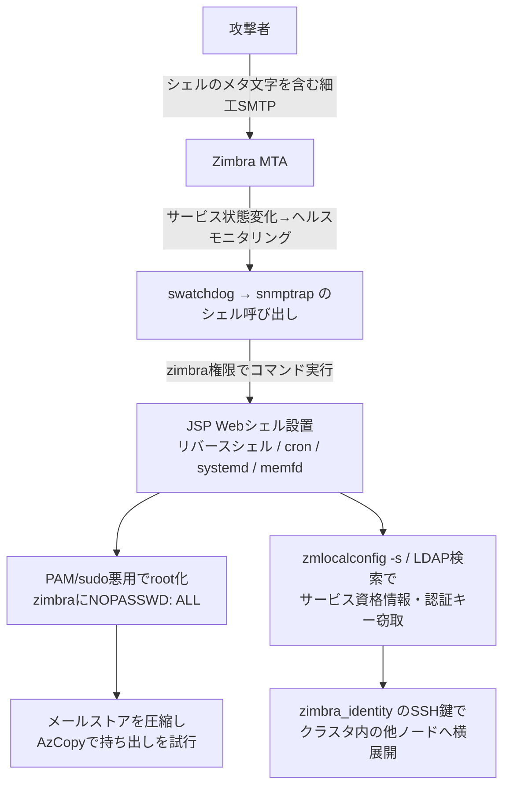

# Zimbra CVE-2026-73570 ― 1通のSMTPがSNMP通知を経てシェルになる、パッチから公表までの「隙間」の悪用

## 概要

- Zimbra Collaboration Suite（ZCS）のSNMP通知処理に、認証不要のOSコマンドインジェクション CVE-2026-73570（CVSS 8.9）がある。オプションの zimbra-snmp パッケージを導入し、SNMP通知を有効にした環境では、細工したSMTPリクエスト（メール）だけで、ユーザー操作なしにzimbraサービスアカウント権限でコマンドを実行される。
- Microsoftは、悪用後にJSP Webシェルやリバースシェルの設置、root権限への昇格、認証用シークレットの窃取、メールボックスデータの収集と持ち出しの試みまで確認したと9月30日に公表した。
- 修正版10.1.20は7月20日に出ていたが、Microsoftは公表（8月13日）より前の7月28日〜8月7日に、すでにこの注入経路への探索を観測していた。

> この記事では、ベンダー・公的機関・報道で確認できた内容を「事実」、筆者の推測や意見を「考察」として分けて書いています。

## 何が起きたか（時系列）

| 日付 | 出来事 |
| --- | --- |
| 2026-07-20 | Zimbraが修正を含む10.1.20をリリース |
| 2026-07-28〜08-07 | Microsoftが、2種類のアウトオブバンド型スキャンツールが注入ポイントを探索しているのを観測（ペイロードは送らず、コマンド実行の可否だけを確認） |
| 2026-08-13 | CVE-2026-73570が公表される |
| 2026年8月 | CERT Polskaが実際の悪用を指摘し、`/var/log/zimbra.log` の不審なサービス再起動や、一時ディレクトリ・`webapps` 配下で作られたファイルの確認を呼びかけ |
| 2026年8月 | CISAがKEVに追加（連邦機関の対応期限は8月24日） |
| 2026-09-30 | Microsoftが攻撃チェーンの詳細と検知クエリを公開 |

Microsoftによると、被害組織は複数の地域・業種にまたがり、特定の業界や地域に限られていなかった。攻撃者は特定されていない。図示された攻撃チェーンは複数の侵害事例をまとめたもので、1台のホストですべての段階が見られたわけではない。

## 技術的な問題点（根本原因）

**事実（Microsoft）**

- 細工したSMTPリクエストに含まれる信頼できない入力が、SNMP通知処理に入り込む。サニタイズが不十分なため、埋め込まれたシェルコマンドがzimbraサービスアカウントの権限で実行される。
- 具体的には、サービス状態の変化がヘルスモニタリングを起動すると、`swatchdog` が攻撃者の制御する値を `snmptrap` のシェル呼び出しに組み込み、コマンドが実行される。
- 注入の痕跡は、正規の `snmptrap` 呼び出しの直後にシェルのメタ文字と `wget` / `curl` が続き、末尾の `#` コメントで残りの正規の引数を無効化する形をとる。
- 前提は、オプションの zimbra-snmp パッケージが導入され、SNMP通知が有効になっていること。

**考察**

外部から届くメールの値が、監視用のスクリプトを通って最終的に `sh -c` の文字列に連結される――という、データと命令を分けないシェル呼び出しの典型的な失敗である。メール本体の処理ではなく、運用監視という「周辺機能」に穴があった点が厄介だ。周辺機能は導入時に有効にされたまま、誰も入力の境界を意識していないことが多い。

## 攻撃・侵入経路

**事実（Microsoft / The Hacker News）**

- **探索**: 公表前、オペレーターは oast[.]fun などの外部インタラクションサービスのサブドメインに向けた軽量プローブで、コマンド実行を確かめていた。`curl`、`wget`、`ping`、`nslookup`、`id` などを使い、HTTPリクエストではCVE固有のUser-Agent `ZB73570` を使っていた。
- **初期アクセスと足場**: Webルートの権限を変え、分割して置いたエンコード・圧縮済みペイロードを組み立てて、公開アプリケーションディレクトリにJSP Webシェルを書き込む。その後、断片ファイルは削除する。Webシェルは Jetty と mailboxd の複数パス、さらに他のメールボックスノードにも冗長に置かれた。公開ディレクトリの書き込み権限を一時的に付けて戻すことで、単純な権限チェックでは気付きにくくしていた例もある。
- **偵察**: `zmprov` でメールボックス・MTAノードを洗い出し、Zimbra用SSH鍵の有無を確認した。
- **権限昇格**: mailboxマネージャーの書き込み可能なログディレクトリを悪用し、`zmmailboxd.out` を `/etc/pam.d/sudo` へのシンボリックリンクに置き換えて特権プロセスを起動し、PAMファイルの所有者をzimbraにした。続いて `pam_exec` フックを仕込み、正規ヘルパー `zmstat-fd` 経由でsudoセッションを起こしてroot権限でsudoers に `NOPASSWD: ALL` を追加した。その後PAMは元に戻し、sudoersのエントリだけを残した。
- **永続化**: Zimbraのログ部品を装った `zimlog.service` を `/etc/systemd/system/` に置き、タイムスタンプを既存のサービスに合わせて改ざんした。別キャンペーンのリモートアクセスエージェント zimclient2（Zimdown2経由で導入）は、systemd、OpenRC、cron、シェル起動ファイル、SSH authorized_keys、ローカルアカウント作成など多数の永続化手段を持つ。
- **認証情報の窃取**: 個々のユーザーのパスワードではなく、`zmlocalconfig -s` でLDAP、MySQL、Postfixなどのサービス資格情報を取り出し、LDAPから `zimbraPreAuthKey`、`zimbraAuthTokenKey`、`zimbraTwoFactorAuthSecret` を取得した。Microsoftによれば、`zimbraAuthTokenKey` があれば任意アカウントのセッショントークンを資格情報なしで生成でき、事前認証キーがあれば任意ユーザーの事前認証ログインURLを作れる。
- **横展開**: `/opt/zimbra/.ssh/zimbra_identity` を使い、ホスト鍵検証を無効にした非対話SSHで信頼関係のあるノードへ移動し、`rsync` でWebシェルや補助スクリプトを配った。
- **収集・持ち出し**: Zimbra専用のGo製インプラント（モジュールパス `zimbra-exfil/client-dump`）が `localconfig.xml` から資格情報を読み、mailbox、mailbox_metadata、mobile_devices、out_of_office などのテーブルを書き出す。別のサーバーでは最近のメールボックスバックアップを `/opt/zimbra/final.tar.gz` にまとめ、AzCopyでAzure Blobへ送ろうとしたが、転送が完了したかは確認されていない。

## なぜ防げなかったか・構造的要因の考察

ここからは筆者の考察である。

1. **「パッチは出ているが、緊急性が伝わっていない」期間**: 修正版は7月20日に出ていたが、CVEの公表は8月13日。その間、多くの運用者にとって10.1.20は「通常のメンテナンスリリース」に見えていたはずだ。一方で攻撃者は7月28日には探索を始めており、パッチの差分分析から脆弱性を特定した可能性がある（Microsoftは経緯を明言していない）。サイレントパッチや公表の遅れは、守る側だけを不利にしうる。
2. **オプション機能という盲点**: 前提条件の zimbra-snmp とSNMP通知は「監視のために入れたもの」で、攻撃面として意識されにくい。自組織がこの条件を満たすかを即答できない管理者も多いだろう。
3. **サービスアカウントの権限と信頼関係が大きすぎる**: 侵入直後はzimbra権限にすぎないが、正規ヘルパーとsudo/PAMの組み合わせでrootに昇格し、クラスタ共通のSSH鍵で横展開できた。単一ノードの侵害がクラスタ全体の侵害になる設計である。
4. **メールサーバ＝認証基盤**: 窃取された `zimbraAuthTokenKey` や事前認証キーは、パスワード変更とは無関係に任意アカウントへのなりすましを可能にする。パッチ適用やWebシェル削除だけでは、この窃取の影響は消えない。
5. **マルウェア名に頼った検知の限界**: Microsoft自身が、最も重大な結果（メールストア全体の持ち出し準備）はマルウェアを使わず、対話シェルだけで行われたと指摘している。

## 運用者向けの具体的な対策と検知ポイント

**対策**

- すべてのZCSを10.1.20以降に更新する。
- すぐに更新できない場合は、zimbra-snmpをアンインストールするかSNMP通知を無効化し、SNMP/SMTPへのアクセスを信頼できるホストに限定する。
- **シークレットの再発行**: すべてのドメインの `zimbraPreAuthKey` をローテーションする（Microsoftの推奨）。（考察）侵害の疑いがあれば、`zmlocalconfig -s` で見えるサービス資格情報、`zimbraAuthTokenKey`、2要素認証シークレット、SSL秘密鍵、`zimbra_identity` SSH鍵も再発行の対象に含めるべきだろう。
- メールサーバのサービスアカウントを namespace / seccomp / AppArmor で閉じ込め、将来の同種の脆弱性の影響範囲を狭める。
- インターネットに面したメールサーバでのリバースシェル検知は、ペイロードが検疫されていなくても最優先インシデントとして扱う。

**検知ポイント**

- `perl` が `.swatchdog_script` から起動したシェルで、`snmptrap` の引数（`zmservicename` 〜 `zmservicestatus` の間）にシェルのメタ文字や `wget` / `curl` / `nslookup` / `ping` が含まれるもの。
- 全メールボックスノードの Jetty / mailboxd の `webapps` 配下や `/work/zimbra/jsp/` にある想定外の `.jsp` や `*_jsp.java`、公開ディレクトリの最近の権限変更。1つのJSPを消せば終わり、と考えない。
- `java` / `jspawnhelper` を親とするシェル、`mkfifo`、`openssl s_client`（`/tmp/s` の名前付きパイプを使ったリバースシェル）。
- `/etc/pam.d/sudo` の変更や `pam_exec`、`/etc/sudoers.d/` への新規エントリ、zimbraアカウントの `NOPASSWD`。
- `zimlog.service` など、Zimbra・OSのログ部品に似せた systemd ユニットの所有者・有効化・タイムスタンプの不自然さ。
- `zmlocalconfig -s` や、`zimbraPreAuthKey` / `zimbraAuthTokenKey` を狙う `ldapsearch`、`zmslapcat` の実行。
- `/opt/zimbra/final.tar.gz` のような大きなアーカイブの作成、AzCopyのダウンロードや実行、`/tmp/zimbra_dump_*` ディレクトリ。
- CERT Polskaの推奨どおり、`/var/log/zimbra.log` の不審なサービス再起動と、一時ディレクトリ・`webapps` 配下の新規ファイル。
- 探索は7月下旬から始まっていたので、ログは30日より前まで遡って確認する（Microsoftも保存期間の外まで調べるよう勧めている）。

## 参考リンク

- Microsoft Security Blog: [Unauthenticated command injection on internet-facing mail servers: tracking CVE-2026-73570](https://www.microsoft.com/en-us/security/blog/2026/09/30/unauthenticated-command-injection-on-internet-facing-mail-servers-tracking-cve-2026-73570/)
- The Hacker News: [Attackers Exploit Zimbra Flaw to Deploy Web Shells and Harvest Authentication Secrets](https://thehackernews.com/2026/09/attackers-exploit-zimbra-flaw-to-deploy.html)
