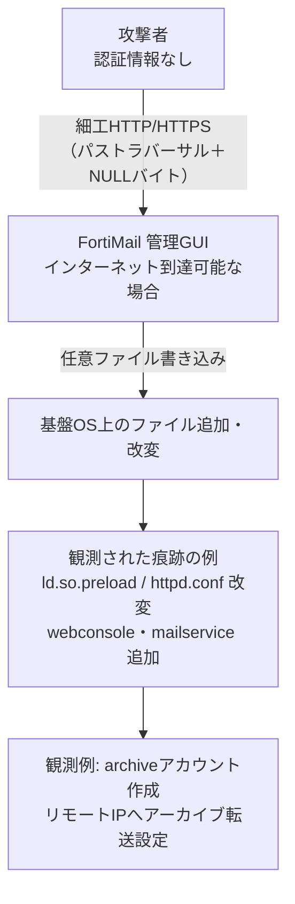

# Fortinet FortiMail CVE-2026-104286 ― 管理GUIのパストラバーサルとNULLバイトで任意ファイル書き込み、修正版未出荷のままKEV入り

## 要点

### 影響バージョン

- FortiMail 8.0.0〜8.0.1（修正予定: 今後の 8.0.2 以降）
- FortiMail 7.6.0〜7.6.6（修正予定: 今後の 7.6.7 以降）
- FortiMail 7.4.0〜7.4.8（修正予定: 今後の 7.4.9 以降）
- FortiMail 7.2.0〜7.2.9（修正: 7.4 ブランチ以降へアップグレード）
- コンポーネントはGUI。攻撃種別は認証不要。CVSS v3 は 9.8（Critical）。仮想パッチはない。

### 今すぐやること

- 更新前に証跡を保全し、Fortinetが示したIoC（ファイル・IP・ログ）で侵害有無を確認する。更新だけでは既存の足場が残る可能性がある。
- 当面の回避策として、IBE（Identity-Based Encryption）機能を無効化する。または、管理インターフェースへのインターネットからの到達を止め、信頼できるプライベートネットワークだけに限定する。
- 7.2 系は 7.4 以降へ移行する。7.4 / 7.6 / 8.0 は修正版が出るまで回避策を維持し、リリース後にすぐ更新する。
- CISAのKEV期限（連邦機関向け）は 2026-10-04。公開資産の法医的トリアージが求められている。

## 概要

- Fortinetは 2026-10-01、FortiMailの管理GUIに認証不要のパス・トラバーサルとNULLバイト処理不備 CVE-2026-104286（FG-IR-26-175、CVSS 9.8）があると公表した。細工したHTTP/HTTPSリクエストで、基盤OS上に任意ファイルを書ける。
- アドバイザリは「実際の悪用が報告されている」とし、回避策（IBE無効化、または管理面の到達制限）と、侵害時に見られたファイル・IP・ログのIoCを併せて公開した。7.4 / 7.6 / 8.0 向けの修正版は公表時点で「upcoming」であり、仮想パッチもない。
- CISAは同日KEVカタログに追加し、連邦機関に法医的トリアージと 2026-10-04 までの緩和を求めた。悪用開始時期・被害規模・攻撃者は公表されていない。

> この記事では、ベンダー・公的機関・報道で確認できた内容を「事実」、筆者の推測や意見を「考察」として分けて書いています。

## 何が起きたか（時系列）

| 時期 | 出来事 |
| --- | --- |
| （日付非公表） | Fortinet Product Securityの Gwendal Guégniaud が内部で発見・報告 |
| （日付非公表） | 実際の悪用が報告される（開始時期・規模は非公表） |
| 2026-10-01 | Fortinetが FG-IR-26-175 を初版公開。Known Exploited: Yes、Virtual Patch: No |
| 2026-10-01 | CISAが CVE-2026-104286 をKEVに追加。Due Date は 2026-10-04、法医的トリアージ要 |
| 2026-10-01 | BleepingComputer等が報道。Fortinetは政府機関（CISA含む）と内容を調整していると回答 |

Fortinetは、いつから悪用されていたか、何台が侵害されたか、誰が背後にいるかは示していない。

### 影響範囲と修正方針（Fortinet）

| バージョン | 影響 | 対応 |
| --- | --- | --- |
| FortiMail 8.0 | 8.0.0〜8.0.1 | 今後の 8.0.2 以降へ |
| FortiMail 7.6 | 7.6.0〜7.6.6 | 今後の 7.6.7 以降へ |
| FortiMail 7.4 | 7.4.0〜7.4.8 | 今後の 7.4.9 以降へ |
| FortiMail 7.2 | 7.2.0〜7.2.9 | 7.4 ブランチ以降へアップグレード |

## 技術的な問題点（根本原因）

**事実（Fortinet）**

- 分類は CWE-22（パストラバーサル）と CWE-158（NULLバイト／NULL文字の不適切な無効化）。
- 認証されていない攻撃者が、細工したHTTPまたはHTTPSリクエスト経由で、基盤システム上に任意のファイルを書ける。
- 影響コンポーネントはGUI。攻撃種別は Unauthenticated。インパクトは「Execute unauthorized code or commands」。
- 回避策のひとつが IBE 機能の無効化であることから、問題は少なくとも IBE 関連のGUI処理経路に関わる（Fortinetは実装詳細を公開していない）。

**考察**

パストラバーサルにNULLバイトの処理不備が重なると、文字列終端を想定した検証を途中で切って、意図しないパスへ書き込ませる古典的なパターンになりやすい。メールセキュリティ製品の「管理GUI」がインターネットから届く位置にあり、かつ認証前のリクエストでファイル書き込みまで到達する、という組み合わせが深刻さを決めている。仮想パッチがなく、主要ブランチの修正版が未出荷という状況では、機能オフか到達性の制限以外に逃げ道がない。

## 攻撃・侵入経路

**事実（Fortinet / BleepingComputer）**

- 悪用の前提は、管理インターフェースへHTTP/HTTPSでリクエストを送れること。認証は不要。
- Fortinetが示した侵害痕跡には、次のようなファイルの追加・改変が含まれる（ハッシュはアドバイザリ参照）。
  - 追加: `/data/lib/liblog.so`、`/data/bin/webconsole`、`/data/bin/mailservice`、`/data/etc/ld.so.preload`
  - 改変: `/bin/smit`、`/data/etc/httpd.conf`、`/data/migadmin.tar.gz`
- 関連IPとして `79.141.169.187` と `45.129.0.192` が挙げられている。
- ログ例では、CLIから `archive234` というアーカイブアカウントが追加され、リモート先 `79.141.169.187`・ディレクトリ `/uploads` が設定されている。cron経由の `/migadmin` 関連コマンド、adminの不明なログアウト、IBE復号時の Invalid Base64 Encoding、内部ユーザーのログイン失敗なども示されている。

侵入後の最終目的（ランサムウェアか、メール窃取か、踏み台か）は、公表資料からは読み取れない。

## なぜ防げなかったか・構造的要因の考察

ここからは筆者の考察である。

1. **メール境界装置の管理面露出**: FortiMailはメールの入口に置かれることが多く、管理GUIまで同じセグメントや同じ公開経路に載せてしまうと、認証前の穴がそのままインターネットに向く。
2. **修正版未出荷での悪用公表**: 主要ブランチでパッチがまだ「upcoming」のまま Known Exploited とされた。回避策（機能オフ／到達制限）に依存せざるを得ない期間が明示的に存在する。
3. **エッジ製品の連続悪用**: 同時期にはCitrix NetScalerやCisco SD-WAN Managerなど、インターネット境界の管理・VPN・メール製品へのゼロデイ悪用が続いている。攻撃者は「パッチが遅れやすい境界アプライアンス」を横断的に狙っている、と見るのが自然である。
4. **法医的トリアージの必要性**: CISAがKEV追加と同時に法医的トリアージを求めているのは、パッチや回避策を当てる前に、既に書き込まれた足場（`ld.so.preload` や不正バイナリ）を見落とすリスクが高いからだと読める。

## 運用者向けの具体的な対策と検知ポイント

**対策**

- Fortinetが示す回避策をすぐ適用する。
  - CLI: `config system encryption ibe` → `set status disable` → `end`
  - または、管理インターフェースへのインターネットアクセスを止め、信頼できるプライベートネットワークのみ許可する。
- 7.2 系は 7.4 以降へ移行する。7.4 / 7.6 / 8.0 は修正版（7.4.9 / 7.6.7 / 8.0.2 以降）が出次第、速やかに更新する。
- **回避策や更新の前に証跡を保全する。** アドバイザリのIoCに当てはまる痕跡がないか確認する。侵害が疑われる場合は、単純な再起動や上書き更新だけで終わらせず、ベンダー／インシデント対応の手順に従う。

**検知ポイント（Fortinetが示した内容）**

- 上記の追加・改変ファイルの有無とハッシュ照合。
- 通信先 `79.141.169.187` / `45.129.0.192`。
- ログ:
  - cron の `/migadmin` 関連コマンド
  - `User admin logged out from (null)` のような不自然なadminログアウト
  - `Added 'archive234' to 'archive account'` とリモートIP `79.141.169.187`
  - IBE復号の `Invalid Base64 Encoding at pos 0. Character=0x2a`
  - 内部ユーザーの連続ログイン失敗
- （考察）管理GUIへの未知IPからのPOST、身に覚えのないアーカイブ／リモート転送設定、想定外の管理者アカウント追加もあわせて確認したい。

## 参考リンク

- Fortinet: [FG-IR-26-175 — FortiMail Path Traversal / NULL Byte (CVE-2026-104286)](https://fortiguard.fortinet.com/psirt/FG-IR-26-175)
- CISA: [CISA Adds One Known Exploited Vulnerability to Catalog (2026-10-01)](https://www.cisa.gov/news-events/alerts/2026/10/01/cisa-adds-one-known-exploited-vulnerability-catalog)
- CISA KEV: [CVE-2026-104286](https://www.cisa.gov/known-exploited-vulnerabilities-catalog?field_cve=CVE-2026-104286)
- BleepingComputer: [Fortinet warns of critical FortiMail flaw exploited in zero-day attacks](https://www.bleepingcomputer.com/news/security/fortinet-warns-of-critical-fortimail-flaw-exploited-in-zero-day-attacks/)
