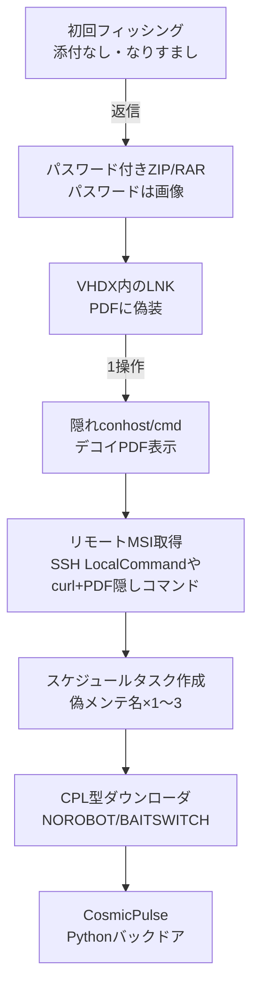

# Star Blizzard RedFlick ― ClickFixからVHDX＋スケジュールタスクへ、1操作でCosmicPulseを入れるespionage配信

## 要点

### 影響バージョン

- 特定の製品CVEというより、Windowsエンドポイント向けの配信手法の更新。対象は主にウクライナ関係者・支援に関わるNGO／シンクタンク／政府／金融機関の利用者端末。
- ペイロードはPython製バックドア CosmicPulse（ダウンローダは NOROBOT / BAITSWITCH とも呼ばれる）。iOS向けには別経路で DarkSword も観測。
- Microsoftは 2026年1月〜8月に少なくとも13件の大規模フィッシングを観測。影響は主に米・英の100組織超。

### 今すぐやること

- フィッシング耐性のある認証、Conditional Access、添付・リンクの高度な検査を有効化する。不審な「会議招待」は既知の連絡先で折り返す。
- スケジュールタスク名「Internet Quality Test Connection」「Network Configuration Manager」「System Health Monitor」と、Defender検知 `Trojan:Script/RedFlick` / `Backdoor:Python/CosmicPulse` を探す。
- 業務上不要な外部向けSSHを制限する（1月型はSSHの LocalCommand でMSIを取得）。EDRをblock modeにし、ASRで未信頼実行ファイルや難読化スクリプトを抑止する。

## 概要

- Microsoft Threat Intelligenceは 2026-09-29、ロシア国家系脅威アクター Star Blizzard（CISA等はFSB Centre 18配下と評価）が、新しいマルウェア配信手法 RedFlick を使って CosmicPulse バックドアを展開していると公表した。
- 従来の ClickFix（利用者が複数操作する）から、パスワード付きアーカイブ内のVHDX／LNK（PDFに見せかける）を開くだけで、隠れウィンドウからMSIを取りに行き、偽のメンテ名のスケジュールタスク経由でダウンローダを実行する流れに変わった。必要なユーザー操作は実質1回。
- 2026年は大規模な初回接触型フィッシング（1キャンペーンあたり数十〜数百通）へも広げ、3月以降は侵害したWordPress／cPanelサイト上のアカウントから送る例が増えた。標的はウクライナおよびウクライナ支援に関わる国際組織。

> この記事では、ベンダー・公的機関・報道で確認できた内容を「事実」、筆者の推測や意見を「考察」として分けて書いています。

## 何が起きたか（時系列）

| 時期 | 出来事 |
| --- | --- |
| 2017年以降 | Star Blizzard活動。従来は信頼できる人物へのなりすましによる標的型フィッシングが中心 |
| 2025年10月 | Google等が COLDCOPY 等を報告。以降、初期アクセス手法の刷新が続く |
| 2026年1月 | ウクライナ向け税務・罰金テーマ。パスワード付きZIP内の悪意あるVHDX＋LNK（PDF偽装）を観測。SSH LocalCommand経由でMSI取得 |
| 2026年3月 | 大規模キャンペーンをウクライナ外へ拡大。IISS／CES／Atlantic Council等の招待状テーマ。一部はDarkSword（iOS）へ誘導 |
| 2026年3月以降 | 侵害サイト（WordPress／cPanel）上に作ったアカウントから送信する手法がほぼ大規模キャンペーン専用で増加 |
| 2026年4月 | MSIがスケジュールタスクを3本作成（Internet Quality Test Connection / Network Configuration Manager / System Health Monitor） |
| 2026年6月 | Digital Security Lab Ukraineが、偽URC招待を使う類似のスケジュールタスク手法を報告（MicrosoftはTTPの重複を指摘） |
| 2026年7月 | LNKがcurlでPDFを取得し、PDF内の隠しBase64をPowerShellで実行してMSIへつなぐ多段化 |
| 2026-09-29 | MicrosoftがRedFlickと検知クエリ・IoCを公開。報道各社が続報 |

Microsoftは、観測期間中に少なくとも1台の感染を確認したとしつつ、侵害組織数の全体は公表していない（The Hacker News）。

## 技術的な問題点（根本原因）

**事実（Microsoft）**

- **RedFlickの要点**: スケジュールタスクの集合で、永続化と段階的なリモート実行を分担し、CosmicPulseダウンローダまでつなぐ。ClickFixよりユーザー操作が少なく、自動化しやすい。
- **1月型（VHDX）**: パスワード付きZIP → VHDX → PDFに見せたLNK。LNK実行で `conhost.exe`（隠れウィンドウ）→ `cmd.exe` → BAT。BATはデコイPDFを開き、`ssh.exe` に `PermitLocalCommand` を付けてリモートMSIを取得・実行。
- **4月型（タスク3本）**:
  1. **Internet Quality Test Connection**: ホスト／ユーザー名をUTF-16＋Base64でC2へ送り、WebDAV UNC経由でリモートDLL実行も可能。
  2. **Network Configuration Manager**: 他タスクが使うWebDAV（HTTPでUNC風パスを扱う）の準備。
  3. **System Health Monitor**: `control.exe` でC2上の次段（Control Panelアプレットに見せたDLL）を実行。
- **ダウンローダ → CosmicPulse**: CPL型DLL（NOROBOT / BAITSWITCH）がZIPを2つ取得。一方はPython 3.8とブートストラップ、他方に暗号化されたCosmicPulse。レジストリ `HKCU\Software\Classes\.mollis` に書いたAES鍵を、埋め込み鍵（AES-ECB）で戻して復号する。
- **7月型**: パスワード付きRARをZIPに入れ、LNKがcurlでPDFを取得。PDF内のマジックヘッダ `cAB` 以降のBase64を抜いてPowerShell実行し、再度MSI／タスク作成へ進む。

**考察**

「正規のWindows部品だけをつなぐ」設計が、静的検知をすり抜けやすい。VHDXはメールゲートウェイによってはアーカイブ扱いや展開検査の対象外になりやすく、LNKのPDFアイコンは利用者の確認を削る。スケジュールタスク名は運用監視のノイズに紛れ、WebDAV＋`control.exe` は開発者・管理者端末ではさらに目立たない。ClickFixが「利用者にコマンドを貼らせる」ことでSOCや啓発に引っかかりやすくなったことへの、攻撃側の適応だと読める。

## 攻撃・侵入経路

**事実（Microsoft / The Hacker News）**

- 大規模キャンペーンでは、最初のメールに添付を付けず、返信した相手にだけアーカイブを送る二段構成が多い。
- 送信元は、組織名をローカル部（@より前）に入れ、ドメインは侵害サイトやフリーメール、というパターンが続く。
- CosmicPulseの能力は、Googleが2025年10月に述べたものと同系統で、攻撃者供給のPythonコード実行、ファイル取得・実行、文書の回収など。
- 2026年8月のキャンペーンでは、標的ごとに異なるZIPを送る、ステガノグラフィで識別子を隠す、といった運用も観測された。

## なぜ防げなかったか・構造的要因の考察

ここからは筆者の考察である。

1. **社会技術とスケールの両立**: 従来の丁寧なやりとり型を残しつつ、招待状テーマの大量送信で母数を稼ぐ。テストをウクライナ向けで行い、その後グローバルへ広げた可能性をMicrosoftも示唆している。
2. **インフラの外部化**: 侵害CMS上のアカウント送信は、フリーメール遮断やドメインレピュテーションだけでは足りないことを示す。
3. **「1クリック」への回帰**: 啓発が進んだClickFixを捨て、見た目PDFのLNKへ戻すのは、利用者教育だけでは閉じないことを改めて示す。
4. **国防・政策コミュニティの構造**: シンクタンク名を騙る招待は、対象層の業務フローそのものに刺さる。技術対策と「既知チャネルでの確認」をセットにしないと効果が薄い。

## 運用者向けの具体的な対策と検知ポイント

**対策（Microsoftの推奨の要約）**

- フィッシング耐性認証、Conditional Access、Defender for Office 365相当の添付・リンク検査、Safe Links / Safe Attachments、ZAP。
- EDRをblock modeに。クラウド保護と自動サンプル送信。ASR（未信頼実行ファイル、難読化スクリプトのブロック）。
- 業務不要な外部SSHをファイアウォール等で制限。
- 送信者ドメインと表示名の不一致（組織名がローカル部だけ）を教育し、既知の電話／メールで確認する。
- iOSは DarkSword が使う脆弱性が直る版へ（報道では iOS 26.3 以降への更新とLockdown Modeが言及される）。

**検知ポイント**

- タスク名: `Internet Quality Test Connection` / `Network Configuration Manager` / `System Health Monitor`。
- `conhost.exe` が `curl` を起動、`ssh.exe` が `PermitLocalCommand=yes` と `LocalCommand=cmd.exe` を含む。
- `msiexec` による外部URLからのサイレントインストール、`control.exe` 経由のリモートCPL実行。
- レジストリ `HKCU\Software\Classes\.mollis`。
- Microsoft公開のドメイン・IP・ファイルハッシュ（例: `secure-dns-hub[.]com` は公表時点で使用継続と記載）。
- Defender XDRのハンティングクエリ（公表版は直近7日）。長期ログはSentinel等へ保管して期間を広げる。

## 参考リンク

- Microsoft Security Blog: [Star Blizzard refines phishing and malware delivery with the RedFlick technique](https://www.microsoft.com/en-us/security/blog/2026/09/29/star-blizzard-refines-phishing-and-malware-delivery-with-the-redflick-technique/) (2026-09-29)
- The Hacker News: [Russia's Star Blizzard Targets 100+ Organizations With Fake Event Invites to Deliver Backdoor](https://thehackernews.com/2026/09/russias-star-blizzard-targets-100.html)
- BleepingComputer: [Russian state hackers use new RedFlick technique to push malware](https://www.bleepingcomputer.com/news/security/russian-state-hackers-use-new-redflick-technique-to-push-malware/)
- SecurityWeek: [Russian APT Star Blizzard Uses 'RedFlick' Infection Chain in Recent Attacks](https://www.securityweek.com/russian-apt-star-blizzard-uses-redflick-infection-chain-in-recent-attacks/)
