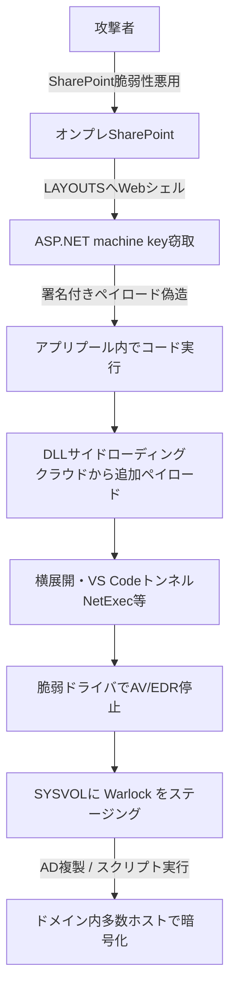

# Warlock（Longlegs / Storm-2603）― SharePoint侵入からSYSVOL複製でドメイン全体へランサムを配る

## 要点

### 影響バージョン

- 初期アクセスはオンプレミスの Microsoft SharePoint Server。Symantecは ToolShell 関連（CVE-2025-49704 / CVE-2025-49706 / CVE-2025-53770 / CVE-2025-53771）が引き続き使われうるとし、CISAが 2026年7月に注意喚起したより新しいSharePoint脆弱性も併用されうると述べている。
- 防御回避では、署名付きだが脆弱なドライバ K7RKScan（CVE-2025-1055）を使った BYOVD（Bring Your Own Vulnerable Driver）が確認されている。
- 直近約2か月の観測被害は、ポルトガル語・スペイン語圏の水道事業者、通信事業者、地方政府、大学など少なくとも4組織（欧州・アフリカ・ラテンアメリカ）。

### 今すぐやること

- インターネットに面したオンプレSharePointを棚卸しし、ToolShellおよびその後のSharePoint修正を適用する。修正できない場合は公開を止め、WAF／到達制限で緩和する。
- SharePointの LAYOUTS 配下の想定外 `.aspx`、ASP.NET machine keyの漏洩・ローテーション要否、ドメインの SYSVOL\scripts 配下の不審な実行ファイルを確認する。
- 署名付きドライバの異常ロード、短時間での多数ホストへの AV/EDR 終了ツール配布、`code-insiders.exe tunnel service install` のような VS Code トンネルのサービス化を監視する。

## 概要

- Symantecは、Warlockランサムウェアを運用する China-nexus の脅威アクターを Longlegs（Microsoft名称: Storm-2603）と呼び、直近約2か月でポルトガル語・スペイン語圏の重要インフラ等を狙った攻撃を分析した（SECURITY.COM、報道はおおむね 2026-10-01 前後）。
- 初期アクセスはオンプレSharePointの脆弱性悪用。LAYOUTSにWebシェルを置き、ファームのASP.NET machine keyを奪って署名付きペイロードを偽造し、SharePointアプリケーションプール内でコード実行する。
- 暗号化直前には脆弱ドライバでセキュリティ製品を止め、ランサムバイナリをドメインの SYSVOL にステージングして、通常のAD複製で多数ホストへ配る。ある重要インフラ侵害では、約2時間で少なくとも40ホストにAV/EDR終了ツールを押し、少なくとも33ホストでWarlockを確認した。

> この記事では、ベンダー・公的機関・報道で確認できた内容を「事実」、筆者の推測や意見を「考察」として分けて書いています。

## 何が起きたか（時系列）

| 時期 | 出来事 |
| --- | --- |
| 2025年6月頃 | Warlock登場。直後、SharePointの ToolShell ゼロデイ連鎖を使った展開が注目される |
| 2025年7月 | Microsoftが、APT27 / APT31 と並び Storm-2603（のちのWarlock運用者）によるSharePoint悪用を報告 |
| 2026年7月 | CISAがより新しいSharePoint脆弱性について注意喚起（Symantecが言及） |
| 2026-07-22 | Symantecが詳述した重要インフラ侵害で、SharePoint上にWebシェル設置を初観測 |
| 2026-07-24〜30 | 偵察、DLLサイドローディング、ドメイン信頼の列挙、VS Codeトンネルのサービス化、NetExecによる横展開 |
| 2026-07-31 | AV/EDR終了ツールを多数ホストへ配布し、直後に SYSVOL 経由で Warlock（`run.exe` / `rune.exe`）を展開 |
| 直近約2か月（Symantec公表時点） | 水道・通信・地方政府・大学など少なくとも4組織を観測。被害はポルトガル語・スペイン語圏に集中 |
| 2026-10-01前後 | Symantec分析および Dark Reading / SC Media 等が報道 |

過去のWarlock活動は米・ブラジル・インド・ロシア・台湾・日本などより広い地域でも観測されていたが、直近は言語圏を絞った動きが目立つ、とSymantecは述べている。

## 技術的な問題点（根本原因）

**事実（Symantec）**

- **初期アクセス**: オンプレSharePointの複数脆弱性。Webシェルを複数SharePointバージョン向けの LAYOUTS に同時配置し、実際のバージョンに依存せず動くようにする。
- **Webシェルの役割**: SharePointファームのASP.NET machine keyを収穫する。攻撃者はそれを使って、有効に署名されたペイロードを偽造し、SharePointアプリケーションプール内でリモートコード実行する。
- **防御回避**: DLLサイドローディング。後続ペイロードは catbox[.]moe や wasabisys[.]com など正規のクラウドストレージから取得。暗号化前に K7RKScan（CVE-2025-1055）などの脆弱な署名付きドライバで、カーネルから保護されたセキュリティプロセスを終了させる（BYOVD）。
- **遠隔操作**: Visual Studio Code のトンネル機能を悪用し、`code-insiders.exe` をサービスとして入れて、開発者／管理者端末に紛れやすい通信経路を作る。
- **ランサム展開**: ドメインの SYSVOL 共有にペイロードを置き、ドメインコントローラー間の通常複製と、ドメイン全体から読める性質を使って一斉実行する。

**考察**

個々の技法は既知でも、「境界のSharePoint → machine key偽造 → ドメイン特権 → SYSVOLという正規の配布チャネル」まで一気通貫だと、EDRやリモート実行ツールの監視だけでは遅い。特に SYSVOL はログオンスクリプトやGPOの正当な置き場でもあるため、「そこに実行ファイルがあること」自体がすぐアラートになりにくい。未パッチのオンプレSharePointが残っている限り、ToolShell以降の知見が公開されても初期アクセス経路として生き続ける、というSymantecの指摘はそのまま運用上の宿題になる。

## 攻撃・侵入経路

**事実（Symantecが詳述した重要インフラ事例の要約）**

- 2026-07-22: Computer 1（SharePoint）にWebシェル。
- 2026-07-24: 別SharePointで `net user /domain` / `whoami`、サイドロード用実行ファイル配置、`nltest /domain_trusts`。
- 2026-07-27: oastify.com（Burp Collaborator系）向けのアウトオブバンド確認らしきリクエスト。
- 2026-07-28: `__VIEWSTATE` 系のデシリアライズにつながりうるアセンブリ読み込みを繰り返し、msiexecで外部MSIを取得。ドメインアカウント `SPSEPRDSetup` を複数ホストのローカルAdministratorsへ追加（SharePointのサービスアカウント名に見せかける意図が疑われる、とSymantec）。
- 同日〜29日: `code-insiders.exe tunnel service install`、NetExec（nxc.exe）による列挙・スプレ・リモート実行。
- 2026-07-31: 内部共有から `a.exe`（AV/EDR Killer）を多数ホストへ。約2時間で少なくとも40ホスト。続けて SYSVOL 上の `run.exe` / `rune.exe` と身代金メモ `how to restore your files.txt` を少なくとも33ホストで確認。一部ホストでは `dfsrs.exe`（SYSVOL複製）が親プロセスとしてペイロードを届けていた。

## なぜ防げなかったか・構造的要因の考察

ここからは筆者の考察である。

1. **「去年のSharePoint」が今年も入口**: ToolShellは2025年に大きく報じられたが、未パッチや緩和不足のオンプレが残れば、同じ入口がランサムの初期アクセスとして再利用される。
2. **正規機能の悪用の積み重ね**: machine key、VS Codeトンネル、SYSVOL複製、署名付きドライバは、いずれも単体では「怪しい外部ツール」ではない。検知は振る舞いの組み合わせ（短時間の大量配布、LAYOUTSへの書き込み、トンネルのサービス化）に寄る。
3. **重要インフラと言語圏の絞り込み**: 水道・通信を含む少数の高価値標的へ寄せる動きは、無差別スキャン型ランサムとは運用が違う。露出したSharePointの地理分布に乗った可能性と、意図的なタスク割り当ての両方がありうるとSymantecも両論を挙げている。
4. **China-nexusと金銭動機の境界**: Storm-2603は当初、国家系APTと同じゼロデイ連鎖の利用者として並んだが、帰結がランサムウェアである点で動機の切り分けが難しい、というこれまでの評価が、今回のキャンペーンでも続いている。

## 運用者向けの具体的な対策と検知ポイント

**対策**

- オンプレSharePointの公開面を洗い出し、ToolShell関連およびその後のベンダー修正を適用する。適用できない場合はインターネット公開を止め、管理アクセスを分離する。
- machine keyの漏洩が疑われる場合はローテーションし、既存のWebシェルを除去する。LAYOUTS（複数バージョンパス）を点検する。
- ドメインの SYSVOL\scripts などへ実行ファイルを置ける権限を最小化し、変更を監視する。
- 不要なカーネルドライバのロードを制限する（WDAC/ドライバブロックリスト等）。K7RKScan のような脆弱ドライバの持ち込みを防ぐ。
- VS Code / code-insiders のトンネル機能を、業務上不要なら制限する。

**検知ポイント（Symantecの観測に基づく）**

- SharePoint LAYOUTS 配下の想定外 `.aspx`（例として事例では `layout2sp.aspx` 名が登場）。
- `nltest /domain_trusts`、短時間での多数ホストへの `net localgroup administrators ... /add`。
- `code-insiders.exe tunnel service install`。
- msiexec による catbox[.]moe / wasabisys[.]com 等からのサイレントインストール。
- 内部共有から多数ホストへ一気にコピーされる AV/EDR Killer、SYSVOL 配下の `run.exe` / `rune.exe`、身代金メモ名 `how to restore your files.txt`。
- 親プロセスが `dfsrs.exe` である不審な実行ファイルの出現。
- Symantecが公開したファイルハッシュ・ネットワークIoC（SECURITY.COM記事参照）。

## 参考リンク

- Symantec / SECURITY.COM: [Warlock Ransomware Attackers Hit Water and Telecom Operators](https://www.security.com/blog-post/warlock-ransomware-critical-infrastructure)
- Dark Reading: [Warlock Ransomware Hits Large Spanish, Portuguese Orgs](https://www.darkreading.com/cyberattacks-data-breaches/warlock-ransomware-spanish-portuguese)
- SC Media: [Chinese ransomware group Warlock targets Spanish- and Portuguese-speaking countries](https://www.scworld.com/brief/chinese-ransomware-group-warlock-targets-spanish-and-portuguese-speaking-countries)
