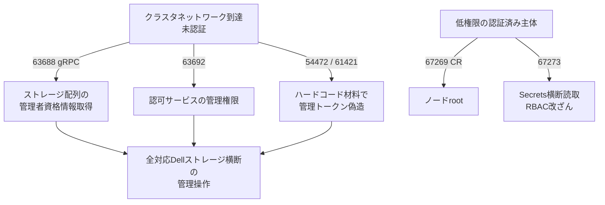

# Dell CSM CVE-2026-63688ほか ― 認証なしでストレージ管理者権限、Kubernetesノードrootまで届く欠陥群

## 要点

### 影響バージョン

- **Dell Container Storage Modules (CSM)** の **1.17.0 未満**が広く影響、と報道・整理される（BleepingComputer / The Hacker News）。修正は **1.18.0 以降**。
- 中核は認可モジュールまわり。代表例:
  - **CVE-2026-63688**（CVSS **10.0**）: `csm-authorization-storage` の gRPC で重要機能の認証欠落。未認証の遠隔攻撃者が登録済み全ストレージ配列のバックエンド管理者資格情報へアクセスし、ストレージ基盤の管理権限を取り得る。
  - **CVE-2026-63692**（CVSS **10.0**）: 認可プロキシ／テナントサービスでの認証欠落。未認証で認可サービスの管理権限へ。
  - **CVE-2026-67269**（9.9）: Custom Resource reconciler の権限管理不備。低権限からクラスタノードの **root** へ。
  - **CVE-2026-54472**（9.8）: ハードコード資格情報により管理トークンを偽造し認可プロキシへ。
  - **CVE-2026-61421**（9.8）: JWT署名秘密のハードコード／既知化により管理トークン偽造。
  - **CVE-2026-67273**（9.6）: テンプレート処理不備により Secrets のクラスタ横断読み取りやRBAC改ざんなど。
- Dellは回避策なし、**更新以外に緩和手段はない**と説明（報道要約）。サポート対象ストレージ（PowerStore / PowerScale / PowerFlex / PowerMax / Unity XT）向けCSMに関わる。

### 今すぐやること

- CSMを **1.18.0以上**へ速やかに上げる。
- 更新後、**JWT署名秘密**とストレージ管理者資格情報をローテーションする（Dell／報道が推奨）。
- 認可サービス・gRPC端点をクラスタ外や不要なNamespaceから到達できないよう NetworkPolicy／Firewall で閉じる。
- 本バッチについてDellは「実害確認」を公表していないが、過去のDell製品（例: RecoverPoint系のハードコード秘密）は国家系に悪用された前例があるため、公開面の有無を資産台帳で確認する。

## 概要

- Dellは 2026-10-02 前後、Kubernetes向けストレージ拡張 **Container Storage Modules (CSM)** のセキュリティ更新を出し、認可（Authorization）まわりを中心に複数の Critical／最大深刻度の欠陥を修正した。
- ふたつの CVSS 10.0 はいずれも「重要機能の認証欠落」で、未認証のネットワーク攻撃者がストレージ管理や認可サービスそのものを掌握し得る、とDellが警告している（BleepingComputer / The Hacker News）。
- 同じ更新にはハードコード秘密によるトークン偽造、ノードroot化、Secrets横断読取などが並ぶ。クラウドネイティブ環境では「ストレージCSIの隣」に置かれがちなコンポーネントだけに、クラスタ侵害の横展開点になりやすい。

> この記事では、ベンダー・公的機関・研究者・報道で確認できた内容を「事実」、筆者の推測や意見を「考察」として分けて書いています。

## 何が起きたか（時系列）

| 時期 | 出来事 |
| --- | --- |
| （過去事例） | Dell dbutil（CVE-2021-21551）や RecoverPoint for VMs のハードコード秘密（CVE-2026-22769）などが実害・国家系悪用の文脈で報じられる |
| 2026-10-02 | BleepingComputer / The Hacker News がCSMの最大深刻度更新を報道。Dell勧告に基づき 1.18.0 への更新と秘密のローテーションを案内 |
| （本稿時点） | 本CVE群についてCISA KEV入りや大規模実害の公式確認は、参照した一次・二次情報からは確認できず |

個別の発見者クレジットや内部検知日は、参照した公開記事からは確認できなかった。

## 技術的な問題点（根本原因）

**事実（Dellの文言を報じた各社）**

- **認証欠落（CWE系: Missing Authentication for Critical Function）**: 63688／63692。認可・ストレージ管理の重要APIが、求めるべき認証なしに応答し、資格情報の取得や管理権限のバイパスに至る。
- **ハードコード／既知の暗号材料**: 54472／61421。埋め込み資格情報や公開され得るJWT署名秘密により、暗号的に妥当な管理トークンを攻撃者が偽造できる。
- **権限管理・テンプレート**: 67269は低権限からのノードroot、67273はテンプレートエンジン経由での情報取得とRBAC改ざん。67269は「単一のCustom Resource投入でクラスタ全ノードを侵害し得る」とDellが述べたと報じられている。

**考察**

CSM Authorizationは「マルチテナントでストレージアクセスを仲介する制御面」であり、ここが落ちるとKubernetesのRBACを守っていてもデータプレーン側の管理者権限が抜ける。ハードコードJWTは、コンテナ／Helmチャートに秘密が焼かれた古典パターンで、イメージやチャートが公開リポジトリ経由で配布されるほど再現性が上がる。CVSS 10.0が2つ並ぶのはスコアのインフレというより、**未認証×管理プレーン×ストレージ横断**という条件が揃っているため、と読むのが自然である。

## 攻撃・侵入経路

**事実**

- 攻撃前提は、問題のサービス／ポートへネットワーク到達できること（クラスタ内横移動後、または誤って公開された端点）。Dellは本バッチの実害を「確認済み」とは述べていない（報道時点）。

## なぜ防げなかったか・構造的要因の考察

ここからは筆者の考察である。

1. **制御面コンポーネントの「内側」幻想**: CSI／認可プロキシは「クラスタ内だけ」と思われ、認証が弱い、またはネットワークポリシーが緩いまま残る。
2. **秘密の配布形態**: チャートやイメージに焼かれた署名鍵は、一度漏れると全デプロイでトークン偽造が可能になる。ローテーション手順が更新とセットで案内されている理由でもある。
3. **ストレージはクラウドの皇冠**: 計算ノードの侵害より、バックエンド配列の管理者権限の方がバックアップ改ざん・データ破壊・永続的な再侵入に直結しやすい。
4. **過去のDell実害との連続性**: ハードコード秘密の再発は、製品横断の設計レビュー（秘密の生成・注入・ローテーション）が追いついていない兆候、と見ることができる。

## 運用者向けの具体的な対策と検知ポイント

**対策**

- CSMを **1.18.0以上**へ更新する。回避策は案内されていない。
- JWT署名秘密、ストレージ管理者パスワード／鍵、関連ServiceAccountトークンをローテーションする。
- Authorization／gRPC端点を ClusterIP＋NetworkPolicy で最小化し、インターネットや他テナントNamespaceから閉じる。
- GitOps管理なら、チャート値に平文秘密が残っていないかリポジトリも点検する。

**検知ポイント**

- 認可プロキシ／gRPCへの未認証クライアントからの呼び出し急増。
- 想定外のストレージ管理操作、テナント横断のポリシー変更。
- 見知らぬJWT／管理者トークンの発行、Secretsの大量GET、クラスタスコープのRoleBinding作成。
- 単一CR適用直後の複数ノードでの特権プロセス起動（67269の文脈）。

## 参考リンク

- [BleepingComputer — Dell asks admins to patch max severity CSM flaws (2026-10-02)](https://www.bleepingcomputer.com/news/security/new-max-severity-dell-csm-flaws-give-hackers-admin-privileges/)
- [The Hacker News — Dell CSM Flaws Enable Unauthenticated Admin Access (2026-10-02)](https://thehackernews.com/2026/10/dell-csm-flaws-enable-unauthenticated.html)
- [Dell Support — Container Storage Modules security updates（ベンダーKBを製品ページから確認）](https://www.dell.com/support/)
