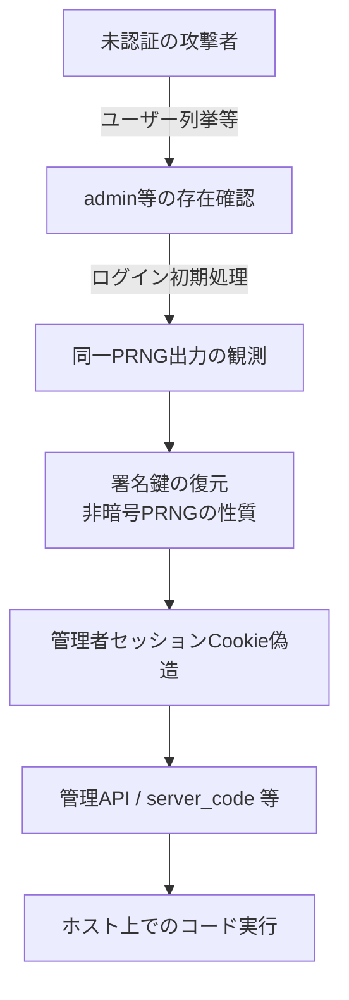

# Rejetto HFS CVE-2026-61500 ― Math.random()署名鍵とPRNG漏洩、Mythos発見から公開後すぐ悪用

## 要点

### 影響バージョン

- **Rejetto HTTP File Server (HFS) 3.0.0〜3.2.0**（NVD / GitHub Advisory系の整理）。セッションCookieの署名鍵を非暗号学的な `Math.random()` 由来で生成し、同じPRNGの出力をログイン過程で未認証クライアントへ漏らす（CWE-338）。
- **修正**: **3.2.1**（2026-07-13 リリース）以降。署名鍵を `randomBytes()`、ハンドシェイク値を `randomUUID()` に変更。同リリースで関連CVE（61501〜61505）やユーザー列挙の緩和も含む。現行はさらに新しいセキュリティ修正入りビルド（例: 3.3.4）を推奨する報道あり。
- CVSS（VulnCheck掲載）: 3.1で **9.8**、4.0で **9.3** 程度。認証回避から管理API経由のコード実行まで到達し得る。

### 今すぐやること

- HFSを **3.2.1以上**（可能なら最新安定版）へ更新する。インターネット公開の 3.0.0〜3.2.0 は優先度最高。
- すぐ更新できない場合は、強い `COOKIE_SIGN_KEYS` を明示設定し、`admin_net` で管理面の到達元を制限する（いずれも暫定。アップグレードが本筋）。
- 公開されていたホストは、`server_code`・プラグイン・管理者ログイン履歴に身に覚えのない変更がないか確認する（チェーンの最終段が管理機能経由のコード実行）。
- VulnCheckが示した探索元IP（例: 中国ホスト1件、米サブネット `173.239.211.248` / `.249`）との通信有無をログで洗う。

## 概要

- Horizon3のZach Hanleyは、Anthropicの脆弱性研究向けモデル **Mythos**（Project Glasswing）を使い、HFS 3.xのセッション署名に `Math.random()`（V8の xorshift128+）が使われ、かつログイン処理が同じPRNGの生出力をCookie経由で漏らすことを突き止めた。鍵を復元して管理者セッションを偽造し、組み込みの管理機能で任意コード実行まで実証した、と2026-09-30に公表した。
- 修正そのものは **2026-07-13** の 3.2.1 で出荷済み。しかし詳細と検証材料が秋に公開された直後、**2026-10-01夕**からVulnCheckのセンサーが実在の脆弱ホスト向け悪用を検知。対象に米国と日本のホストが含まれ、翌2日も米プロキシ疑いのIPから追加ヒットがあった（The Register、2026-10-03）。
- HFSは過去にもKEV入り（CVE-2024-23692等）した実績がある「手軽な公開ファイルサーバ」であり、パッチ適用遅れがそのままスキャン対象になる典型例でもある。

> この記事では、ベンダー・公的機関・研究者・報道で確認できた内容を「事実」、筆者の推測や意見を「考察」として分けて書いています。再現用の手順やソルバー入力は書きません。

## 何が起きたか（時系列）

| 時期 | 出来事 |
| --- | --- |
| 2026-07-10 | 署名鍵を暗号論的乱数へ差し替える修正コミット |
| 2026-07-13 | HFS **3.2.1** リリース。リリースノートは「複数の重大な脆弱性」、Hanley／Claude／Anthropic Research への謝辞 |
| 2026-09-26 | 第三者のPoCリポジトリ出現（報道整理） |
| 2026-09-30 | Horizon3が技術解説を公開。HFS 3.3.4 も追加セキュリティ修正 |
| 2026-10-01 夕 | VulnCheckがCVE-2026-61500の悪用を検知開始。中国ホストIPから米・日の脆弱ホストへ |
| 2026-10-02 | 米サブネット上の2IPから追加4ヒット（プロキシ疑い） |
| 2026-10-03 | The Register等が悪用観測を報道。Mythos由来CVEの「実害2件目」との位置づけ |

CISAのKEVに本CVEが入ったかは、2026-10-03時点の報道では未掲載とされている。VulnCheck独自のKEVには載せた、との整理がある。

## 技術的な問題点（根本原因）

**事実（Horizon3 / NVD整理 / 修正差分の報道）**

- `COOKIE_SIGN_KEYS` 未設定時、Koaの keygrip 用キーが `randomId(30)` になり、内部で **`Math.random()` を複数回**消費して文字列化する。
- ログインの初期ハンドシェイクで `Math.random()` の値がセッションCookie（署名はあるが暗号化ではない base64 JSON）に入り、**クライアントが同じPRNG系列の出力を読める**。
- V8の `Math.random()` は xorshift128+ ベースで、十分な連続観測があれば内部状態の復元が学術的・ツール的に知られている。MDNもセキュリティ用途への使用を明示的に否定。
- 管理者セッションを偽造できれば、HFSの管理API（カスタムエンドポイントでJavaScript実行など）へ到達し、RCEになる、というのがHorizon3の実証結果の要約。
- 修正は「観測可能な `Math.random()` から再構成できない乱数」へ鍵生成を切り替えたこと、およびログイン側も `randomUUID()` へ変更したこと。

**考察**

個々の部品（弱いPRNG、Cookieへのsid格納、管理APIの強力なスクリプト実行）はどれも「あるある」だが、**漏洩した観測値と起動時キー生成が同一ストリーム**であることまでつなぐと、認証回避が現実の攻撃手数に落ちる。Mythosの話の核心は「脆弱性クラスの新規発明」より、数学的に面倒な連鎖を人が諦めやすいところで自動化した点にある、というHorizon3の自己評価は、防御側には「`Math.random()` を鍵やトークンに使っていないか」の機械的監査を優先せよ、という教訓に翻訳できる。パッチから公開まで約11週間空いていたのに、**詳細公開の翌日にセンサーが鳴った**事実は、未更新ホストのインターネット露出がまだ残っていたことも示す。

## 攻撃・侵入経路

**事実（Horizon3 / VulnCheck報道）**

- 悪用観測は「脆弱ホストへの到達試行」が中心で、本番侵害の確定件数は公開されていない。
- 探索元は当初中国ホスト1IP、その後米同一サブネットの2IP（プロキシ疑い）。対象に日本のホストが含まれる。

防御記事の範囲を超えるソルバー手順・リクエスト列は記載しない。公開PoCの存在自体は報道で確認できる。

## なぜ防げなかったか・構造的要因の考察

ここからは筆者の考察である。

1. **「簡単公開」ソフトウェアの長期放置**: HFSは手軽さゆえにホーム／中小／一時共有でインターネットに残りやすく、7月の静かなパッチが届かない。
2. **セキュリティ用途への `Math.random()`**: 言語ランタイムが長年警告してきた用法が、フレームワークの「デフォルトの便利な乱数」経由で本番鍵になる。
3. **詳細公開がスキャンのトリガ**: 修正済みでも、書きぶりとPoCが出た瞬間にインターネット全体が再スキャンされる。パッチ適用のSLAを「リリース日」ではなく「悪用可能性の公開日」でも測る必要がある。
4. **AI発見CVEの運用**: Mythos関連CVEの実害率はまだ低い、という第三者トラッカーの見方もある。一方で「数学的に重いが影響がクリティカル」なクラスが現実のKEV候補になる速度は上がり得る。

## 運用者向けの具体的な対策と検知ポイント

**対策**

- **3.2.1以上へ更新**し、可能なら最新のセキュリティ修正入りリリースへ。
- 管理面をインターネットに出さない。`admin_net` で許可網を絞る。
- 暫定で `COOKIE_SIGN_KEYS` に十分な長さの秘密を設定（アップグレード代替にはしない）。
- ファイル共有が終わったインスタンスは停止・破棄する。

**検知ポイント**

- 短時間に繰り返されるログイン初期リクエスト、未知IPからの管理API呼び出し。
- `server_code` やプラグインの予期しない変更、新規管理者セッション。
- VulnCheckが挙げた探索元IP／同一サブネットからの到達。
- （考察）HFS以外でも、Nodeアプリで Cookie署名・CSRF・招待トークンに `Math.random()` / `randomId` 系を使っていないかのコード検索。

## 参考リンク

- [Horizon3 — Anthropic Mythos Finds Rejetto HFS RCE](https://horizon3.ai/attack-research/disclosures/anthropic-mythos-rejetto-hfs-rce/)
- [The Register — Mythos vuln under attack (2026-10-03)](https://www.theregister.com/security/2026/10/03/anthropics-super-bug-hunting-model-mythos-is-hardcore-good-at-math-as-latest-vuln-under-attack-shows/5300933)
- [SXZ.io — Exploitation timeline and patch diff summary](https://sxz.io/rejetto-hfs-cve-2026-61500-mythos-exploited/)
- [NVD — CVE-2026-61500](https://nvd.nist.gov/vuln/detail/CVE-2026-61500)
- [GitHub Advisory — GHSA-xxrm-3f86-v97j](https://github.com/advisories/GHSA-xxrm-3f86-v97j)
