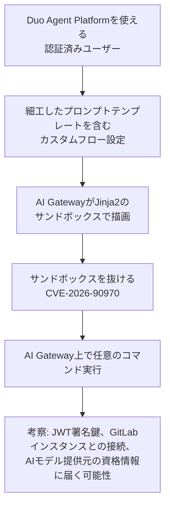

# GitLab AI Gateway CVE-2026-90970 ― カスタムフローのプロンプトテンプレートがサンドボックスを破りコマンド実行、自前ホストのゲートウェイは要更新

## 要点

### 影響バージョン

- GitLab AI Gateway の **18.1.6以降19.2.4未満**、**19.3.2未満の19.3**、**19.4.1未満の19.4**（GitLab、CVEレコード）。
- 修正版は **19.2.4／19.3.2／19.4.1**。19.1以前の系列向けの修正版は示されておらず、18.1.6〜19.1系は19.2.4以降へ移る必要がある（The Hacker News）。
- 対象は**自前でホストしているAI Gateway**（GitLab Duo Self-Hosted）。GitLab.com、GitLab Dedicated、GitLabがホストするゲートウェイを使うSelf-Managedは修正済みで対応不要（GitLab）。
- CVSS 3.1 は **9.9**（`AV:N/AC:L/PR:L/UI:N/S:C/C:H/I:H/A:H`）、CWE-1336（テンプレートエンジンでの特殊要素の無害化不備）。悪用の報告はなく、CISAのCVEレコード上の評価も「Exploitation: none」（CVEレコード）。

### 今すぐやること

- 自前ホストのAI Gatewayのバージョンを確認し、19.2.4／19.3.2／19.4.1以上のイメージへ入れ替える。Dockerならコンテナを止めて新しいタグ（例: `self-hosted-v19.4.1-ee`）で起動し直し、Helmならチャートのイメージ設定を更新する（The Hacker News、GitLabのインストール文書）。
- 回避策は示されていない。更新できるまでは、Duo Agent Platformを使える利用者を必要な人に絞る（考察）。
- （考察）更新後、ゲートウェイが持つJWTの署名鍵やAIモデル提供元のAPIキーを、念のため入れ替えることを検討する。GitLabは攻撃の有無を確かめる方法を示していないため。

## 概要

- GitLabは2026-10-02、AI Gatewayの重大な脆弱性CVE-2026-90970を修正したと公表した。Duo Agent Platformを使える認証済みのユーザーが、細工したフロー設定によって「プロンプトテンプレートのサンドボックス」を抜け出し、AI Gateway上で任意のコマンドを実行できる可能性があった。
- AI GatewayはGitLabのインスタンスとAIモデルをつなぐサービスで、AIの要求・応答のデータを自社環境に留めたい組織が自前でホストする。そうした組織に対し、GitLabは公表前に個別に連絡し、直ちに更新するよう求めた。
- 2月にも同じ種類（CWE-1336）でCVSS 9.9のCVE-2026-1868が修正されている。ユーザーが書けるテンプレートをサンドボックスで安全に描画しようとする設計そのものに、繰り返し穴が見つかっている。

> この記事では、ベンダー・公的機関・研究者・報道で確認できた内容を「事実」、筆者の推測や意見を「考察」として分けて書いています。

## 何が起きたか（時系列）

| 日付 | 出来事 |
| --- | --- |
| 2026年2月 | GitLabがAI Gatewayの18.6.2／18.7.1／18.8.1でCVE-2026-1868（Duo Workflow Serviceでのテンプレート展開の不備、CVSS 9.9）を修正。GitLab社員が内部で発見（GitLab） |
| 2026-09-14 | CVE-2026-90970の番号が予約される（CVEレコード） |
| 公表前 | GitLabが自前ホストのAI Gatewayを使う顧客に個別に連絡（GitLab） |
| 2026-10-02 | GitLabが19.2.4／19.3.2／19.4.1を公開し、CVE-2026-90970を公表。報告者はHackerOneのinvisiblemeerkat氏。CISAがCVEレコードに「Exploitation: none」「Automatable: no」「Technical Impact: total」と評価を追加（GitLab、CVEレコード） |

## 技術的な問題点（根本原因）

**事実（GitLab）**

- 脆弱性の名前は「Improper Neutralization issue in custom flow prompt template impacts AI Gateway」。カスタムフロー（Duo Agent Platformで利用者が作る、複数の手順を自動化するAIワークフロー）のプロンプトテンプレートに問題があった。
- 一定の条件下で、Duo Agent Platformを使える認証済みユーザーが、細工したフロー設定によってプロンプトテンプレートのサンドボックスを抜け、AI Gateway上で任意のコマンドを実行できた。どの条件で成立するか、どの役割が必要かは、Duo Agent Platformへのアクセス以外に示されていない（The Hacker News）。

**事実（公開ソースコード）**

AI Gatewayのソースは公開リポジトリ `gitlab-org/modelops/applied-ml/code-suggestions/ai-assist` にある。2026-10-05時点のmain（最終コミットは2026-10-02）を確認すると、次のようになっている。

- プロンプトテンプレートはJinja2で描画され、`ai_gateway/prompts/base.py` の `PromptSandboxedEnvironment` が、Jinja2標準の `ImmutableSandboxedEnvironment` を継承している。
- その上に独自の制限が重ねられている。呼び出し可能な属性へのアクセスの禁止、関数呼び出しの全面禁止（`is_safe_callable` が常に `False`）、`*` と `**` 演算子の禁止、`...` のブロック形式で `Namespace` 以外のオブジェクトへ書き込めてしまうJinja2側の抜けを塞ぐ独自のコード生成器など。
- Jinja2の既定のフィルター表もプロセス全体で書き換えられ、`reverse`・`escape`・`dictsort`・`xmlattr`・`urlize` などが禁止、`last`・`indent`・`safe`・`wordwrap` は検査付きに置き換えられている。`wordwrap` のコメントには、値の `splitlines()` や区切り文字の `join()` を直接呼ぶため、Pydanticの `model_extra` のような `__getattr__` の代替経路を通じて攻撃者が用意したメソッドが呼ばれ得る、と書かれている。
- ただし、これらのうちどの変更がCVE-2026-90970の修正にあたるのかは、GitLabは公表しておらず、この記事でも特定できていない。

**考察**

テンプレートエンジンのサンドボックスは、本来「テンプレートを書く人はある程度信頼できる」前提の仕組みで、Jinja2のサンドボックスも完全な隔離ではない。テンプレートの中から到達できるオブジェクトには、Python側の属性やメソッド、フィルターの内部処理といった抜け道が多く、守る側は1つずつ塞ぐしかない。公開コードに並ぶ制限の数と、それぞれのコメントの具体性は、そのいたちごっこの跡に見える。カスタムフローは「利用者がプロンプトを自由に組める」ことが価値なので、テンプレートを書ける人の範囲が、社内の一般の開発者まで広がっている。ここで信頼の前提がずれている。

## 攻撃・侵入経路

**事実（The Hacker News、GitLabのインストール文書を引用）**

- 自前ホストのゲートウェイはJSON Web Token（JWT）の署名鍵を持ち、GitLabのインストール文書はこれを機密の資格情報として扱うよう求めている。ゲートウェイはGitLabのインスタンスと、組織が使うAIモデル提供元にも接続している。

**考察**

必要なのは「Duo Agent Platformを使える」程度の権限で、外部の攻撃者がいきなり使える欠陥ではない。ただし、乗っ取られた開発者アカウントや内部の利用者から到達でき、CVSSでも範囲の変更（`S:C`）として評価されている。AIの要求と応答を自社に留めるために自前ホストを選んだ組織ほど、そのゲートウェイにはソースコードや社内文書を含むプロンプトが集まっている点に注意したい。

## なぜ防げなかったか・構造的要因の考察

ここからは筆者の考察である。

1. **同じ種類の欠陥が8か月で2度**: 2月のCVE-2026-1868も、フロー定義を通じたテンプレート展開の不備で、同じCVSS 9.9だった。利用者が書けるテンプレートをサーバー側で描画する設計を続ける限り、同種の報告は今後も出ると見ておくのが妥当だろう。
2. **ゲートウェイは本体とは別の製品として更新が必要**: AI Gatewayは独自のDockerイメージやHelmチャートで動き、GitLab本体とは別に更新しなければならない。本体の定期更新の手順だけでは抜け落ちやすい。
3. **古い系列の修正がない**: 修正は19.2〜19.4系だけで、18.1.6〜19.1系のゲートウェイを使い続けている組織は、本体との組み合わせも含めて上げる必要がある。GitLabの文書は本体のマイナーバージョンに合ったゲートウェイのイメージを使うよう求めているが、19.2.4のゲートウェイが19.1以前の本体で動くかどうかは示されていない（The Hacker News）。
4. **AI機能の権限設計がまだ粗い**: 「AIエージェントのフローを作れる」権限が、実際には「ゲートウェイ上でコードを動かせる」に近い意味を持ち得ることは、権限を与える側に伝わりにくい。

## 運用者向けの具体的な対策と検知ポイント

**対策**

- 自前ホストのAI Gatewayを19.2.4／19.3.2／19.4.1以上へ更新する。本体のバージョンとの組み合わせを確認し、古い系列なら本体ごと上げる計画を立てる。
- （考察）Duo Agent Platformの利用やカスタムフローの作成を、必要な利用者とグループに限る。
- （考察）ゲートウェイのコンテナから外部への通信を、GitLabのインスタンスとAIモデル提供元など必要な宛先に限る。
- （考察）攻撃の有無を判断できない以上、更新後にJWTの署名鍵やAIモデル提供元のAPIキーを入れ替える。

**検知ポイント**

- GitLabは攻撃を受けたかどうかを確かめる方法を示していない（The Hacker News）。以下は筆者の考察である。
- ゲートウェイのコンテナで、Pythonのプロセスからシェルや `curl`・`wget` などが起動していないか。
- ゲートウェイのログで、プロンプトテンプレートに関するセキュリティエラー（公開コードでは、ブロックした操作を警告としてログに出している）が増えていないか。
- 最近作られたり変更されたりしたカスタムフローの設定に、`__` で始まる属性名や見慣れないフィルターの連鎖など、通常のプロンプトには不要な構文が含まれていないか。

## 参考リンク

- GitLab: [GitLab AI Gateway Critical Patch Release: 19.2.4, 19.3.2, and 19.4.1](https://docs.gitlab.com/releases/patches/other-patches/patch-release-gitlab-ai-gateway-19-4-1-released/)
- CVE: [CVE-2026-90970](https://www.cve.org/CVERecord?id=CVE-2026-90970)
- GitLab: [AI Gateway 18.8.1（CVE-2026-1868）](https://docs.gitlab.com/releases/patches/other-patches/patch-release-gitlab-ai-gateway-18-8-1-released/)
- GitLab: [Install the GitLab AI gateway](https://docs.gitlab.com/install/install_ai_gateway/#upgrade-the-ai-gateway-docker-image)
- GitLab: [ai-assist リポジトリ（ai_gateway/prompts/base.py）](https://gitlab.com/gitlab-org/modelops/applied-ml/code-suggestions/ai-assist/-/blob/main/ai_gateway/prompts/base.py)
- The Hacker News: [GitLab Patches Critical 9.9 AI Gateway Flaw Allowing Command Execution on Self-Hosted Servers](https://thehackernews.com/2026/10/gitlab-patches-critical-self-hosted-ai.html)
- BleepingComputer: [GitLab warns of critical RCE vulnerability in AI Gateway service](https://www.bleepingcomputer.com/news/security/gitlab-warns-of-critical-rce-vulnerability-in-ai-gateway-service/)
