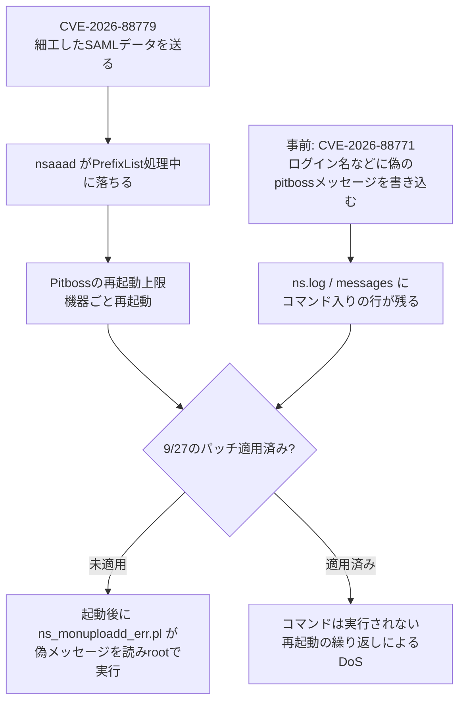

# Citrix NetScaler CVE-2026-88779 ― SAML署名の正規化処理で認証デーモンが落ちる、「ただのDoS」が再起動トリガーとして悪用された

## 要点

### 影響バージョン

- SAMLを使う構成（SAML SPとして `add authentication samlAction`、またはSAML IdPとして `add authentication samlIdPProfile` が設定されている）のNetScaler ADC／NetScaler Gatewayが対象（Citrix CTX697174）。
- 14.1 は **14.1-73.41**、13.1 は **13.1-64.28**、14.1-FIPS は **14.1-73.41 FIPS**、13.1-FIPS／NDcPP は **13.1-37.282** で修正（Citrix CTX697174）。
- 9月27日の緊急パッチ（14.1-73.37、13.1-64.23 など）を当てた機器も影響を受ける。CitrixはSAMLを使っている場合は**もう一度更新する**よう求めている（BleepingComputerが伝えるCitrixの説明）。
- CVSS v4.0 は 8.7（可用性のみHigh）、CWE-119。CISAは2026-10-04にKEVへ追加し、米連邦機関の期限は2026-10-07（CISA KEV）。

### 今すぐやること

- `ns.conf` に `add authentication samlAction` または `add authentication samlIdPProfile` があるかを確認し、あれば上記の修正版へ更新する。
- すぐ更新できない場合は、Citrixが配布しているGlobal Deny Listの更新を適用する（Citrixはあくまで一時的な緩和と位置づけている）。
- 9月27日のパッチを**まだ当てていない**機器は最優先で更新する。後述のとおり、今回のDoSは古いログ注入の欠陥（CVE-2026-88771）を「再起動で発火させる」用途に使われている（Beazley Security）。
- 更新前に `/var/log/ns.log*`・`/var/log/messages*`・`httpaccess` ログを保全し、偽のpitbossメッセージやシェル文字を含むログイン名がないか確認する。

## 概要

- 9月末に2件のRCEゼロデイ（CVE-2026-88771／88772）の緊急パッチを当てたNetScalerで、10月1日ごろから認証デーモン `nsaaad` が落ちて機器が再起動を繰り返す事象が報告され、Citrixは10月3日（米太平洋時間）に新しい脆弱性CVE-2026-88779として修正版を出した。
- 原因は細工したSAMLデータで、Beazley Securityによると `nsaaad` が署名の正規化（canonicalization）設定、具体的には長すぎる `InclusiveNamespaces` の `PrefixList` を処理する途中で落ちる。Citrixは可用性への影響のみで、顧客データの完全性への影響は確認していないとしている。
- 一方で、攻撃者はこのDoSを使って機器を強制的に再起動させ、未修正の機器ではログに仕込んだコマンド（CVE-2026-88771）を起動直後にroot権限で実行させようとしていた、とBeazley Securityは報告している。

> この記事では、ベンダー・公的機関・研究者・報道で確認できた内容を「事実」、筆者の推測や意見を「考察」として分けて書いています。

> 追記（2026-10-10）: SAMLを使う構成では、さらに新しい重大欠陥CVE-2026-107406の修正版（14.1-73.46／13.1-64.29など）への再更新が必要になった。14.1-73.41／13.1-64.28はSAML IdPとして使っている場合に対象になる。詳細は[CVE-2026-107406の記事](/security-notes/notes/2026-10-10-netscaler-saml-cve-2026-107406-memory-overflow-rce/)を参照。

## 何が起きたか（時系列）

| 日付 | 出来事 |
| --- | --- |
| 2026-09-27 | CitrixがCTX697096で8件の脆弱性を修正し、CVE-2026-88771／88772の悪用を確認。修正版は14.1-73.37、13.1-64.23など（Beazley Security）。この件は[既存記事](/security-notes/notes/2026-10-01-citrix-netscaler-cve-2026-88772-88771/)で扱った |
| 2026-10-01（木、米国時間） | Redditで、14.1-73.37に更新済みの複数の機器が強制再起動を繰り返すと報告される。`nsaaad` が落ち続け、プロセス監視のPitbossが再起動上限に達して機器ごと再起動する症状（BleepingComputer） |
| 2026-10-02 | CitrixがSAML認証に関する「新たに観測された問題」の告知を出し、既知の脆弱性とは別物と説明（BleepingComputer、Beazley Security） |
| 同時期 | Kevin Beaumont氏が、パッチ済みのハニーポットが複数のIPからの要求で落ちると報告。のちに1台でダウンロードされたマルウェアが動いていたと述べる。watchTowrは脆弱性を再現したと公表（BleepingComputer、Decipher） |
| 2026-10-03（米太平洋時間） | CitrixがCTX697174を公開し、CVE-2026-88779と修正版（14.1-73.41ほか）を発表（Citrix） |
| 2026-10-04 | CISAがKEVに追加（期限10-07、フォレンジックによるトリアージ要）。Beazley SecurityがDoSと確認し、再起動を使った攻撃を報告（CISA、Beazley Security） |

## 技術的な問題点（根本原因）

**事実（Citrix）**

- CTX697174の説明は「Memory overflow vulnerability leading to Denial of Service」。前提条件はSAML SPまたはSAML IdPとして構成されていること。CVSS v4.0のベクタは `AV:N/AC:L/AT:N/PR:N/UI:N/VC:N/VI:N/VA:H`で、認証なしで到達でき、影響は可用性のみと評価されている。
- Citrixは、繰り返し発生させるとサービスが使えない状態が続き得ること、顧客データの完全性への影響は確認していないことを説明している（BleepingComputer、Decipherが引用）。謝辞はBishop FoxとwatchTowr。

**事実（Beazley Security）**

- 攻撃者が細工したSAMLデータで発生し、`nsaaad` が署名の正規化設定、具体的には長すぎる `InclusiveNamespaces` の `PrefixList` を処理する途中で落ちる。
- 9月27日のパッチを当てた機器でコード実行が起きた証拠は見つかっていない。

**考察**

`InclusiveNamespaces PrefixList` はXML署名で使う排他的XML正規化（Exclusive XML Canonicalization）の仕様にある属性で、正規化のときに残す名前空間の接頭辞を空白区切りで並べるものである。SAMLの応答やリクエストでは、署名を検証するためにこの正規化を**署名の検証より前に**行う必要があるため、そこでの欠陥は「信頼できるかどうかを判断する前に、攻撃者が書いたXMLを解析する」位置にある。今回のように認証なしで届くのはそのためで、SAMLを有効にした時点で認証画面の前に大きな解析器を公開していることになる。CitrixはDoSと分類しているが、メモリ境界の欠陥であることは変わらず、Beaumont氏も過去のCVE-2025-6543が当初DoSとされ後にRCEとして悪用された例を挙げている（BleepingComputer）。続報で評価が変わる可能性は残る。

## 攻撃・侵入経路

**事実（Beazley Security）**

- CVE-2026-88771は、rootで動く保守用スクリプト `ns_monuploadd_err.pl` が、Pitboss（NetScalerのプロセス監視）の「missed too many heartbeats」「unexpectedly died」というログを探し、その行の文字列を無害化せずにシェルコマンドへ渡す欠陥。ログイン名やUser-Agentはログに残るため、認証なしで偽のpitbossメッセージを書き込める。watchTowrによると、このスクリプトは定期的に動き、実行まで最大24時間ほど遅れることがある。
- 攻撃者は、すでに偽のpitbossメッセージを仕込んだ機器に対してCVE-2026-88779で再起動を強制していた。未修正の機器では、起動後に `ns_monuploadd_err.pl` がそのメッセージを読み、埋め込まれたコマンドをrootで実行する。
- 10月2日ごろの第2波では、`pitboss PPE unexpectedly died NSPPE;<コマンド>;# X` 形式の注入で、FreeBSD向けにビルドされたSliver（オープンソースのC2フレームワーク）のインプラントを取得・実行させる試みが観測された。

**事実（BleepingComputer）**

- ある管理者は、14.1-73.37の機器で、ペイロードを `213.209.159[.]55` から取得して `/v` に保存・実行するシェルコマンド入りのログイン名を確認した。この要求は `nsaaad` の3回のクラッシュの直前に複数のSAML認証要素へ送られていた。ただし、その管理者はコマンドが実際に実行されたことは確認していないと強調している。

**考察**

報告が食い違っている点は分けて読む必要がある。Beaumont氏はパッチ済みのハニーポットでマルウェアが動いていたと述べ、Beazley Securityはパッチ済みの機器でコード実行の証拠はないとしている。手元の材料では、どちらが正しいか、あるいはハニーポットが別経路で侵害されたのかは判断できない。確かなのは、**DoSが「ログ注入の時限装置を今すぐ動かすスイッチ」として使われた**という攻撃者の使い方で、最大24時間の遅れを再起動で縮めている。

## なぜ防げなかったか・構造的要因の考察

ここからは筆者の考察である。

1. **緊急パッチの直後に同じ機器が再び狙われる**: 9月末のゼロデイで研究者と攻撃者の目がNetScalerに集中し、周辺の機能（今回はSAML）まで一斉に掘られた。1つの緊急パッチで終わりにせず、同じ製品で続けて欠陥が見つかる前提で、再更新できる手順と保守時間を確保しておく必要がある。
2. **「可用性だけ」という分類の落とし穴**: CVSSでは可用性のみの評価でも、再起動が別の欠陥の発火条件になれば、実際の影響はコード実行に近づく。DoSを優先度の低い脆弱性として後回しにすると、このような組み合わせを見落とす。
3. **ログを信頼する保守スクリプト**: 88771の根本は、攻撃者が書けるログを、rootのスクリプトが命令のように扱っていたことにある。機器の内部では「ログは自分が書いたもの」という前提が崩れていた。
4. **SAMLは認証の前に大きな解析器を公開する**: SAMLのSPやIdPを有効にすると、XML署名の正規化や検証というかなり複雑な処理が、未認証の通信に対して動く。境界機器にとって攻撃面が大きい機能であることを、構成を選ぶ時点で意識しておきたい。

## 運用者向けの具体的な対策と検知ポイント

**対策**

- SAMLを構成しているかを確認する（Beazley Securityの例: `grep -qE '^add authentication saml(Action|IdPProfile)' /flash/nsconfig/ns.conf`）。該当すれば14.1-73.41／13.1-64.28などへ更新する。
- 9月27日のパッチ（14.1-73.37など）が未適用の機器は、今回の修正版で両方をまとめて塞ぐ。仮想アプライアンスなら更新前にスナップショットを取り、証跡を残す（Beazley Security）。
- 更新までの間はCitrixのGlobal Deny Listを適用する。Secure Private Accessのハイブリッド構成で使うNetScalerも対象になる（Citrix）。
- パッチは既存のバックドアを消さない。88771／88772の侵害痕跡がある機器は、更新だけで済ませず再構築や認証情報の更新を検討する（Beazley Security）。

**検知ポイント**

- `nsaaad` のクラッシュと、Pitboss による再起動の繰り返し。特にSAML認証の要求の直後に起きているもの（BleepingComputer、Decipher）。
- ログ注入の痕跡（Beazley Securityの例）:
  - `` zgrep -E 'pitboss.*(IFS|b64decode|[;`|$])|authenticate user :pitboss' /var/log/ns.log* /var/log/messages* ``
  - `zgrep 'INDEX:' /var/log/httpaccess*.log*`（User-Agentに入れたbase64のペイロード）
  - `/var/cron/tabs/` や `/nsconfig/rc.netscaler`・`/nsconfig/nsafter.sh` の想定外の変更
- 本物の監視イベントでも「missed too many heartbeats」は記録されるため、その文言が**認証ログの行**にある、または `;`・バッククォート・`${IFS}` などのシェル文字と並んでいる場合に注目する（Beazley Security）。
- `213.209.159[.]55` など、Beazley Securityが公開している送信元・配布元への通信。

## 参考リンク

- Citrix: [Citrix NetScaler ADC and Citrix NetScaler Gateway Security Bulletin for CVE-2026-88779（CTX697174）](https://support.citrix.com/external/article/CTX697174/citrix-netscaler-adc-and-citrix-netscale.html)
- Citrix: [Understanding and Addressing CVE-2026-88779 in Citrix NetScaler ADC and Citrix NetScaler Gateway](https://community.citrix.com/techzone-blogs/110_security-updates/understanding-and-addressing-cve-2026-88779-in-citrix-netscaler-adc-and-citrix-netscaler-gateway/)
- CISA: [Known Exploited Vulnerabilities Catalog](https://www.cisa.gov/known-exploited-vulnerabilities-catalog)
- Beazley Security: [Citrix NetScaler Vulnerabilities Under Active Exploitation (CVE-2026-88771, CVE-2026-88772, & CVE-2026-88779)](https://labs.beazley.security/advisories/BSL-A1216)
- BleepingComputer: [Citrix patches NetScaler SAML zero-day exploited in attacks](https://www.bleepingcomputer.com/news/security/citrix-patches-netscaler-saml-zero-day-exploited-in-attacks/)
- Decipher: [New Citrix NetScaler Issue Emerges](https://decipher.sc/2026/10/03/new-citrix-netscaler-issue-emerges/)
- 関連記事: [Citrix NetScaler ADC/Gateway CVE-2026-88772/88771 悪用](/security-notes/notes/2026-10-01-citrix-netscaler-cve-2026-88772-88771/)
