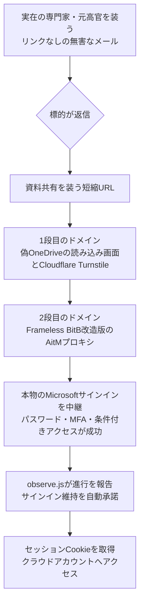

# TA419 ― 元米政府高官やAnthropic社員を装ってAI政策の専門家に接近、MFAごとセッションを奪うAitMフィッシング

## 要点

### 影響バージョン

- 製品の脆弱性ではなく、Microsoft 365／Entra IDのアカウントを狙う標的型の認証情報フィッシング。パスワード、MFAのワンタイムコード、条件付きアクセスの確認を通した後のセッションCookieが奪われる（Proofpoint）。
- 標的はAI政策に関わる米国のシンクタンク・大学・法律事務所の専門家。TA419は2025年4月以降、米国と**日本**のシンクタンク、防衛関連企業、大学、法律事務所の関係者を継続的に狙っている（Proofpoint）。
- 2026年には日本台湾交流協会（`tw-koryu[.]org`）や小泉進次郎防衛相の公式サイト（`shinjirou[.]info`）を装うドメインも登録・使用された（Proofpoint）。

### 今すぐやること

- 政策・防衛・安全保障分野の組織は、パスキーなど**接続先のドメインに結び付いた**フィッシング耐性のある認証へ移行する（Proofpointの推奨）。
- 面識のない専門家や元高官からの「委員会への参加依頼」「報告書への協力依頼」は、別の連絡手段で本人確認してからリンクを開く（Proofpointの推奨）。
- Proofpointが公開した送信元アドレス・ドメイン（後述）を、メールゲートウェイ・プロキシ・DNSのログで照合する。

## 概要

- Proofpointは、中国寄りでスパイ活動を目的とする攻撃者TA419が、2026年7月に元ホワイトハウス科学技術政策局（OSTP）の幹部や著名な経済学者を装い、米国のAI政策の専門家に認証情報フィッシングを仕掛けたと報告した。2月にはAnthropicの上級社員を装った例もあった。
- 最初のメールにはリンクがなく、返信してきた相手にだけ短縮URLを送る。リンクの先は偽のOneDrive画面で、オープンソースのBrowser-in-the-Browserキット「Frameless BitB」を改造したAitM（中間者）プロキシが本物のMicrosoftのサインインを中継し、MFAを通した後のセッションCookieを奪う。
- 独自の監視スクリプトは被害者がサインインのどの段階にいるかを攻撃者に送り、「サインインしたままにする」を自動で選び、ワンタイムコードを自動送信する。Proofpointは、米国のAI政策や輸出規制の動向を把握するという中国の情報収集目的に沿った活動と評価している。

> この記事では、ベンダー・公的機関・研究者・報道で確認できた内容を「事実」、筆者の推測や意見を「考察」として分けて書いています。

## 何が起きたか（時系列）

| 時期 | 出来事（すべてProofpointによる） |
| --- | --- |
| 2025年4月以降 | TA419が米国・日本のシンクタンク、防衛関連企業、大学、法律事務所の関係者を狙う認証情報フィッシングを継続 |
| 2025年12月〜2026年5月 | ファイル共有やクラウドサービス風のドメインが次々に観測される（`sharehub[.]space`、`publicsharefile[.]cloud`、`smartsyncbox[.]com` など。日付は指標の初観測時期） |
| 2026年2月 | Anthropicの上級社員を装い、件名「Request for Feedback on Military Integration of Claude」で米シンクタンクのAI政策アナリストを狙う。同月、小泉防衛相の公式サイトを装う送信ドメイン `shinjirou[.]info` を初観測 |
| 2026年3月 | ヘリテージ財団を装う送信ドメイン `heritiages[.]org`／`heritiage[.]org` を初観測 |
| 2026年5月 | 日本台湾交流協会を装う送信ドメイン `tw-koryu[.]org` を初観測 |
| 2026-07-08以降 | 元OSTP首席副局長のLynne Parker氏、続いて経済学者のHeidi Crebo-Rediker氏を装い、AI政策の専門家に接触 |
| 2026年10月初め | Proofpointが報告を公開。Help Net Security（10-02）、The Hacker News などが報道 |

## 技術的な問題点（根本原因）

**事実（Proofpoint）**

- AitMの対象は、Microsoft 365／Entra IDのファーストパーティアプリOfficeHome（`client_id=4765445b-32c6-49b0-83e6-1d93765276ca`）を使ったサインイン。基盤はFrameless BitBで、BitBの重ね表示、Microsoft 365用のEvilginxのphishlet、プロキシしたページにキットを差し込むサーバー側の置換ルールを含む。
- 被害者が見るのは、リアルタイムに中継された本物のMicrosoftの `/common/oauth2/v2.0/authorize` の応答で、プロキシはそこへ `/secondary/script.js` と `/secondary/observe.js` を差し込む。パスワード、MFAコード、条件付きアクセスの確認はすべて本物のMicrosoftに対して成功し、その結果のセッションCookieを攻撃者が取得する。
- `/secondary/script.js` はShadow DOMの中に、攻撃者のOneDriveに置いたおとり文書のフォルダー一覧を表示する。`/primary/script.js` は文書のクリックや、OneDrive自身の「権限がありません」バナーをきっかけに、Chromeのウィンドウに見せかけた偽のサインイン画面を出す。
- `/secondary/observe.js` は独自のスクリプトで、被害者がサインインのどの段階にいるかを攻撃者に送ってセッションをリアルタイムで見せ、「サインインしたままにする」を自動で承諾し、ワンタイムコードが有効と確認された時点で自動送信する。

**考察**

根本にあるのは、パスワードもワンタイムコードも「人が読んで入力できる」秘密だという点である。入力先が本物か偽物かを判断するのは人の目だけで、BitBはその判断材料であるアドレスバーごと偽物を描く。AitMは本物のMicrosoftと通信しているので、MFAも条件付きアクセスも正しく動いたうえで、その結果のCookieが持ち出される。パスキーのように認証がドメインに結び付いた方式なら、偽ドメインでは署名が作られないため、この中継は成立しない。Proofpointが「origin-bound」と強調しているのはこの性質である。

## 攻撃・侵入経路

**事実（Proofpoint）**

- 最初のメールは「AI Policy Advisory Committee」への参加や、上院外交委員会のAI輸出規制とサプライチェーンに関する報告書への協力を依頼する内容で、返信を引き出すことが目的。
- 返信した相手には短縮URLを送る。1段目の攻撃者ドメインは偽のOneDrive読み込み画面の裏でCloudflare Turnstileの確認を行うフィルターで、通過した相手だけを2段目のAitMページへ送る。7月の2つの活動では1段目に `driftshare[.]co`、2段目に `globalfileshareplatform[.]com` が使われた。
- ドメインはCloudflareのCDNの背後に置かれ、主にNameSiloで登録されている。メールの最初の `Received` ヘッダーから、攻撃者が使ったとみられるVPS（例: `108.61.163[.]187`）が見えた例があり、それらのサーバーは高位ポートで同じ自己署名証明書（`O=Castro Inc`, `CN=CI`）を使っていた。住宅用プロキシ経由で送られた例もある。

**考察**

Turnstileの確認は、セキュリティ製品のクローラーやサンドボックスに2段目を見せないための関門として働く。リンクを返信の後にしか送らない手順も、最初のメールをメールゲートウェイで判定させないための工夫で、一般的なURL検査が効きにくい。

## なぜ防げなかったか・構造的要因の考察

ここからは筆者の考察である。

1. **信頼を先に作る手順**: 最初のメールに悪いものが何も入っていないため、技術的な検査では止まらない。研究者や政策担当者は、外部からの協力依頼に応じることが仕事の一部で、断りにくい依頼が選ばれている。
2. **MFAの「種類」の差**: SMSやアプリのワンタイムコード、プッシュ承認はAitMに中継される。MFAを導入済みという事実だけでは、この手口への耐性は判断できない。
3. **個人と組織の境界**: シンクタンクや大学の専門家は、組織の管理が薄い環境や外部との共同作業の中にいることが多い。所属組織のメール防御が強くても、個人宛ての連絡や共有アカウントから入られる余地がある。
4. **日本も対象に入っている**: TA419は日本のシンクタンクや防衛関連も狙い、日本台湾交流協会や防衛相のサイトを装うドメインを使っている。AI政策に限らず、安全保障や対中政策に関わる日本の組織や個人も、同じ手口の対象として考えておく必要がある。

## 運用者向けの具体的な対策と検知ポイント

**対策**

- パスキー（FIDO2）など、ドメインに結び付いたフィッシング耐性のある認証方式を、まず政策・研究・役員など狙われやすい人から必須にする（Proofpointの推奨）。
- 外部の専門家を名乗る依頼は、公開されている所属先の連絡先など、メールとは別の手段で確かめる（Proofpointの推奨）。
- （考察）セッションの長期化を許す「サインインしたままにする」の扱いや、セッションの有効期間・再認証の条件を見直す。observe.jsがこの選択を自動承諾している点から、奪ったセッションをできるだけ長く使う意図が読み取れる。

**検知ポイント**

- Proofpointが公開した指標との照合:
  - 送信元アドレス: `leparker@mail[.]com`、`hcrediker@mail[.]com`、`hcrediker@outlook[.]com`
  - 1段目のドメイン: `driftshare[.]co`、`quickfly[.]online`、`cirrushare[.]co`、`goshshare[.]online`、`synchvault[.]co`、`msfile[.]online`、`winsync[.]cloud`、`sharehub[.]space`
  - 2段目のドメイン: `globalfileshareplatform[.]com`、`smartsyncbox[.]com`、`mypublicshare[.]com`、`cloudsyncpulse[.]com`、`onecloudfilesync[.]com`、`publicsharefile[.]cloud`、`fileswiftonline[.]cloud`
  - なりすまし用の送信ドメイン: `tw-koryu[.]org`、`heritiages[.]org`、`heritiage[.]org`、`shinjirou[.]info`
  - 証明書（`O=Castro Inc`）のSHA256: `b314a1499cd728ca3e54b7150661fd0c7d2279065fe3f570f0f66c395d744460`
- （考察）Entra IDのサインインログで、OfficeHomeアプリへのサインインの直後に、別のIPアドレスや地域から同じセッションが使われていないかを見る。AitMでは、サインインの送信元（攻撃者のプロキシ）と、その後のCookieの利用元が利用者本人の環境と一致しないことが多い。
- （考察）ファイル共有風の新しいドメインへの短縮URL経由のアクセスで、直後にMicrosoftのサインインが発生している通信。

## 参考リンク

- Proofpoint: [Hallucinating Credibility: China-Aligned TA419 Impersonates its Way into US AI Policy Circles](https://www.proofpoint.com/us/blog/threat-insight/hallucinating-credibility-china-aligned-ta419-impersonates-its-way-us-ai-policy)
- The Hacker News: [China-Aligned TA419 Targets U.S. AI Policy Experts With Microsoft AitM Phishing](https://thehackernews.com/2026/10/china-aligned-ta419-targets-us-ai.html)
- Help Net Security: [Chinese spies impersonate White House, Anthropic figures to phish AI policy experts](https://www.helpnetsecurity.com/2026/10/02/china-aligned-ta419-phishing-ai-policy-experts/)
