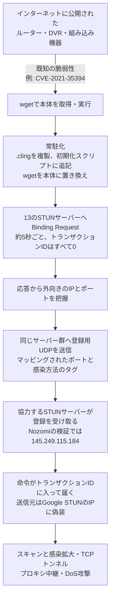

# Cling（ClingSTUN）― 公開STUNサーバーとのやり取りに命令を紛れ込ませ、GoogleのSTUNを装って届くIoTボットネット

## 要点

### 影響バージョン

- 特定の製品の新しい脆弱性ではない。修正済みの既知の脆弱性を突いて、インターネットに公開されたルーター、DVR（監視カメラの録画機）、組み込み機器などのLinux機器に感染する（Nozomi Networks、FortiGuard Labs）。
- Nozomi Networksが最初に観測した侵入経路は、Realtek Jungle SDKの診断用コンポーネント（`UDPServer`）のコマンド実行の脆弱性CVE-2021-35394。Realtekの部品は多くのルーター、アクセスポイント、中継器に組み込まれ、更新されないまま残りやすい（Nozomi Networks）。
- FortiGuard Labsは、ほかにD-Link、Tenda、TP-Link（Archer AX21）、AVTECH、EnGenius、Lantronix、MeiG、Hytec、Sunhillo、Linearの機器と、Ivanti Connect Secure／Policy Secure（CVE-2023-46805、CVE-2024-21887）の脆弱性も侵入に使われたと報告している。
- 感染した機器は、自分でさらに7件の脆弱性（Realtek、MVPower、TBK、Linksys、LB-LINK、China Mobile、KGUARD）を突いて広がる（FortiGuard Labs）。

### 今すぐやること

- インターネットに公開しているルーター、DVR、カメラ、組み込み機器を洗い出し、後述のCVEに該当する機器を更新する。更新できない機器は、外部からの接続を制限するか、分離した区画に置くか、入れ替える（両社の推奨）。
- Ivanti Connect Secure／Policy Secureを使っている組織は、CVE-2023-46805／CVE-2024-21887の修正が入っているかを改めて確認する。
- ネットワーク監視で、短い間隔で繰り返されるSTUNのBinding Requestのうち、トランザクションIDがすべて0のもの、STUNサーバー宛てのSTUNの形式に合わないUDPデータグラムを探す（Nozomi Networksの推奨）。
- 機器の中に `/root/.cling`、`/usr/local/bin/.cling`、初期化スクリプトへの追記、`wget.r`／`wget.p` が残っていないかを確かめる（Nozomi Networks）。

## 概要

- Nozomi Networksは10月1日、Realtek Jungle SDKの脆弱性CVE-2021-35394を狙う通信の急増を追ううちに、命令のやり取りにSTUN（NAT越えのための標準プロトコル）を使うボットネット「Cling」を見つけたと報告した。FortiGuard Labsも10月5日に同じマルウェアを「ClingSTUN」として報告した。
- Clingは公開されているSTUNサーバーに定期的に問い合わせて、自分の外向きのIPアドレスとポートを調べ、その情報を登録用のUDPパケットとして同じサーバー群に送る。命令は、STUNの応答のうち本来は乱数が入る「トランザクションID」の12バイトに埋め込まれて届く。
- Nozomiの検証では、命令はGoogleのSTUNサーバー（`stun.l.google.com`）のIPアドレスを送信元に偽装して届いていた。通信だけ見ると、信頼されている有名サービスとの普通のNAT越えのやり取りに見える。

> この記事では、ベンダー・公的機関・研究者・報道で確認できた内容を「事実」、筆者の推測や意見を「考察」として分けて書いています。

## 何が起きたか（時系列）

| 時期 | 出来事 |
| --- | --- |
| 2026年9月5日ごろ以降 | CVE-2021-35394を狙う通信が急増し、その一部がClingを配っていた（The Hacker NewsによるNozomi Networksの報告の要約。Nozomiの報告にも観測数の急増を示す図がある） |
| 2026年9月〜10月 | FortiGuard Labsが3つの時期にわたる配布を観測。最初はHytecのルーターの脆弱性CVE-2022-36553経由で `124[.]163[.]212[.]119` から（2日間だけ）、次に `222[.]223[.]152[.]97`、最新は `118[.]145[.]196[.]225` から配布 |
| 2026-10-01 | Nozomi Networksが報告「A STUNning Disguise: Cling Malware Masquerades as Google」を公開 |
| 2026-10-05 | FortiGuard Labsが報告「ClingSTUN Linux Backdoor Abuses Public STUN Infrastructure」を公開。The Hacker News、SecurityWeekが報道 |

## 技術的な問題点（根本原因）

**事実（Nozomi Networks）**

- CVE-2021-35394は、Realtek Jungle SDKの診断用コンポーネント（一般に `UDPServer` としてビルドされる）のリモートコード実行の脆弱性。`orf;` で始まるUDPデータグラムを送ると、その後ろのシェルコマンドが機器上で実行される。観測された攻撃では、BusyBoxの `wget` で実行ファイルを取ってきて実行権限を付け、感染方法を示すタグ（例: `realtek.selfrep`）を引数にして起動していた。
- 脆弱性自体は数年前のものだが、該当するSDKの部品が多くのIoT機器やネットワーク機器に組み込まれ、更新されないまま何年も残るため、今も広く悪用されている。

**事実（FortiGuard Labs）**

- FortiGuard Labsは、ClingSTUNの活動から、修正の遅れ、サポートの切れたファームウェア、不要に公開されたサービスといった基本的な衛生管理の穴が見えると指摘している。

**考察**

根本にあるのは、ひとつの脆弱な部品（Realtekの診断用UDPサービス）が多くのメーカーの製品に組み込まれ、利用者がそれを知る手段も更新する手段も持たないという、組み込み機器の供給の構造である。Clingが新しいゼロデイを使っていないことは重要で、侵入に使われた脆弱性はすべて修正や公表から時間がたったものだ。それでも感染が広がるのは、機器の側が更新されていないからである。

## 攻撃・侵入経路

**事実（Nozomi Networks。分析対象はMIPS版のサンプル `3b0ac6aaabb3bf8058ca14f9c8ccc613cfa3ea71`）**

- 二重起動を防ぐため、`SO_REUSEADDR` を付けてポート33957にソケットをバインドし、失敗したら終了する。
- 自分を `/root/.cling` と `/usr/local/bin/.cling` に複製し、`/etc/inittab`、`/etc/init.d/rcS`、`/etc/rc.d/rc.boot` に追記して、SysVやBusyBoxの起動時に実行されるようにする。
- もう一つの常駐の方法として、`wget` を `wget.r` に移し、その場所を `wget.p` に書いたうえで、`wget` を自分自身に置き換える。以後、cronや保守作業、ほかの攻撃者が `wget` を呼ぶたびにマルウェアが再実行され、本物の `wget` にも引数を渡すので動作は変わらないように見える。
- 約5秒ごとに13のSTUNサーバーへBinding Requestを送る。RFC 8489に反して、トランザクションIDは乱数ではなくすべて0になっている。13のサーバーはいずれもVirusTotalで悪い評判がなく、大半は公開のSTUNサーバー一覧に載っている。
- 応答で得た外向きのポートと感染方法のタグ（`argv[1]`）を、STUNの形式に合わない独自のUDPデータグラムとして13のサーバーすべてに送る。仕様どおりのサーバーはこれを無視する。
- 13のうち `145.249.115[.]184` だけが、応答でトランザクションIDを返さずすべて0を返した。Nozomiは、サーバーごとに異なるポートを申告する偽の感染端末を作り、このサーバーにだけ申告したポートに数時間後C2からの命令が届いたことで、このサーバーがボットネットの運用者と通じていると確認した。
- 命令はSTUNのBinding Success ResponseのトランザクションID（12バイト）に、命令と引数を埋め込んで届く。命令は、指定先からの取得と実行、IPv4空間のスキャンと脆弱性を突いた感染拡大、スキャンの停止、TCPトンネルの開始と停止、指定した中継サーバーとのプロキシ、その停止、指定時間のDoS攻撃（フラッド）。
- 命令を運ぶパケットの送信元は `74.125.250[.]129` で、`stun.l.google.com` が解決されるIPアドレスだった。Nozomiは、STUNサーバーに特定のトランザクションIDを中継させる正当な方法は知られていないこと、UDPで一方向の通信であること、正規の応答と命令入りの応答でIPのTTLの値が一貫して違うことから、送信元アドレスの検証をしていないネットワークから送信元を偽装して送っている可能性が最も高いとしている。
- 数日間の観測で、感染拡大の指示と、韓国のISP、シカゴ大学のクラスター、Minecraftサーバー2台へのフラッド攻撃の指示が届いた。感染拡大の指示では、`121[.]32.243.81:1337` からマルウェアを読み込むよう指定されていた。

**事実（FortiGuard Labs。分析対象はx86-64版の第2世代 `m.x86_64` と第3世代 `x86_64`）**

- 第3世代のダウンローダーは、`/proc/mounts` を調べて、プロセスに紐付いたマウントを外してそのプロセスを止め、`/tmp` から動いているプロセスも止める。先に入っているほかのマルウェアを追い出す動きである。
- `/dev/watchdog` と `/dev/misc/watchdog` を開いて、`ioctl` でウォッチドッグタイマーを止める（機器が自動で再起動して駆除されるのを防ぐ）。
- `/proc` を調べ、`/tmp` や `/var/tmp` から動き、コマンドラインと実行ファイル名が合わないプロセスを競合と見なして止める。
- 自分のコマンドライン引数を消して `ps` で空に見せ、root権限なら `/proc/1/` の情報を `/tmp` に写して、自分の `/proc/<pid>` の上にバインドマウントし、initプロセスに見せかける。
- 第2世代は24、第3世代は13の公開エンドポイントへ20バイトのSTUN Binding Requestを送る。その後、グループ識別子とマッピングされたポートの一覧を定期的に同じエンドポイントへ送る。FortiGuard Labsは、別の調整用サーバーへの登録は見つからず、運用者がどうやって外向きのマッピングを知り、NAT越しに命令を届けているかは確認できていないとしている。
- 20バイトの制御パケットを受け取ると、命令1では指定先へ別途TCPで接続し、受け取ったコマンドを実行する。

**考察**

両社の報告は大筋で一致しているが、命令の届き方については確かさに差がある。Nozomiは協力するSTUNサーバーと送信元の偽装を実験で確かめ、FortiGuard Labsは命令の経路を「未確認」としている。どちらの見方でも、防御側にとっての結論は同じで、「有名なSTUNサーバーとの通信だから問題ない」とは言えない。

## なぜ防げなかったか・構造的要因の考察

ここからは筆者の考察である。

1. **評判に頼る判定の盲点**: 多くのファイアウォールや監視の運用は、送信元や宛先の評判で通信をふるい分ける。Clingは正規の公開STUNサーバーと実際に通信し、命令はGoogleのSTUNのアドレスから来たように見せる。宛先の評判だけで判断する仕組みには、ほぼ見えない。
2. **STUNが「普通の通信」である環境**: Teams、Zoom、Webex、ブラウザーのWebRTCなどが日常的にSTUNを使うため、組織のネットワークではSTUNの通信が大量に流れている。そこに紛れたボットの通信を、量や宛先だけで見分けるのは難しい。
3. **送信元を偽装できるネットワークの存在**: 送信元アドレスの検証をしないネットワークが残っている限り、UDPでは「どこから来たか」を信用できない。これはインターネット全体の課題で、個々の組織だけでは解決できない。
4. **組み込み機器には監視の手段が少ない**: ルーターやDVRには、EDRのようなホスト側の監視を入れられないことが多い。中で `wget` が置き換えられても、利用者が気付く手段はほとんどない。Nozomiが、組み込み機器ではネットワーク側の監視が特に重要だとしているのはこのためである。
5. **日本の家庭や小規模拠点も対象になる**: 対象のCVEには、家庭用や小規模オフィス向けのルーター、監視カメラの録画機が多く含まれる。日本でも、同じメーカーの機器や、Realtekの部品を使った別ブランドの機器が使われている可能性がある。「自宅や店舗のルーターは関係ない」とは考えないほうがよい。

## 運用者向けの具体的な対策と検知ポイント

**対策**

- インターネットに公開している機器の台帳を作り、ファームウェアの版とサポートの状況を記録する。悪用が確認された脆弱性から優先して更新する（FortiGuard Labsの推奨）。
- 更新できない機器、サポートが終わった機器は、入れ替えるか分離する。不要に公開しているサービス（管理画面、UPnP、診断用のポートなど）は止めるか、接続元を制限する（両社の推奨）。
- （考察）Realtekの診断用サービスはUDPで動く。境界のファイアウォールで、機器へ外から届くUDPを必要なものだけに絞る。

**検知ポイント**

- ネットワーク:
  - トランザクションIDがすべて0のSTUN Binding Requestが、約5秒間隔で繰り返し送られている（Nozomi Networks）。
  - STUNサーバーのポート（3478、19302など）宛てに、STUNの形式に合わないUDPデータグラムが送られている（Nozomi Networks）。
  - IoT機器や組み込み機器から、普段と違う相手へのUDP通信や、定期的な死活監視のような通信が出ている（FortiGuard Labs）。
  - FortiGuard Labsは、公開STUNサーバーそのものを攻撃者の基盤と自動で見なさないよう注意を促している。STUNの通信は、不審なプロセスの動きや予期しないUDP接続と合わせて評価する。
- 機器の中:
  - `/root/.cling`、`/usr/local/bin/.cling` の存在
  - `/etc/inittab`、`/etc/init.d/rcS`、`/etc/rc.d/rc.boot` への見慣れない追記
  - `wget` が置き換えられ、`wget.r`、`wget.p` がある
  - ポート33957を使うプロセス（Nozomi Networks）
  - `/proc/<pid>` にバインドマウントがあるプロセス（FortiGuard Labsが示したプロセス隠しの手口から）
- 指標（両社の報告から抜粋）:
  - 協力していたSTUNサーバー: `145.249.115[.]184`（Nozomi Networks）
  - マルウェアの読み込み元: `121[.]32.243.81:1337`（Nozomi Networks）、`124[.]163[.]212[.]119`、`222[.]223[.]152[.]97`、`118[.]145[.]196[.]225`（FortiGuard Labs）
  - FortiGuardの検出名: `BASH/Mirai.AEH!tr.dldr`、`BASH/Dloader.P!tr`、`Linux/Agent.BHT!tr`
- 侵入に使われたCVE（FortiGuard Labs）: CVE-2025-34035（EnGenius）、CVE-2024-23625／CVE-2024-23624／CVE-2019-17621／CVE-2022-37055／CVE-2024-10915／CVE-2024-10914（D-Link）、CVE-2019-7256（Linear）、CVE-2021-35394（Realtek）、CVE-2023-1389（TP-Link）、CVE-2021-36380（Sunhillo）、CVE-2023-46805／CVE-2024-21887（Ivanti）、CVE-2024-46048／CVE-2024-35340／CVE-2024-32314／CVE-2024-32292／CVE-2024-32281／CVE-2022-35555／CVE-2022-26289（Tenda）、CVE-2022-36553（Hytec）、CVE-2024-7029（AVTECH）、CVE-2026-36356（MeiG）、CVE-2025-67038（Lantronix）
- 自己拡散に使うCVE（FortiGuard Labs）: CVE-2014-8361（Realtek）、CVE-2016-20016（MVPower）、CVE-2024-3721（TBK）、CVE-2025-34037（Linksys）、CVE-2023-26801（LB-LINK）、CVE-2023-41011（China Mobile）、CVE-2026-87827（KGUARD）。Nozomiが分析したサンプルには、ほかにEir D1000のCVE-2016-10372も含まれていた。

## 参考リンク

- Nozomi Networks: [A STUNning Disguise: Cling Malware Masquerades as Google](https://www.nozominetworks.com/blog/a-stunning-disguise-cling-malware-masquerades-as-google-)
- FortiGuard Labs: [ClingSTUN Linux Backdoor Abuses Public STUN Infrastructure](https://www.fortinet.com/blog/threat-research/clingstun-linux-backdoor-abuses-public-stun-infrastructure)
- The Hacker News: [Realtek Jungle SDK Exploit Attempts Deliver Cling Botnet With STUN-Based C2](https://thehackernews.com/2026/10/realtek-jungle-sdk-exploit-attempts.html)
- SecurityWeek: [Linux Backdoor Abuses STUN Protocol, Exploits Dozens of Flaws](https://www.securityweek.com/linux-backdoor-abuses-stun-protocol-exploits-dozens-of-flaws/)
