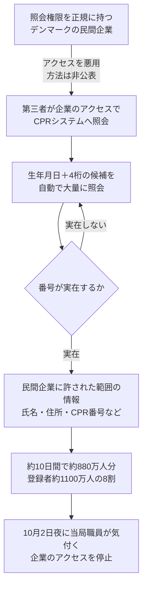

# デンマーク CPR（中央住民登録）― 民間企業の正規の照会権限が悪用され、約880万人分の氏名・住所・個人番号が抜かれた

## 要点

### 影響バージョン

- 製品の脆弱性ではない。デンマークの中央住民登録（CPR）で、民間企業に法律に基づいて認められていた照会のアクセスが、第三者に悪用された（デンマーク研究・教育・デジタル化省）。
- 対象は登録者約1100万人（国内の居住者のほか、国外へ転出した人、死亡した人を含む）のうち約880万人分。氏名、住所、CPR番号などが取得された（同省）。
- 氏名・住所の保護を申請して登録している人の氏名と住所は含まれない（同省）。
- データ保護庁（Datatilsynet）は、有効なCPR番号を割り出すために、非常に多くの自動照会が行われたと説明している。

### 今すぐやること

- デンマークの拠点や取引先、デンマークに住んだことのある従業員を持つ組織は、本人確認でCPR番号・氏名・住所を「本人しか知らない情報」として扱わない。相手がそれらを知っていても、パスワードや認証コードを電話やメールで伝えないよう周知する（同省の呼びかけ）。
- 外部にデータの照会APIを提供している組織は、取引先ごとの照会件数の上限、通常と違う量や順番の照会の検知、取引先の認証情報の保護を見直す（考察）。

## 概要

- デンマークのCPR当局は10月2日（金）の夜、9月中にCPRシステムで不規則な動きがあったことに気付いた。週末の調査で、第三者が約880万人分の氏名、住所、CPR番号などを不正に取得していたことがわかった。
- 第三者は、照会の権限を正規に持つデンマークの民間企業のアクセスを悪用し、民間企業に許された範囲の情報を照会していた。デジタル化相によると、悪用は9月のおよそ10日間続いた。当局は企業のアクセスを止め、警察が捜査している。
- 企業名、悪用された方法、誰が関わったかは公表されていない。デジタル化相は、この企業のアクセスを守る対策が十分でなかったと認め、CPRシステム全体のセキュリティ評価を指示した。全国民のCPR番号を振り直すかどうかは「まだ判断できない」としている。

> この記事では、ベンダー・公的機関・研究者・報道で確認できた内容を「事実」、筆者の推測や意見を「考察」として分けて書いています。

## 何が起きたか（時系列）

| 日付（現地） | 出来事 |
| --- | --- |
| 2026年9月 | 民間企業の正規の照会アクセスが、およそ10日間にわたって悪用される（デジタル化相がRitzauに説明、Berlingske） |
| 2026-10-02（金）夜 | CPR当局の職員が、9月中の不規則な動きに気付く（同省、Berlingske） |
| 2026-10-03（土）〜04（日） | セキュリティ事案であること、約880万人分が取得されたことがわかる（同省） |
| 2026-10-04（日） | CPR当局がデータ保護庁に届け出る（データ保護庁） |
| 2026-10-05（月） | 研究・教育・デジタル化省とCPR当局が公表。デジタル化相が議会の委員会に報告。データ保護庁が「CPR番号を割り出すための大量の自動照会」があったと公表。同日11:57、民間企業によるCPRへのアクセスを再開（CPR当局） |
| 2026-10-05 | BleepingComputer、TechCrunch、DRなどが報道 |

## 技術的な問題点（根本原因）

**事実（研究・教育・デジタル化省、CPR当局）**

- CPR法第38条により、正当な利益がある民間企業は、あらかじめ1人ずつ特定した人について、CPR番号、生年月日と氏名、または氏名と住所のいずれかで照会し、情報を受け取れる。受け取れる情報の範囲も同条で定められている。
- 今回の第三者は、ある民間企業のこの照会アクセスを使い、民間企業に許された範囲の情報を取得した。
- CPR番号は10桁で、先頭6桁が生年月日（日・月・西暦の下2桁）、後ろ4桁が通し番号。通し番号の1桁目と生年で生まれた世紀がわかり、最後の桁は性別を示す（CPR当局）。
- 2007年10月1日までは、すべてのCPR番号が「モジュラス11」と呼ばれる検査を満たしていた。一部の生年月日で番号が足りなくなったため、それ以降はこの検査を満たさない番号も発行されている（CPR当局）。

**事実（データ保護庁）**

- 有効なCPR番号を割り出すことを目的に、CPRシステムに対して非常に多くの自動照会が行われた。

**考察**

CPR番号は、生年月日がわかれば残りは4桁で、1日あたりの候補は最大1万通りしかない。生年月日を順に変えながら4桁を総当たりすれば、照会に答えるAPIそのものが「この番号は実在するか」を教えてくれる。この照会の仕組みは「あらかじめ特定した人について照会する」ことを前提にしているが、番号が推測できる以上、その前提を仕組みの側で確かめられない限り、総当たりと正規の照会の区別は件数と順番でしかつかない。ひとつの企業のアクセスで、登録者の8割にあたる件数が約10日間照会されても止まらなかったことから、企業ごとの照会件数の上限や、異常な量の照会を止める仕組みが働いていなかった、または十分でなかったとみられる。デジタル化相自身が、このアクセスの安全対策が十分でなかったと認めている。

## 攻撃・侵入経路

**事実（同省、データ保護庁、報道）**

- 悪用されたのは、デジタル化相の言葉では「小規模なデンマークの企業」のアクセス（Berlingske）。
- 企業自体が侵害されたのか、企業の関係者が関わったのか、認証情報が盗まれたのかは公表されていない。デジタル化相は、企業に犯罪の意図があったかについて、捜査を理由にコメントしなかった（Berlingske）。
- BleepingComputerは当局に企業がどう侵害されたかを問い合わせたが、記事の公開時点で回答はなかった。

**考察**

経路の可能性としては、企業のシステムへの侵入、企業に発行された照会用の認証情報の流出、企業の内部の人物による不正、の大きく3つが考えられるが、どれかは判断できない。どの場合でも、CPRの側から見えるのは「正規の企業が正規の認証で照会している」通信であり、認証の段階では止められない。止める機会があったのは、照会の量と中身を見る段階である。

## なぜ防げなかったか・構造的要因の考察

ここからは筆者の考察である。

1. **正規の権限は「内側」として扱われる**: 外部からの不正アクセスには多くの防御があっても、契約や法律で認めた取引先の照会は、信頼された通信として扱われやすい。攻撃者にとっては、自分で突破するより、アクセスを持つ誰かを乗っ取るほうが簡単である。オーフス大学の Jens Myrup Pedersen 教授もDRに対し、アクセスを持つ誰かを侵害してその権限を使うほうが、自力で入るより簡単だと指摘している。
2. **推測できる番号を鍵にした照会**: CPR番号は生年月日と短い通し番号でできており、もともと秘密にできる値ではない。それを照会の入力として受け付ける仕組みは、件数の制限がなければ、そのまま番号の総当たりに使える。
3. **件数の異常に気付けなかった**: 登録者の8割にあたる照会がひとつの企業から約10日間続き、気付いたのは発生後だった。デジタル化相も「これほど長い期間なら警告が出るべきだった」という指摘に同意している（Berlingske）。
4. **番号が「本人確認の材料」として使われてきた**: 当局は、相手が氏名・住所・CPR番号を知っていても信用しないよう呼びかけている。裏返せば、これまでこの3つを知っていることが本人らしさの根拠として使われる場面があったということで、流出の影響はその後の詐欺やフィッシングで現れる。Pedersen教授は、CPR番号を他人が知らないものと考える時代は「終わるべきだ」と述べている（DR）。
5. **日本の組織にとっての示唆**: 国の制度は違うが、取引先や委託先にデータの照会APIやシステムへのアクセスを渡している構図は日本の企業や自治体にも多い。正規の取引先の認証で来る大量の照会を、どこで止めるかを決めておく必要がある。

## 運用者向けの具体的な対策と検知ポイント

**対策**

- （考察）取引先や委託先に照会のアクセスを渡している場合は、取引先ごとに1日あたりの照会件数の上限を決め、上限を超えたら自動で止める。業務上の必要な件数から上限を逆算する。
- （考察）照会の入力が推測できる値（連番、生年月日を含む番号、会員番号など）の場合は、「存在しない」と「権限がない」を同じ応答にするなど、応答から実在を判定できないようにする。
- （考察）取引先に発行する照会用の認証情報を、送信元のIPアドレスの制限、クライアント証明書、定期的な更新などで守る。取引先のセキュリティ要件を契約で決め、確認する。
- デンマークに関係する従業員や顧客には、CPR番号・氏名・住所を知っている相手からの連絡でも、パスワードや認証コードを伝えないよう周知する。デンマークでは sikkerdigital.dk と電話相談窓口（Cyberhotline、+45 33 37 00 37）が案内されている（同省）。

**検知ポイント**

- （考察）取引先ごとの照会件数を日単位・時間単位で記録し、過去の水準から大きく外れた日を通知する。
- （考察）照会の入力が連続している（生年月日を順に変えている、通し番号を順に増やしている）、または「該当なし」の応答の割合が高い取引先は、総当たりを疑う。
- （考察）照会の時間帯や送信元が、取引先の通常の業務と合っているかを見る。

## 参考リンク

- デンマーク研究・教育・デジタル化省: [Omfattende uautoriseret adgang til borgeres CPR-oplysninger](https://ufm.dk/aktuelt/pressemeddelelser/2026/oktober/omfattende-uautoriseret-adgang-til-borgeres-cpr-oplysninger/)
- CPR当局: [Omfattende uautoriseret adgang til borgeres CPR-oplysninger](https://www.cpr.dk/cpr-nyt/nyhedsarkiv/2026/okt/omfattende-uautoriseret-adgang-til-borgeres-cpr-oplysninger)
- CPR当局: [Private virksomheders adgang til CPR er genetableret mandag den 5. oktober 2026 kl. 11:57](https://www.cpr.dk/cpr-nyt/nyhedsarkiv/2026/okt/private-virksomheder)
- データ保護庁: [Datatilsynet er opmærksom på sag om opslag i CPR](https://www.datatilsynet.dk/presse-og-nyheder/nyhedsarkiv/2026/okt/datatilsynet-er-opmaerksom-paa-sag-om-opslag-i-cpr)
- CPR当局: [Opbygning af CPR-nummeret](https://www.cpr.dk/cpr-systemet/opbygning-af-cpr-nummeret)
- CPR当局: [Personnumre uden kontrolciffer (modulus 11 kontrol)](https://www.cpr.dk/cpr-systemet/personnumre-uden-kontrolciffer-modulus-11-kontrol)
- Berlingske（Ritzau）: [Misbrug af CPR-adgang stod på i ti dage: Minister erkender svigt](https://www.berlingske.dk/politik/misbrug-af-cpr-adgang-stod-paa-i-ti-dage-minister-erkender-svigt)
- DR: [Professor: 'Det største brud nogensinde mod det danske CPR-register'](https://www.dr.dk/nyheder/indland/professor-det-stoerste-brud-nogensinde-mod-det-danske-cpr-register)
- BleepingComputer: [Denmark population registry data breach affects 8.8 million people](https://www.bleepingcomputer.com/news/security/denmark-population-registry-data-breach-affects-88-million-people/)
- TechCrunch: [Hackers steal 8 million citizens' records from Danish government database](https://techcrunch.com/2026/10/05/hackers-steal-8-million-citizens-records-from-danish-government-database/)
