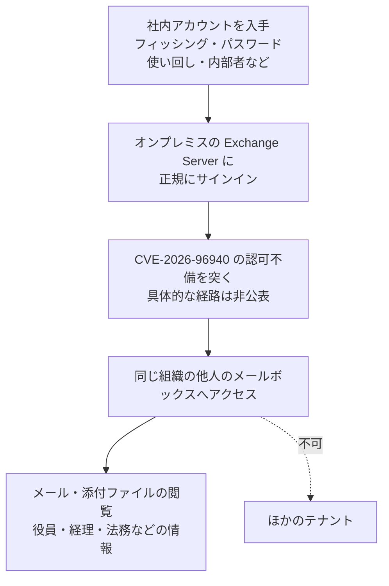

# Microsoft Exchange Server CVE-2026-96940 ― 社内の一般ユーザーが他人のメールボックスを読める認可の不備、予定より前倒しで「V2」更新を配布

## 要点

### 影響バージョン

- Exchange Server Subscription Edition（SE）RTM は、KB5129955（ビルド 15.02.2562.053）で修正（Microsoft）。
- Exchange Server 2019 CU15 は KB5129956（15.02.1748.053）、CU14 は KB5129957（15.02.1544.048）で修正（Microsoft）。
- Exchange Server 2016 CU23 は KB5129958（15.01.2507.075）で修正（Microsoft）。
- Exchange 2016／2019 はサポートが終了しており、この更新を受け取れるのは Period 2 の延長セキュリティ更新（ESU）プログラムに登録した組織だけ（Microsoft）。
- Exchange Online は、Microsoftがサービス側で対処済みで、利用者の作業は不要（Microsoft）。

### 今すぐやること

- オンプレミスの Exchange Server すべてと、Exchange 管理ツールだけを入れたサーバー・端末に、9月の「V2」セキュリティ更新を入れる。ハイブリッド構成で管理用にだけ残しているサーバーも対象（Microsoft）。
- Exchange Server Health Checker スクリプトで、更新の適用漏れや追加の手作業が必要かを確認する（Microsoft）。
- Exchange 2016／2019 を ESU なしで使っている組織は、この修正を受け取れない。Exchange SE への移行を急ぐ（Microsoft）。

## 概要

- Microsoftは米国時間10月2日、Exchange Server の権限昇格の脆弱性 CVE-2026-96940（CVSS 3.1 の基本値 8.8、深刻度「重要」）を公表した。Microsoftの説明は「Exchange Server の弱い認可により、認証済みの攻撃者がネットワーク経由で権限を昇格できる」。
- 悪用に成功した攻撃者は、同じ組織の他人のメールボックスにアクセスし、メールと添付ファイルを読める。テナントの境界を越えたアクセスはできない。
- 公表時点で悪用や詳細の公開は確認されていないが、Microsoftは「悪用される可能性が高い（Exploitation More Likely）」と評価している。修正は9月のセキュリティ更新に CVE-2026-96940 を加えた「V2」として、予定より前倒しで配布された。

> この記事では、ベンダー・公的機関・研究者・報道で確認できた内容を「事実」、筆者の推測や意見を「考察」として分けて書いています。

## 何が起きたか（時系列）

| 日付 | 出来事 |
| --- | --- |
| 2026年9月 | Microsoftが Exchange Server の9月のセキュリティ更新（最初の版）を配布（Exchange Team Blog） |
| 2026-10-02（米国時間） | Microsoftがセキュリティ更新ガイドで CVE-2026-96940 を公表。Exchange Team Blog で「September 2026 V2」セキュリティ更新を公開し、最初の版との違いは CVE-2026-96940 の追加だけと説明 |
| 2026-10-02 | Exchange Online にはサービス側の修正がすでに展開済みと説明（Microsoft） |
| 2026-10-05 | The Hacker News などが報道 |

## 技術的な問題点（根本原因）

**事実（Microsoft）**

- CVSS 3.1 のベクトルは `AV:N/AC:L/PR:L/UI:N/S:U/C:H/I:H/A:H`。ネットワーク経由で、低い権限（一般ユーザー相当）があれば、利用者の操作なしに攻撃できる。
- 脆弱性の種類は CWE-1390（Weak Authentication）に分類されている。説明文は「弱い認可（Weak authorization）」で、FAQでは影響を「同じ組織内の他人のメールボックスにアクセスし、メールと添付ファイルを読める」と説明している。
- Exchange Team Blog によると、脆弱性はMicrosoft社内で見つけたもので、悪用は確認していない。The Hacker News は、発見者として Microsoft の研究者 Jan Mitchell 氏の名前を挙げている。
- どのプロトコル（OWA、EWS、MAPI など）やどの処理に問題があるのかは公表されていない。

**考察**

公表されている情報からは、「認証は正しく通るが、そのユーザーが対象のメールボックスにアクセスしてよいかの確認が、どこかの経路で足りていない」種類の欠陥と読める。Exchange には、代理人のアクセス、共有メールボックス、偽装（impersonation）、管理者用のAPIなど、他人のメールボックスに触れる正規の仕組みが多い。その分、権限の確認が入る場所も多く、どれか一つに漏れがあると、社内の誰かのアカウントを奪った攻撃者が役員や経理のメールを読めるようになる。CVSS の完全性と可用性も「高」になっている理由は公表されておらず、読み取り以外の影響があるのかはわからない。

## 攻撃・侵入経路

**事実（Microsoft）**

- 攻撃の前提は、攻撃者が組織の Exchange に認証できること。テナントの境界は越えられない。
- 利用者の操作は要らない（`UI:N`）。

**考察**

最初の足掛かりは、フィッシングやパスワードの使い回しで奪った一般社員のアカウントで足りる。これまでのビジネスメール詐欺や標的型攻撃では、侵入したアカウントのメールボックスだけでなく、上司や経理担当者のやり取りを読むことに価値があった。この脆弱性は、その「次のメールボックス」へ進む手間を大きく減らす。悪用の詳細が公開されると、すでに社内アカウントを持っている攻撃者にとって使いやすい手段になる。

## なぜ防げなかったか・構造的要因の考察

ここからは筆者の考察である。

1. **オンプレミスとクラウドで修正の速さが違う**: Exchange Online はサービス側の修正で利用者の作業なしに守られたが、オンプレミスは各組織が更新を入れるまで脆弱なまま残る。修正の公開そのものが攻撃者に「ここに穴がある」と知らせるため、公開から適用までの日数がそのまま危険な期間になる。
2. **サポート終了後の版が残っている**: Exchange 2016／2019 はサポートが終わり、ESU に登録した組織だけが更新を受け取れる。ESU も Period 2 は2026年10月末までとされている。登録していない組織の 2016／2019 には修正が届かず、今後も同じ状況が続く。
3. **前倒しの配布は判断の重さを示す**: Microsoftは今回の更新を「予定より前倒しで公開した」と説明している。悪用は確認されていないとしつつ、定例を待たずに出したことは、修正の内容から悪用方法を推測されやすいなど、待つ危険が大きいと判断した可能性がある。理由は公表されていない。
4. **メールボックスは「社内なら安全」という前提**: 多くの組織は、社外からの攻撃に比べて、社内の一般ユーザーが他人のメールを読むことへの監視が薄い。認可の不備はこの前提を崩す。

## 運用者向けの具体的な対策と検知ポイント

**対策**

- すべての Exchange Server と、Exchange 管理ツールを入れたサーバー・端末に「September 2026 V2」セキュリティ更新を入れる。セキュリティ更新は累積なので、対応する CU を使っていれば最新の更新だけを入れればよい（Microsoft）。
- 更新後はサーバーを再起動し、すべての Exchange サービスが起動しているかを確かめる。無効のままのサービスがあれば、インストールが途中で止まった可能性がある（Microsoft）。
- ハイブリッド構成で、更新後に認証用の証明書を変えた場合は、ハイブリッド構成ウィザードを再実行する（Microsoft）。
- 既知の問題として、公開した予定表（.ics）が HTTP 500 を返す、韓国語のメールで ContentEngine がデッドロックする、の2件が挙がっている。該当する組織は影響を確かめてから展開する（Microsoft）。
- （考察）ESU のない Exchange 2016／2019 を使い続けている場合は、修正を受け取れない前提で、外部からの公開範囲を絞り、Exchange SE への移行計画を前倒しする。

**検知ポイント**

- 悪用の具体的な痕跡（通信の特徴やログの文字列）は公表されていない。
- （考察）メールボックス監査ログを有効にし、本人以外のアカウントによるメールボックスへのアクセスを確認する。特に、代理人や共有メールボックスの設定がないのに、一般ユーザーが他人のメールボックスを開いた記録に注意する。
- （考察）IISのログで、一般ユーザーのアカウントから、通常と違う量や時間帯の EWS／OWA へのアクセスがないかを見る。
- （考察）社内アカウントの侵害が疑われる場合は、そのアカウントのメールボックスだけでなく、同じ期間にほかのメールボックスへアクセスしていないかまで調査範囲を広げる。

## 参考リンク

- Microsoft セキュリティ更新ガイド: [CVE-2026-96940 Microsoft Exchange Server Elevation of Privilege Vulnerability](https://msrc.microsoft.com/update-guide/vulnerability/CVE-2026-96940)
- Exchange Team Blog: [Released: September 2026 V2 Exchange Server Security Updates](https://techcommunity.microsoft.com/blog/exchange/released-september-2026-v2-exchange-server-security-updates/4561718)
- Microsoft サポート: [KB5129957（Exchange Server 2019 CU14 向けV2更新）](https://support.microsoft.com/help/5129957)
- Microsoft: [Exchange Server Health Checker](https://microsoft.github.io/CSS-Exchange/Diagnostics/HealthChecker/)
- The Hacker News: [Microsoft Exchange Flaw Lets Authenticated Attackers Read Other Users' Mailboxes](https://thehackernews.com/2026/10/microsoft-exchange-flaw-lets.html)
