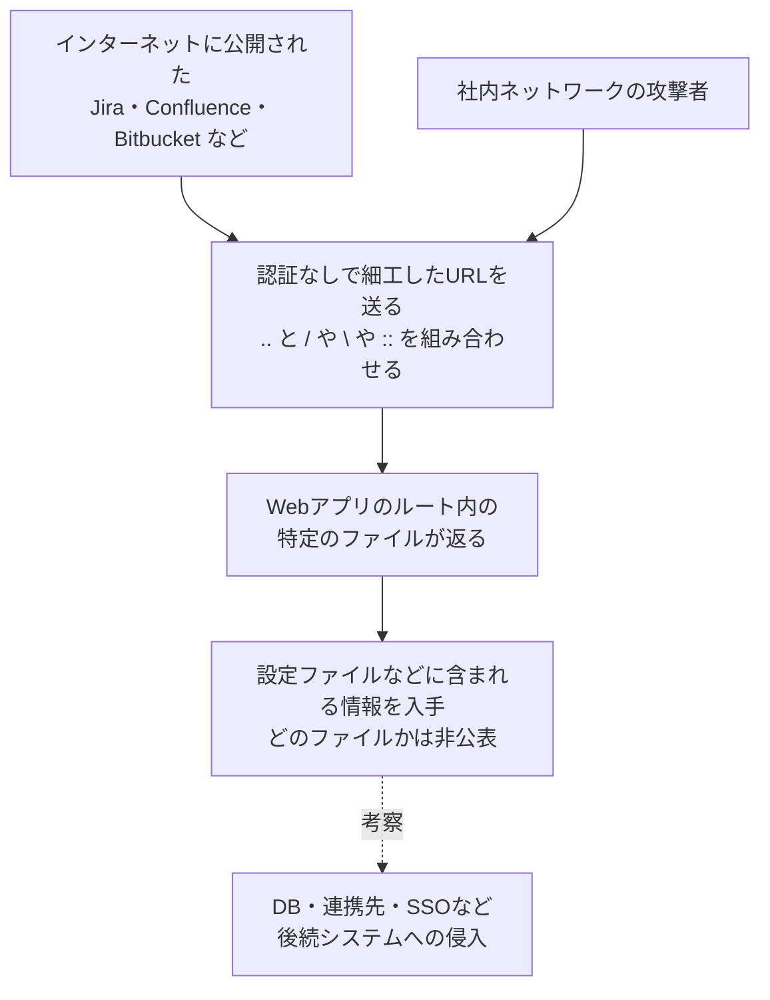

# Atlassian Data Center CVE-2026-21589 ― ログインなしでWebルート内のファイルを読める欠陥、Jira・Confluenceなど8製品の自前運用版が対象

## 要点

### 影響バージョン

- 対象は、自前で運用する次の8製品の、下記の修正版より前のすべてのバージョン。サポートが終わった版も含まれうる（Atlassian）。
- Bitbucket Data Center は 9.4.26／10.2.8／10.5.1、Confluence Data Center は 9.2.26／10.2.19 で修正（Atlassian）。
- Jira Software Data Center は 9.12.40／10.3.26／11.3.12、Jira Service Management Data Center は 5.12.40／10.3.26／11.3.12 で修正（Atlassian）。
- Bamboo Data Center は 10.2.24／12.1.12、Crowd Data Center は 6.3.7／7.0.3／7.1.7／7.2.4、Crucible と Fisheye は 4.9.15 で修正（Atlassian）。
- Atlassian Cloud の対象製品は修正済みで、利用者の作業は不要。Bitbucket Cloud は影響を受けない（Atlassian）。

### 今すぐやること

- 修正版（できればLTS版）へ更新する。すぐに全台を更新できない場合は、可能ならインスタンスをネットワークから外し、インターネットから届くものはログインが必要なものも含めて外部からの接続を制限する（Atlassian）。
- 更新までのつなぎとして、`..` が `/`・`\`・`::` と隣り合うURLを遮断するルールを、WAF・リバースプロキシ、Tomcat の RewriteValve、または Bitbucket の `urlrewrite.xml` に入れる。Atlassianは「パッチの代わりにはならない」としている（Atlassian）。
- アクセスログをURLデコード（最大2回）したうえで同じパターンを探し、過去に狙われていないかを確かめる（Atlassian）。

## 概要

- Atlassianは2026年10月5日、自前で運用する8製品（Bitbucket・Confluence・Jira Software・Jira Service Management・Bamboo・Crowd の各 Data Center 版と、Crucible・Fisheye）に共通する任意ファイルアクセスの脆弱性 CVE-2026-21589 を公表した。深刻度は「重大」で、CVSS 4.0 の値は 9.3。
- 認証されていない攻撃者が、Webアプリケーションのルートディレクトリにある特定のファイルを読める。読むにはファイル名とパスを正確に知っている必要があり、ディレクトリの中身を一覧することはできない。設定によっては機密性の高いファイルが置かれている場合がある。
- Cloud版は修正済みで、Atlassianの調査ではCloudで悪用の証拠は見つかっていない。自前運用のインスタンスについては「影響を受けたかどうかは確認できない」として、各組織にログの調査を求めている。

> この記事では、ベンダー・公的機関・研究者・報道で確認できた内容を「事実」、筆者の推測や意見を「考察」として分けて書いています。

## 何が起きたか（時系列）

| 日付 | 出来事 |
| --- | --- |
| 2024-11-12 | 米CISAが、Jira Server／Data Center の別のパストラバーサル CVE-2021-26086 を「悪用が確認された脆弱性」カタログ（KEV）に追加（CISA） |
| 2026-10-05 | Atlassianがセキュリティアドバイザリで CVE-2026-21589 を公表。製品ごとの修正版と3種類の一時的な遮断ルールを示す（Atlassian） |
| 2026-10-06（日本時間） | CVEレコードが公開される（CVE Program、UTCでは10月5日 21:30） |
| 2026-10-06 | The Hacker News、BleepingComputer が報道。The Hacker News は、CVEレコードと各製品のチケットで一部の修正版の番号が食い違っていると指摘 |

## 技術的な問題点（根本原因）

**事実（Atlassian）**

- 脆弱性の種類は「任意ファイルアクセス」。CVEレコードでは問題の種類を「Path Traversal (Arbitrary Read/Write)」としている。
- 認証のない攻撃者が、Webアプリケーションのルートディレクトリ内の特定のファイルにアクセスできる。ファイル名とパスを事前に知っている必要があり、一覧はできない。「設定によっては機密性の高いファイルがあり、危険が高まる」と説明している。
- CVSS 4.0 のベクトルは `AV:N/AC:L/AT:N/PR:N/UI:N/VC:H/VI:N/VA:N/SC:H/SI:H/SA:H`。ネットワーク経由で、権限も利用者の操作も要らない。脆弱なシステム自体への影響は機密性だけが「高」だが、後続のシステムへの影響は機密性・完全性・可用性のすべてが「高」になっている。
- 一時的な遮断ルールは、`..` が `/`・`\`・`::` のいずれかと隣り合うURLを、URLエンコードされた形（`%2e`、`%2f`、`%5c`、`%3a`、二重エンコードの `%25…` など）も含めて拒否するもの。

**事実（The Hacker News）**

- アドバイザリは、どのファイルが機密なのか、どの設定でそれが置かれるのか、後続システムへの影響を「高」とした理由を説明していない。
- CVEレコードは、Server 版（旧来の自前運用ライン）の Bamboo・Bitbucket・Confluence・Crowd も全バージョンを影響ありとし、修正版を挙げていない。アドバイザリには Server 版の記載がない。

**考察**

遮断ルールの中身から、URLのパスに `../` や `..\`、`..::` を混ぜ込み、Webアプリケーションが本来は返さない場所のファイルを読ませる、典型的なパストラバーサルと読める。`::` が対象に入っている点や、`;` や `%3b` も遮断の対象にしている点からは、Tomcat などのJavaのWebサーバーと、アプリ側でのパスの解釈がずれる箇所を突く形が想定されていると考えられる。ただし、具体的にどのURLのどの処理が問題なのかは公表されていない。

「Webルートの中だけ」「名前を知っている必要がある」という条件は、一見すると影響を小さく見せる。しかし、8製品はどれも配布物の構成が公開されているので、Webルートに置かれる設定ファイルやライブラリの場所は、製品とバージョンがわかれば推測できる。後続システムへの影響を「高」としていることは、読み出したファイルの中に、データベースや連携先へ入るための情報が含まれうるとAtlassianが見ている可能性を示している。これは推測で、Atlassianはそう説明していない。

## 攻撃・侵入経路

**事実（Atlassian）**

- 攻撃の前提は、インスタンスにHTTPで届くこと。ログインは要らない。
- Atlassianは、インターネットから届くインスタンスは、ログインが必要な構成でも外部からの接続を制限するよう求めている。

**事実（CISA、The Hacker News）**

- Atlassian製品では、Jira Server／Data Center の CVE-2021-26086（特定のファイルを読めるパストラバーサル）が過去に悪用され、CISAが2024年11月12日にKEVに追加している。

**考察**

同じ種類の欠陥が過去にKEV入りしていることから、今回も修正の差分や遮断ルールから攻撃方法が割り出され、インターネット上の広い範囲への探索が始まる可能性は高いと見ておくべきだ。Crowd はSSOの基盤として使われることが多く、Bitbucket はソースコードとCIの認証情報を抱え、Bamboo はビルドと配布の権限を持つ。8製品のうちどれか一つから読み出した情報が、ほかのシステムへの入り口になりうる。

## なぜ防げなかったか・構造的要因の考察

ここからは筆者の考察である。

1. **共通の土台に入った欠陥は全製品に広がる**: 8製品が同時に、しかも「全バージョン」が対象になったことは、製品ごとの機能ではなく、共通で使っている部品やWebの処理に欠陥があったことを示唆する。共通部品は一度直せば全製品が直る一方、欠陥が入ると全製品が同時に危険になる。
2. **「ログインが要るから大丈夫」が通用しない**: 社外の取引先や協力会社のために、ログイン画面をインターネットに公開しているJiraやConfluenceは多い。認証の前で起きる欠陥では、ログイン画面の公開そのものが攻撃面になる。Atlassianがログイン必須の構成でも外部からの接続を絞れと書いたのはこのためと考えられる。
3. **自前運用版の更新は各組織の手作業**: Cloud版は利用者の作業なしで直ったが、Data Center 版は各組織が更新するまで脆弱なまま残る。クラスタ構成では全ノード、Bitbucket ではミラーまで手を入れる必要があり、更新の負担が大きいほど、公開から適用までの空白が長くなる。
4. **公開情報の食い違いが判断を遅らせる**: The Hacker News が指摘したように、Crowd 7.1系や Bamboo の修正版の番号が、CVEレコードとチケットで食い違っている。Server 版がCVEレコードには載ってアドバイザリには載っていないなど、自社が対象かどうかを判断するための情報にも揺れがある。脆弱性管理ツールがCVEレコードの値を取り込むと、更新が足りないのに「対応済み」と表示される恐れもある。

## 運用者向けの具体的な対策と検知ポイント

**対策**

- 修正版、またはそれより新しいLTS版へ更新する。クラスタ構成では全ノードを更新する（Atlassian）。
- 修正版の番号は、CVEレコードではなくアドバイザリと各製品のチケット（BSERV-20604、CONFSERVER-104488、JRASERVER-79546、JSDSERVER-16809、BAM-26567、CWD-6610、CRUC-8741、FE-7583）で確かめる（考察。The Hacker News が番号の食い違いを指摘しているため）。
- すぐに更新できない場合は、次のどれかで遮断する（Atlassian）。
  - 全8製品: WAF またはリバースプロキシで、アドバイザリの正規表現にあてはまるURLを遮断する。
  - Confluence・Jira Software・Jira Service Management・Bamboo・Crowd: 各ノードを止めて、Tomcat の `server.xml` に RewriteValve を有効にし、`WEB-INF/rewrite.config` に遮断ルールを追加してから再起動する。
  - Bitbucket: 全ノード・ミラー・ミラーファームのノードで、`app/WEB-INF/urlrewrite.xml` の先頭に遮断ルールを追加して再起動する。
  - Crucible と Fisheye は、WAF・リバースプロキシでの遮断しか選べない。
- 遮断ルールを入れたら、`..` と `/`・`\`・`::` の組み合わせや、そのURLエンコード形が実際に拒否されることをテストする（Atlassian）。
- （考察）Server 版やサポート切れの版を使っている場合は、修正版が提供されない前提で、外部からの接続を止め、Data Center の修正版への移行を急ぐ。

**検知ポイント**

- アクセスログの各リクエスト行を最大2回URLデコードし、`..` が `/`・`\`・`::` と隣り合っているものを探す。あるいは、デコードしていない生のログに、アドバイザリの正規表現をそのままかける（Atlassian）。
- アドバイザリは、失敗した試行と実際にファイルが返ったリクエストの見分け方や、見つかった場合の追加の対応を説明していない（The Hacker News）。
- （考察）該当するリクエストが見つかったら、HTTPのステータスコードと応答サイズで、ファイルが返った可能性があるものを絞り込む。返っていた場合は、Webルート内の設定ファイルに書かれたデータベースのパスワード、連携用のトークン、SSOの設定などを漏れたものとして扱い、変更する。

## 参考リンク

- Atlassian: [CVE-2026-21589 - Arbitrary File Access Vulnerability impacts Multiple Products](https://confluence.atlassian.com/security/cve-2026-21589-arbitrary-file-access-vulnerability-impacts-multiple-products-1870495748.html)
- Atlassian: [JRASERVER-79546（Jira Software Data Center）](https://jira.atlassian.com/browse/JRASERVER-79546) / [CONFSERVER-104488（Confluence Data Center）](https://jira.atlassian.com/browse/CONFSERVER-104488) / [BSERV-20604（Bitbucket Data Center）](https://jira.atlassian.com/browse/BSERV-20604)
- CVE Program: [CVE-2026-21589 のCVEレコード（cvelistV5）](https://github.com/CVEProject/cvelistV5/blob/main/cves/2026/21xxx/CVE-2026-21589.json)
- NVD: [CVE-2021-26086](https://nvd.nist.gov/vuln/detail/CVE-2021-26086)
- The Hacker News: [Critical Atlassian Flaw Lets Unauthenticated Attackers Read Known Files Across 8 Products](https://thehackernews.com/2026/10/critical-atlassian-flaw-lets.html)
- BleepingComputer: [Atlassian warns of critical file-access flaw in Jira, Confluence](https://www.bleepingcomputer.com/news/security/atlassian-warns-of-critical-file-access-flaw-in-jira-confluence/)
