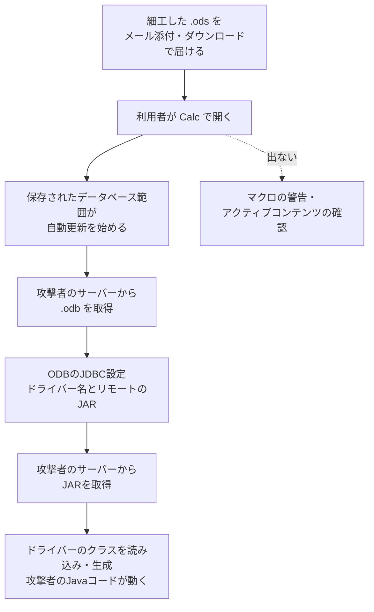

# LibreOffice CVE-2026-63277／OpenOffice CVE-2026-59265 ― 表計算ファイルを開くだけで外部のJavaコードが動く、マクロの警告を通らない「データ連携」の連鎖

## 要点

### 影響バージョン

- LibreOffice は 26.2.5 より前と 26.8.0 より前が影響を受け、26.2.5 と 26.8.0 で修正（CVE-2026-63277、The Document Foundation）。
- Apache OpenOffice は 4.1.16 以前のすべてが影響を受ける。修正は 4.1.17 で予定されており、公表時点ではリリース候補の段階（CVE-2026-59265、Apache OpenOffice）。
- どちらも、Java（JDBC）の連携が入っていて有効になっている環境が対象（V12、The Hacker News）。

### 今すぐやること

- LibreOffice を 26.2.5 以降、または 26.8.0 以降に更新する（The Document Foundation）。
- Apache OpenOffice は、4.1.17 が出るまで設定画面で Java 連携を無効にする。できなければ、信頼できない文書を開かない。4.1.17 が出たら更新する（Apache OpenOffice）。
- （考察）Java 連携を使っていない LibreOffice の環境では、更新に加えて Java 連携を無効にしておくと、同じ種類の欠陥への備えになる。

## 概要

- LibreOffice Calc と Apache OpenOffice Calc は、表計算の範囲を外部のデータベースとつなぎ、自動で更新する機能を持つ。細工した表計算ファイル（.ods）を開くと、この自動更新が外部のデータベースファイル（.odb）を取りに行き、そこに書かれたJavaのデータベースドライバー（JDBCドライバー）を、指定された場所のJARファイルから読み込んで起動する。
- この流れのどこにも、マクロを動かす前に出るような安全確認の警告がない。研究者の検証用コード（PoC）は電卓を起動するだけだが、同じ経路で任意のJavaコードを動かせる。
- LibreOfficeは10月5日に修正版を公表した。Apache OpenOfficeは10月2日に脆弱性を公表したが、修正版はまだ出ていない。実際の攻撃での悪用は報告されていない。

> この記事では、ベンダー・公的機関・研究者・報道で確認できた内容を「事実」、筆者の推測や意見を「考察」として分けて書いています。

## 何が起きたか（時系列）

| 日付 | 出来事 |
| --- | --- |
| 2026-10-02 | Apache OpenOffice が oss-security メーリングリストで CVE-2026-59265（深刻度「critical」）を公表。4.1.16 以前が影響を受け、修正は 4.1.17 で予定、それまでは Java 連携の無効化で防げると説明（Apache OpenOffice） |
| 2026-10-05 | The Document Foundation が CVE-2026-63277 を公表。LibreOffice 26.2.5／26.8.0 で修正。同じ「データ連携」まわりのファイル書き込み・ファイル読み出し・SSRF などの欠陥5件（CVE-2026-63266〜63270）も同時に修正（The Document Foundation） |
| 2026-10-06 00:56（日本時間） | V12 のチームが LibreOffice と OpenOffice の PoC を GitHub に追加（GitHubのコミット記録、UTCでは10月5日 15:56） |
| 2026-10-06 | The Hacker News が報道 |

## 技術的な問題点（根本原因）

**事実（The Document Foundation）**

- LibreOffice Calc は、セル範囲を外部のデータソースにつなぐことができ、そのつながりは文書の中に保存される。文書は、そのつながりのために、離れた場所から読み込むJavaのデータベースドライバーを指定できたため、文書を開くとその場所のJavaコードが動くことがあった。
- 修正版では、Javaのクラスパスの項目は `file:` のURL（ローカルのファイル）でなければならなくなった。
- 発見者は V12 のチームの Rick de Jager 氏と、Codean Labs の Thomas Rinsma 氏・Edoardo Geraci 氏で、それぞれ独立に報告した。修正は Collabora Productivity の Caolán McNamara 氏が書いた。

**事実（V12）**

- 表計算ファイルには、自動更新の間隔（`table:refresh-delay="PT1S"`）を付けた「データベース範囲」が保存されている。そのデータソース名（`table:database-name`）に、外部のODBファイルのURLを書ける。
- 読み込まれたODBファイルには、JDBCドライバーのクラス名（`db:java-driver-class`）とクラスパス（`db:java-classpath`）を書ける。クラスパスに `jar:http://…!/` 形式のリモートのURLを書くと、LibreOffice はそのJARを取得し、指定されたドライバーのクラスを読み込んで生成する。
- 研究者は、個々の機能はどれも仕様どおりに動いていて、問題はそれらを組み合わせると、利用者に文書を信頼するかを一度も尋ねずにコードの実行まで届くことだと説明している。
- 確認環境は Ubuntu 24.04 上の LibreOffice 24.2.7.2。The Hacker News によると、研究者は Windows と Linux で試し、OSに依存しないとしている。

**考察**

オフィスソフトは長年、「文書の中のマクロは危険なので、動かす前に利用者に確認する」という線引きで守ってきた。今回の欠陥は、その線引きの外側にある「データの取り込み」という機能が、実はJavaのクラスを読み込む、つまりコードを動かす機能でもあったことを示している。JDBCドライバーは本来、管理者がローカルに入れて設定するものだが、その設定を文書の側（しかも外部から取ってくる別の文書）が書けたことが根本原因と読める。LibreOfficeの修正は、クラスパスをローカルのファイルに限ることで、「文書が指定した遠隔のコードを読み込む」という部分だけを断っている。

同時に直された CVE-2026-63266〜63270 も、データ連携の仕組みを使って、任意の場所へのファイル書き込み、ローカルファイルの読み込み、外部へのリクエスト（SSRF）、環境変数やINIファイルの値の外部への送信ができたというものだ。Codean Labs が「文書を開いたときに外部とつながる機能」をまとめて調べた結果と考えられる。

## 攻撃・侵入経路

**事実（V12、The Hacker News）**

- 攻撃の前提は、利用者がファイルを開くことと、Java（JDBC）の連携が入っていて有効になっていること。
- PoC では作業の都合で同じマシンのHTTPサーバーからODBとJARを配ったが、実際の攻撃では攻撃者が用意したサーバーに置くと研究者は説明している。
- PoC で動くのは電卓だが、仕組みとしては任意のJavaコードを LibreOffice のプロセスの権限で実行できる。

**考察**

狙われやすいのは、請求書や見積書、名簿などの表計算ファイルをメールで受け取る業務だ。Microsoft Office のマクロ付きファイルは、多くの組織で警告やブロックの対象になっている一方、.ods ファイルにはそうした警戒が少ない。また、開いた時点で外部のサーバーへHTTPの通信が出るので、プロキシで外部への通信を制限している組織では、ODBやJARの取得が止まる可能性がある。逆に、端末から自由にインターネットへ出られる環境では、ファイルを開くだけで成立する。

## なぜ防げなかったか・構造的要因の考察

ここからは筆者の考察である。

1. **「安全な文書」の範囲が広すぎた**: マクロには警告があるが、外部データの取り込み、リンクの更新、データベースの接続など、文書が外部とつながる機能は他にも多い。そのそれぞれが「データを読むだけ」と見なされ、コードの実行につながる経路として扱われていなかった。
2. **機能の組み合わせは個別の審査をすり抜ける**: データベース範囲の自動更新、ODBの読み込み、JDBCドライバーのクラスパスは、どれも単体では仕様どおりの機能だ。危険が生まれるのは、文書が外部の文書を指し、その文書がさらに外部のコードを指すという連鎖のときで、機能ごとに安全性を考えていると見落としやすい。
3. **OpenOffice は修正が遅れている**: Apache OpenOffice は脆弱性を公表した時点で修正版を出しておらず、利用者は Java 連携を自分で切るしかない。開発の体制が小さい製品ほど、公表から修正版までの空白が長くなる。PoC が公開された今、その空白は以前より危険になっている。
4. **AIを使った発見の速さ**: V12 は自社の製品で見つけたとしている。この連載でも、AIを使った探索で見つかった脆弱性を何度か取り上げてきた（Zammad や Rejetto HFS など）。古くからある大きなコードベースの「機能の組み合わせ」に潜む欠陥が、今後も続けて見つかると考えておくべきだ。

## 運用者向けの具体的な対策と検知ポイント

**対策**

- LibreOffice を 26.2.5 以降、または 26.8.0 以降に更新する。同じ更新で CVE-2026-63266〜63270 も直る（The Document Foundation）。
- Apache OpenOffice は、4.1.17 が出るまで、設定画面で Java ランタイムとの連携を無効にする。それができない場合や、念のための追加策として、信頼できない文書を開かない（Apache OpenOffice）。
- （考察）LinuxディストリビューションのパッケージでLibreOfficeを入れている場合は、ディストリビューションが修正を取り込んだ版を出しているかを確かめる。上流の版番号と一致しないことがある。
- （考察）業務で Java 連携（Base のJDBC接続など）を使っていない端末では、LibreOffice でも Java 連携を無効にし、JRE自体を入れない構成を検討する。
- （考察）メールのゲートウェイで、外部から届く .ods／.fods ファイルの中身（`content.xml`）に、URLをデータソースにしたデータベース範囲（`table:database-range` と `table:database-source-sql` の `table:database-name` が `http` で始まるもの）が含まれていないかを確認する仕組みがあれば、隔離の対象にする。

**検知ポイント**

- 研究者が示した通信の流れは、ファイルを開いた直後に、外部の同じサーバーへ `.odb` と `.jar` を続けて取りに行くもの（V12）。
- （考察）プロキシのログで、`soffice` などオフィスソフトのプロセス、またはその利用者の端末から、`.odb` や `.jar` のファイルを取得した記録を探す。普段の業務でオフィスソフトがJARを外部から取ることはまずない。
- （考察）EDRで、LibreOffice／OpenOffice のプロセス（`soffice.bin` など）の下でJava仮想マシンが動き、さらにシェルや別のプログラムが起動していないかを監視する。

## 参考リンク

- The Document Foundation: [LibreOffice Security Advisories（CVE-2026-63277 ほか）](https://www.libreoffice.org/security/)
- oss-security: [CVE-2026-59265: Apache OpenOffice: Opening a malicious document can lead to system takeover](https://www.openwall.com/lists/oss-security/2026/10/02/2)
- V12: [Office JDBC Classpath Bugs（PoC）](https://github.com/v12-security/pocs/tree/main/office_jdbc_bugs)
- The Hacker News: [LibreOffice and OpenOffice Flaws Let Malicious Spreadsheets Run Code Without Macro Warnings](https://thehackernews.com/2026/10/libreoffice-and-openoffice-flaws-let.html)
