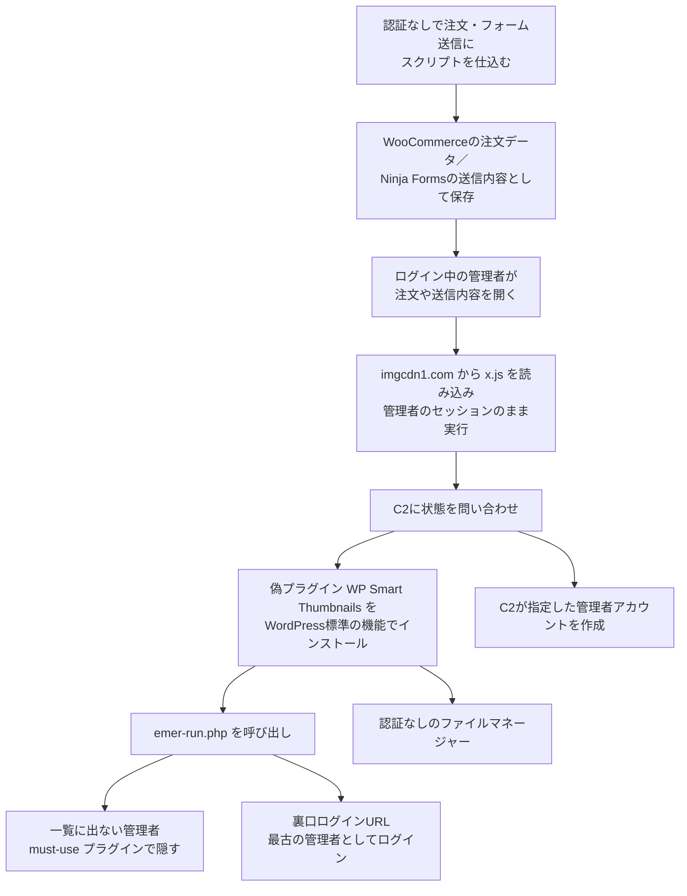

# Ninja Forms／WPC Product Bundles の蓄積型XSS悪用 ― 管理者が投稿を開いた瞬間に、一覧に出ない管理者と裏口ログインが作られる

## 要点

### 影響バージョン

- Ninja Forms は 3.15.3 以前が影響を受け、3.15.4 で修正（CVE-2026-94504、Patchstack）。
- WPC Product Bundles for WooCommerce は 8.6.6 以前が影響を受け、8.6.7 で修正（CVE-2026-93836、Patchstack）。
- どちらも認証なしで攻撃用の値を送り込める蓄積型XSSで、CVSS は 7.1（Patchstack）。

### 今すぐやること

- 2つのプラグインを修正版へ更新する。ただし、更新しても、すでに入り込んだ裏口は消えない（Patchstack、BleepingComputer）。
- 管理画面ではなくデータベースで管理者アカウントを一覧し、管理画面の一覧と突き合わせる。`wp-content/mu-plugins/` に `class-wp-token-validate.php` や `class-wp-query-*.php` がないか、`wp_options` に `fz_emer_login_tokens` がないかを確かめる（Patchstack）。
- 痕跡があれば侵害されたものとして扱い、不正なアカウント・プラグイン・must-use プラグイン・オプションを消したうえで、管理者のパスワードと WordPress の認証用ソルトを変える（Patchstack）。

## 概要

- WordPressのセキュリティ企業Patchstackは2026年10月6日、2つの無関係なプラグインの蓄積型XSSを入り口に、同じJavaScriptを管理者のブラウザで動かす攻撃キャンペーンを報告した。最初の観測は10月4日（WPC Product Bundles for WooCommerce）、翌5日には Ninja Forms でも同じ攻撃が見つかった。
- 攻撃者は注文データやフォームの送信内容にスクリプトを仕込み、ログイン中の管理者がそれを開くと、管理者のセッションのまま偽のプラグイン「WP Smart Thumbnails」のインストールと管理者アカウントの作成が行われる。
- 1回の成功で、見える管理者、一覧に出ない管理者、元の管理者として入れる裏口ログインURL、認証なしのファイルマネージャーの4つの侵入口が残る。Patchstackは現時点で悪用の規模は限定的としている。

> この記事では、ベンダー・公的機関・研究者・報道で確認できた内容を「事実」、筆者の推測や意見を「考察」として分けて書いています。

## 何が起きたか（時系列）

| 日付 | 出来事 |
| --- | --- |
| 2026-09-22 | CVE-2026-93836（WPC Product Bundles）と CVE-2026-94504（Ninja Forms）が公開される（Patchstack） |
| 2026-10-01 | 攻撃に使われたドメイン `imgcdn1[.]com` が登録される（Patchstack） |
| 2026-10-02 | 同ドメインがCloudflareのネームサーバーに委任されたことが公開DNSの記録に載る（Patchstack） |
| 2026-10-04 19:39（日本時間） | Patchstackが、WPC Product Bundles の CVE-2026-93836 を狙った最初の攻撃を観測（UTCでは10:39） |
| 2026-10-05 | 同じペイロードが Ninja Forms の CVE-2026-94504 を通じて送られているのを観測（Patchstack） |
| 2026-10-06 | Patchstackが分析と侵害の痕跡（IoC）を公開。BleepingComputer が報道 |

## 技術的な問題点（根本原因）

**事実（Patchstack）**

- WPC Product Bundles for WooCommerce（8.6.6 以前）は、数量の値が数字で始まっていれば検証を通し、後ろに続く攻撃者のマークアップを残したまま WooCommerce の注文のメタデータに保存し、あとで安全でない形で表示していた。攻撃では `woosb_ids[…][qty]` パラメータに `1 <script src=…x.js></script>` のような値が送られた。
- Ninja Forms（3.15.3 以前）は、リッチテキストでないテキストエリアの送信内容を保存し、旧来の管理用の送信内容編集画面で、HTMLを安全にエスケープせずに表示することがあった。攻撃では通常の送信用エンドポイント（`/wp-admin/admin-ajax.php` の `action=nf_ajax_submit`）に、`</textarea>` で入力欄を閉じてから `img` タグの `onerror` でスクリプトを読み込む値が送られた。3.15.4 では該当画面の出力のエスケープが強化された。

**考察**

2つの欠陥はどちらも「外から受け取った値を保存し、管理画面で表示する」箇所での出力エスケープの不足で、根本は同じだ。入口は誰でも送れる注文やフォーム、出口は最も権限の高い利用者の画面という組み合わせで、検証が甘い値がそのまま管理者のブラウザに届く。数量のように「数字のはず」と考えられた値ほど、表示側でのエスケープが省かれやすい。

## 攻撃・侵入経路



**事実（Patchstack）**

- `x.js` は管理者のクッキーを盗まない。サイトと同じオリジンで動くため、`/wp-admin/` へのリクエストに管理者のセッションが自動で付く。スクリプトは管理画面を読み込んでCSRF対策のnonceを取り出し、それを使って正規の管理操作を行う。HttpOnly のクッキーでも防げない。
- 処理の前に `https://imgcdn1.com/fz/c.php?xa=check&site=<サイト>` に問い合わせ、どの段階まで済んでいるかを受け取る。ブラウザの Local Storage にも `__xp_v9_` で始まるキーで進み具合を残し、同じXSSが何度動いても無駄に繰り返さない。結果は `fetch()`・`navigator.sendBeacon()`・画像リクエストのいずれかでC2に送る。
- 偽プラグインは「WP Smart Thumbnails」1.2.4（作者名「MediaPress Labs」）を名乗る。本体ファイルは、WordPressが読み込んだとき（`ABSPATH` が定義されているとき）は何もせずに終わり、ファイルへ直接HTTPリクエストが来たときだけ動く。通常のプラグインとは逆の判定になっている。
- 本体の中身は7段階に難読化され、`eval()` を使わず独自のストリームラッパー（`dyiv://`）経由で読み込まれる。展開すると約37KBのファイルマネージャー（画面タイトルは「Moon, tell me if I could」）で、一覧・アップロード・削除・名前変更・読み書きができ、認証は一切ない。コマンド実行の機能はないが、任意の場所にファイルを書けるので、別のWebシェルを置くには十分である。
- `emer-run.php` は、support・updater・maintenance など運用でありがちな名前の管理者を `@wordpress.org` のメールアドレスで作り、`wp-content/mu-plugins/` に置いた must-use プラグインで、ユーザー一覧・管理者の絞り込み・件数表示のすべてからその管理者を隠す。
- さらに、`/wp-login.php?_wplogin=<トークン>` で入れる裏口を別の must-use プラグインで作る。トークンは隠した管理者ではなく、サイトで最も古い管理者に結び付いており、ユーザーIDだけを記録するログでは本物のログインと見分けられない。
- must-use プラグインはサイトごとに別の鍵で難読化され、ファイルの更新日時はWordPressのルートで最も古い日時に書き換えられる。

**考察**

この攻撃で目を引くのは、サーバー側の2つ目の脆弱性を必要としていない点だ。XSSで管理者のブラウザに入れば、あとはWordPressが管理者に許している「プラグインのアップロード」と「ユーザーの追加」を使うだけで、サーバー上でコードを動かすところまで届く。WordPressの管理画面は、事実上、管理者のブラウザから使えるリモート管理ツールでもある。

## なぜ防げなかったか・構造的要因の考察

ここからは筆者の考察である。

1. **XSSは「入り口の部品」として交換できる**: Patchstackは、攻撃者がプラグインごとに別のマルウェアを作るのではなく、管理者の前にJavaScriptを置ける蓄積型XSSを集め、同じ後段の処理につないでいると指摘している。どのプラグインの欠陥かは関係なく、蓄積型XSSが公表されるたびに同じ攻撃の入口が増える。CVSS 7.1 の「XSS」は、深刻度の数字以上にサイト乗っ取りに近い。
2. **公表から悪用までの準備期間**: 2つの脆弱性の公表は9月22日、攻撃用ドメインの登録は10月1日、攻撃の開始は10月4日だった。Patchstackはこの時系列を、キャンペーンのために基盤を用意したものと見ている。公表から2週間で攻撃が始まったことになり、プラグインの自動更新を止めているサイトは、その間ずっと狙われうる状態にあった。
3. **管理画面だけを見ても見つからない**: 隠しアカウントは、管理画面のユーザー一覧を書き換えるフックで隠され、must-use プラグインはプラグイン画面に出ない。ファイルの日付も古く書き換えられるので、「最近変わったファイル」を探す一般的な調査も効かない。管理画面とファイルの日付に頼る運用では、侵害に気づけない作りになっている。
4. **更新しても裏口が残る**: 脆弱なプラグインを更新しても、新しい攻撃が止まるだけで、すでに置かれた4つの侵入口のうち3つは残る。「更新したので対応済み」と判断すると、侵害が続いたままになる。

## 運用者向けの具体的な対策と検知ポイント

**対策**

- Ninja Forms を 3.15.4 以降、WPC Product Bundles for WooCommerce を 8.6.7 以降に更新する（Patchstack）。
- XSSが管理者のブラウザで動いた可能性があるサイトは、侵害されたものとして扱う。不正なアカウントとプラグインを消し、`mu-plugins` に置かれたファイルを消し、`fz_emer_done_v1` と `fz_emer_login_tokens` のオプションを消し、管理者の認証情報と WordPress の認証用ソルトを変え、ファイルとデータベースにほかの変更がないかを確かめる（Patchstack）。
- 裏口のログインURLはサイトで最も古い管理者として認証するので、そのアカウントのパスワードは盗まれていなくても漏れたものとして扱う（Patchstack）。
- オプションだけを消しても、must-use プラグインが残っていれば新しいトークンを発行できる。両方を消す（Patchstack）。
- （考察）攻撃の送信元の多くはTorの出口ノードで、IPアドレスの遮断は長続きしない（Patchstackも同旨）。外部から受け取った注文やフォームの内容を管理画面で開く担当者のアカウントは、普段の作業用と、プラグインの追加やユーザー管理ができる管理者用に分けると、XSSが動いたときの被害を減らせる。
- （考察）運用上必要がなければ、`wp-config.php` で `DISALLOW_FILE_MODS` を有効にし、管理画面からのプラグインのインストールを止める。今回のようにブラウザ経由でプラグインを入れる攻撃の後段を断てる。

**検知ポイント**

- HTTPやアプリのログで `imgcdn1.com`、`/fz/x.js`、`/fz/c.php` を探す（Patchstack）。
- `/wp-content/plugins/wp-smart-thumbnails/` と、その中の `emer-run.php` があるかを確かめる（Patchstack）。
- 管理画面ではなくデータベースで管理者を一覧し、管理画面の表示と比べる。データベースにだけいるアカウントは隠されている。`@wordpress.org` のメールアドレスや、support・updater・maintenance のような名前は不審な印になる（Patchstack）。

  ```sql
  SELECT u.user_login, u.user_email, u.user_registered
  FROM wp_users u
  JOIN wp_usermeta m ON m.user_id = u.ID
  WHERE m.meta_key = 'wp_capabilities'
    AND m.meta_value LIKE '%administrator%';
  ```

- `/wp-content/mu-plugins/class-wp-token-validate.php` と `/wp-content/mu-plugins/class-wp-query-*.php` を探す。ファイルの更新日時は書き換えられているので、日付ではなく中身で判断する（Patchstack）。
- Webサーバーのログで、`wp-login.php` への `_wplogin` パラメータ付きのリクエストと、プラグイン画面以外からの `wp-smart-thumbnails.php` への直接のリクエストを探す（Patchstack）。
- 管理者が WooCommerce の注文や Ninja Forms の送信内容を見た時刻の前後に、管理者アカウントが作られていないかを確かめる（Patchstack）。
- Patchstackが公開した `x.js` の SHA-256 は `af803bc822cf9596b1f1785e1d59642f91f6fbc21f8e9943feefa19a6df8c2a4`。must-use プラグインはサイトごとに鍵が変わるのでハッシュでは見つからない（Patchstack）。

## 参考リンク

- Patchstack: [Four ways back in: the WordPress XSS campaign that hides its own admin account](https://patchstack.com/articles/four-ways-back-in-the-wordpress-xss-campaign-that-hides-its-own-admin-account/)
- Patchstack Database: [WPC Product Bundles for WooCommerce 8.6.6 以前の認証なし蓄積型XSS（CVE-2026-93836）](https://patchstack.com/database/WordPress/Plugin/woo-product-bundle/vulnerability/wordpress-wpc-product-bundles-for-woocommerce-plugin-8-6-6-unauthenticated-stored-cross-site-scripting-vulnerability)
- Patchstack Database: [Ninja Forms 3.15.3 以前の蓄積型XSS（CVE-2026-94504）](https://patchstack.com/database/WordPress/Plugin/ninja-forms/vulnerability/wordpress-ninja-forms-contact-form-builder-with-calculators-quizzes-signatures-ai-form-builder-plugin-3-15-3-stored-cross-site-scripting-vulnerability)
- BleepingComputer: [Ninja Forms plugin flaw exploited to hack WordPress sites](https://www.bleepingcomputer.com/news/security/ninja-forms-plugin-flaw-exploited-to-hack-wordpress-sites/)
