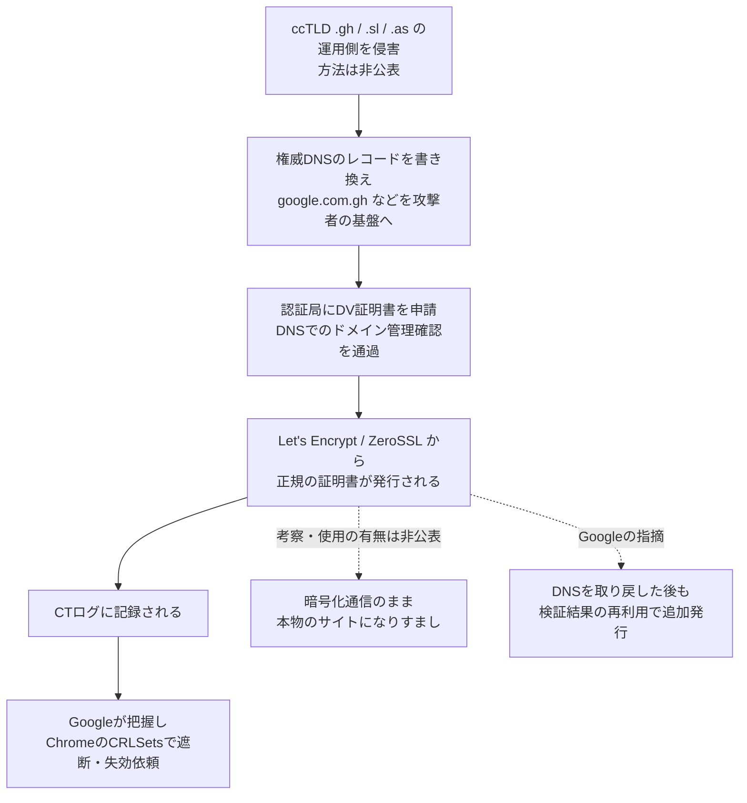

# ガーナ・シエラレオネ・米領サモアのccTLD乗っ取り ― 国別ドメインのDNSを書き換え、GoogleやYouTubeの正規のHTTPS証明書を取得

## 要点

### 影響範囲

- .gh（ガーナ）・.sl（シエラレオネ）・.as（米領サモア）で終わるすべてのドメインが危険にさらされた。攻撃者は権威DNSのレコードを書き換え、Googleの複数のドメインとほかの組織のドメインについて、正規の認証局からHTTPS証明書を取得した（Google）。
- CTログでは、9月22日〜27日に google.com.gh・google.sl・google.as などGoogle・YouTubeの7ドメインに対する証明書が少なくとも12枚発行されていた。11枚がLet's Encrypt、1枚がZeroSSLの発行で、10月7日時点ですべて失効済み（The Hacker News）。
- Googleは「世界的なブランドや広く使われるオンラインサービスを含む、ほかの組織も同じ攻撃の影響を受けたとみられる」としているが、名前は挙げていない（Google）。

### 今すぐやること

- 自社が持つすべてのドメインについて、CTログを継続的に監視する。使っていないドメインや国別ドメインも含める。.gh・.sl・.as のドメインを持っているなら、最近発行された身に覚えのない証明書がないか確かめる（Google）。
- CAAレコードで証明書を発行できる認証局を限定し、可能ならACMEアカウントと検証方法まで縛る（Google）。
- 身に覚えのない証明書を見つけたら、発行した認証局に問題報告（Certificate Problem Report）を出す（The Hacker News）。

## 概要

- Googleは2026年10月6日（米国時間）、.gh・.sl・.as の国別トップレベルドメイン（ccTLD）で起きた一連のドメイン乗っ取りについて、Chromeの対応を公表した。攻撃者はccTLD側を侵害して権威DNSを書き換え、Googleのドメインを含む証明書を取得していた。
- Googleは自社システムの侵害ではないとし、発行した認証局にも落ち度はないとみている。ChromeはCRLSetsで証明書を遮断し、認証局と協力して失効させた。
- 攻撃者が誰か、ccTLDがどう侵害されたか、証明書が実際に使われたかは公表されていない。

> この記事では、ベンダー・公的機関・研究者・報道で確認できた内容を「事実」、筆者の推測や意見を「考察」として分けて書いています。

## 何が起きたか（時系列）

日付はThe Hacker Newsの表記による（時刻帯の明記はない）。

| 日付 | 出来事 |
| --- | --- |
| 2026-09-22 | .gh の google.com.gh・youtube.com.gh の証明書2枚（Let's Encrypt）がCTログに記録される（The Hacker News） |
| 2026-09-25 | .sl の google.sl・google.com.sl・youtube.sl の証明書6枚（Let's Encrypt 5枚、ZeroSSL 1枚）が記録される（The Hacker News） |
| 2026-09-26 | .gh の2枚とZeroSSLの1枚が失効（The Hacker News） |
| 2026-09-27 | .as の google.as・youtube.as の証明書4枚（Let's Encrypt）が記録される。.gh の証明書の失効から約1日後（The Hacker News） |
| 2026-10-01 | 残る9枚が失効（The Hacker News） |
| 2026-10-06（米国時間） | Googleが「先週、一連のドメイン乗っ取りを把握した」としてブログで公表（Google） |
| 2026-10-07 | The Hacker NewsがCTログ検索で12枚を特定。Let's Encryptの担当者がコミュニティフォーラムで「GoogleとYouTubeの証明書が発行され、失効済み」と回答（The Hacker News、Let's Encrypt） |

## 技術的な問題点（根本原因）

**事実（Google）**

- 今回の件はGoogleのシステムの侵害ではなく、攻撃者が第三者であるccTLD側を侵害したもので、.gh・.sl・.as で終わるすべてのドメインが危険にさらされた。
- 乗っ取りの間、攻撃者は権威DNSのレコードを書き換え、Googleの複数のドメインとほかの組織のドメインについて、正規でないHTTPS証明書を取得した。攻撃の性質上、発行した認証局に落ち度があったとは考えていない。
- CAAレコードは、DNSの乗っ取りが進行している最中の発行は防げない。

**事実（The Hacker News、BleepingComputer）**

- 認証局は、申請者がドメインを管理していることを確かめてから証明書を発行する。確かめ方の一つは、認証局が指定する値をDNSにレコードとして置かせる方法。
- 12枚はすべてドメイン認証（DV）証明書だった。少なくとも9月10日以降の記録では、google.com.gh・google.sl・google.as の正規の証明書はすべてGoogleの認証局（Google Trust Services）が発行していた。
- 権威DNSを書き換えたことで、攻撃者はドメインを自分の基盤に向けつつ、正規の証明書を手に入れられた（BleepingComputer）。

**考察**

ここで破られたのは暗号でも認証局でもなく、「DNSを管理できる者がドメインの持ち主である」というWebの証明書制度の前提そのものだ。ドメイン認証は、その時点でDNSに答えを書ける者を持ち主とみなす。ccTLDのレジストリ（またはその運用を担う第三者）が侵害されれば、その下にある全ドメインについて、攻撃者は「持ち主」として振る舞える。Google自身のDNSやサーバーには一切触れずに、google.com.gh の正規の証明書が出たのはこのためだ。

ccTLDのどの部分（レジストリのシステム、管理画面のアカウント、ネームサーバーの運用委託先など）が侵害されたのかは公表されていない。

## 攻撃・侵入経路

**事実（The Hacker News）**

- 証明書は1つのccTLDずつ、3日に分けて記録された（.gh が9月22日、.sl が25日、.as が27日）。CTログへの記録から失効までは、短いもので約1日半、長いもので1週間近くかかった。
- この種の証明書があれば、攻撃者は暗号化された接続のまま本物のサイトになりすまし、送られてくる個人データを読める。ただし、Googleのブログは、証明書がなりすましや盗聴に使われたかどうかに触れていない。

**事実（Google、The Hacker News）**

- 認証局は、一度完了したドメインの管理確認を、その後の発行に再利用することが認められている。このため、乗っ取りの間に確認を通った攻撃者は、乗っ取りが終わった後も追加の証明書を申請できる。厳しいCAAレコードはこれを防ぐ（Google）。
- CA/Browser Forumの基準では、確認結果の再利用は最長200日まで認められ、2027年3月に100日、2029年3月に10日へ短縮される。Let's Encryptは2025年12月時点で再利用期間を30日とし、2028年までに7時間へ縮める計画としている（The Hacker News）。

**考察**

3つのccTLDを数日おきに順番に狙っている点からは、場当たり的な侵入ではなく、同じ手口（あるいは共通の運用基盤）を使い回した計画的な作戦と読める。.gh の証明書が失効した翌日に .as で同じことが起きており、最初の検知と対処が、次の標的への攻撃を止められなかったことも示している。

ccTLDの乗っ取りでは、ネームサーバーそのものが攻撃者の手にあるため、CAAレコードも攻撃者が自由に消したり書き換えたりできる。筆者が10月8日にGoogle Public DNSで確認したところ、google.com.gh・google.sl・google.as・youtube.sl には認証局をGoogle Trust Services（pki.goog）に限るCAAレコードがあった。乗っ取り前から同じ設定だったかは確認できていないが、もし乗っ取り前からあったのなら、攻撃者はCAAも含めて応答を偽装したことになる。いずれにしても、Googleほど備えた組織でも発行自体は防げなかった、というのが今回の教訓だ。

## なぜ防げなかったか・構造的要因の考察

ここからは筆者の考察である。

1. **信頼の起点がドメイン所有者の手の外にある**: ドメイン認証の安全性は、レジストリ・レジストラ・権威DNSの運用という、ドメイン所有者が管理できない上流の安全性に依存している。.com のように大規模な運用体制を持つTLDと比べ、小国のccTLDは運用規模も体制もさまざまだ。グローバル企業は各国向けに国別ドメインを取得するが、その安全性は最も弱いccTLDに引きずられる。
2. **「念のため取っておいたドメイン」が攻撃面になる**: google.com.gh や google.as は、ブランド保護や地域向けサービスのために持つドメインで、本社のセキュリティチームの監視の中心にはないことが多い。Googleが「使っていない（parked）ドメインや国別ドメインも監視せよ」と書いたのは、ここが盲点になりやすいからと考えられる。
3. **CAAは事後の歯止めであって、乗っ取り中の盾ではない**: CAAはDNSの応答を前提にした仕組みなので、DNSそのものを握られると効かない。それでもGoogleがCAAを強く勧めるのは、乗っ取り後に「確認済み」の状態を悪用した追加発行を止められるからだ。ACMEアカウントに紐づけるCAA（RFC 8657）は、仮に攻撃者が同じ認証局を使っても、自社のアカウント以外からの発行を拒否できる点で、通常のCAAより一段強い。
4. **ブラウザ側の救済には限りがある**: ChromeはCRLSetsで素早く遮断できたが、Googleは「すべての影響ドメインを特定できたとは保証できない」「Chrome以外の利用者を確実には守れない」と明言している。証明書の失効情報をどれだけ早く確実に確認するかは、ブラウザやアプリ、OSごとに異なる。結局、最初に気づけるのはCTログを見ているドメイン所有者自身だ。

## 運用者向けの具体的な対策と検知ポイント

**対策**

- 保有するドメインの台帳を作り、使っていないドメイン・国別ドメインも含めて、CTログの監視サービス（Cert Spotter など）に登録する（Google。台帳化は考察）。
- CAAレコードを設定し、発行を許す認証局を限定する。認証局が対応していれば、`accounturi` と `validationmethods`（RFC 8657）でACMEアカウントと検証方法も縛る（Google）。
- 身に覚えのない証明書を見つけたら、発行した認証局に問題報告を出す。CA/Browser Forumの基準では誰でも報告でき、認証局は24時間以内に初期調査の結果を報告しなければならない（The Hacker News）。
- （考察）国別ドメインを事業で使っている場合は、レジストラのアカウントにMFAとレジストラロック（移管・NS変更の制限）をかけ、ネームサーバー（NS）の委任が変わったら通知が来るよう監視する。ただし今回のようにレジストリ側が侵害された場合、これらの設定も迂回される可能性がある。
- （考察）.gh・.sl・.as のドメインでログインや決済を扱っている場合は、9月下旬の期間に自社のDNS応答や証明書が書き換わっていなかったか、DNSの監視記録やアクセスログで確かめる。

**検知ポイント**

- CTログで、自社のドメインに対し、普段使っていない認証局（今回の例ではGoogle Trust Services以外のLet's EncryptやZeroSSL）から発行された証明書がないか（The Hacker News。普段と違う認証局に注目する見方は考察）。
- The Hacker Newsは、12枚の証明書のSHA-256フィンガープリントを公開しており、CTログ検索で照合できる。
- （考察）自社ドメインのNSレコードやAレコードを外部の複数の地点から定期的に解決し、想定外の値が返ったら警報を出す。CTログより先に乗っ取りに気づける場合がある。

## 参考リンク

- Google: [Chrome's Response to Recent ccTLD Registry Hijacks](https://blog.google/security/chromes-response-to-recent-cctld-registry-hijacks/)
- Let's Encrypt Community Support: [Chrome's response to recent ccTLD registry hijacks](https://community.letsencrypt.org/t/chromes-response-to-recent-cctld-registry-hijacks/251941)
- The Hacker News: [Attackers Hijack .gh, .sl, and .as Registries to Obtain Certificates for Google Domains](https://thehackernews.com/2026/10/attackers-hijack-gh-sl-and-as.html)
- BleepingComputer: [Hackers hijack Google domains after breaching ccTLD registries](https://www.bleepingcomputer.com/news/security/hackers-hijack-google-domains-after-breaching-cctld-registries/)
- Chromium: [CRLSets](https://www.chromium.org/Home/chromium-security/crlsets/)
- Certificate Transparency: [Monitors](https://certificate.transparency.dev/monitors/)
- IETF: [RFC 8659 DNS Certification Authority Authorization (CAA) Resource Record](https://datatracker.ietf.org/doc/html/rfc8659) / [RFC 8657 CAA Record Extensions for Account URI and ACME Method Binding](https://www.rfc-editor.org/rfc/rfc8657.html)
- CA/Browser Forum: [Ballot SC081v3: Introduce Schedule of Reducing Validity and Data Reuse Periods](https://cabforum.org/2025/04/11/ballot-sc081v3-introduce-schedule-of-reducing-validity-and-data-reuse-periods/)
