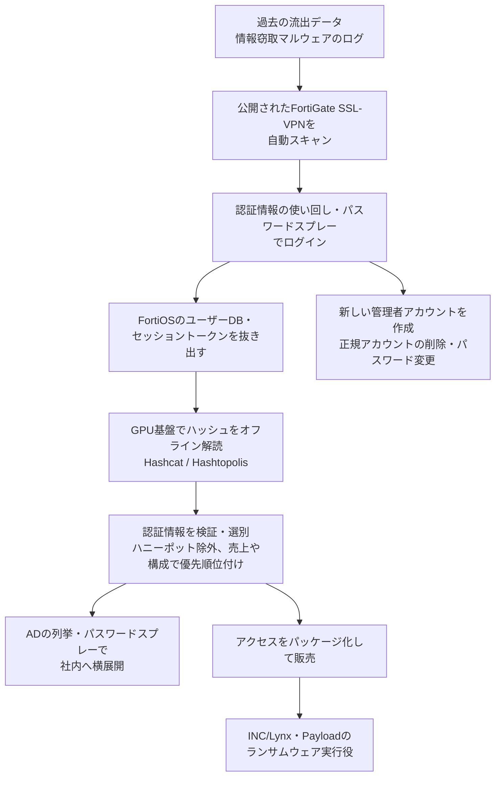

# FortiBleed ― 使い回された認証情報と古いSHA-256のパスワード保存を突くFortiGate乗っ取り、FBIとシークレットサービスが「管理者の締め出し」を警告

## 要点

### 影響範囲

- インターネットに公開されたFortinet FortiGateファイアウォールとSSL-VPNゲートウェイ。単一の脆弱性（CVE）によるものではない（FBI・USSS、Fortinet）。
- SOCRadarは、86,644台・194か国分の「実際に使える」装置の認証情報を確認したとしている（SOCRadar、FBI・USSSが引用）。
- 管理者パスワードは、FortiOS 7.2.10・7.4.7・7.6.0 以前ではSHA-256で保存される。7.2.11・7.4.8・7.6.1 以降はPBKDF2に変わったが、更新後もその管理者が一度ログインするまではSHA-256のまま残る。さらに隠し設定 `old-password` に古いSHA-256のハッシュが残る（Fortinet）。

### 今すぐやること

- インターネットからの管理アクセスをなくす。難しければ、ローカルインポリシー、最低でも信頼済みホスト（trusted hosts）で接続元を絞る（FBI・USSS、Fortinet）。
- 管理者とVPNのセッションをすべて切断し、FortinetのVPN・管理者のパスワードをすべて変更する（FBI・USSS、Fortinet）。
- 遠隔アクセスと管理用のすべてのアカウントで、フィッシングに強いMFAを必須にする（FBI・USSS）。
- 全管理者のパスワードをPBKDF2で保存し直し、`login-lockout-upon-weaker-encryption`（7.2・7.4系では `login-lockout-upon-downgrade`）で古いSHA-256のハッシュを消す（Fortinet）。
- 身に覚えのない管理者アカウント、VPNユーザー、REST APIキー、設定変更がないか確かめる（FBI・USSS）。

## 概要

- 米連邦捜査局（FBI）と米シークレットサービス（USSS）は2026年10月6日（米国時間）、共同サイバーセキュリティ勧告 JCSA-20261006-01 で、FortiGateを狙う認証情報窃取作戦「FortiBleed」が今も続いていると警告した。過去に入手した認証情報で、公開されたFortiGateへのスキャンが続いているという。
- 攻撃者は、過去の流出データや情報窃取マルウェアのログから集めた認証情報で装置に入り、装置から抜いたパスワードハッシュをGPUの解読基盤でオフライン解読して、社内ネットワークへ広げていた。侵入後に新しい管理者アカウントを作り、正規のアカウントを消したりパスワードを変えたりして、持ち主を締め出す事例も報告されている。
- この作戦は初期アクセスブローカーによるもので、奪ったアクセスはINC/Lynx、Payloadの各ランサムウェアの実行役に渡っているとされる。

> この記事では、ベンダー・公的機関・研究者・報道で確認できた内容を「事実」、筆者の推測や意見を「考察」として分けて書いています。

## 何が起きたか（時系列）

| 日付 | 出来事 |
| --- | --- |
| 2025-12-24 | Fortinetが、FortiOS 7.2.11 以降で管理者パスワードの保存をPBKDF2に揃える手順を技術情報として公開（Fortinet） |
| 2026-02 | SOCRadarによれば、作戦はこの頃から続いている（SOCRadar） |
| 2026-06 | 攻撃者が自分のバックエンドサーバーを公開状態にしてしまい、ツールとデータが見えるようになる。研究者のVolodymyr Diachenko氏が最初に指摘し、SOCRadarが「FortiBleed」と名付けて分析（SOCRadar、FBI・USSS） |
| 2026-06-19 | Fortinetが「新しい脆弱性ではない」とし、過去の事案（FG-IR-26-060、FG-IR-25-647）の認証情報の再利用と総当たりによるものとの分析を公表（Fortinet） |
| 2026-06-18〜07-23 | FBI・USSSが、総当たりや侵害アカウントでの認証成功に使われたIPアドレスを観測した期間（FBI・USSS） |
| 2026-06-29 | SOCRadarが、作戦をLynx／INCランサムウェア集団に結びつける分析を追加（SOCRadar） |
| 2026-10-06（米国時間） | FBI・USSSが共同勧告を公表。作戦は継続中で、管理者の締め出しが起きていると警告（FBI・USSS） |
| 2026-10-07 | The Hacker News、BleepingComputer が報道 |

## 技術的な問題点（根本原因）

**事実（FBI・USSS）**

- 作戦は、使い回されたり漏れたりした認証情報と、古いSHA-256のパスワード保存を突き、認証データを大規模に収集・解読するもの。
- 攻撃者は、侵害した装置からFortiOSのユーザーデータベースとセッショントークンを抜き出し、追加の認証情報を得ていた。パスワードハッシュはGPUで高速化した解読基盤に送られ、HashcatとHashtopolis（解読作業を複数の計算資源に分散させるオープンソースの基盤）で平文に戻されていた。
- 対策として、PBKDF2で管理者の認証情報を保存し、弱い古いハッシュを削除するよう求めている。

**事実（Fortinet）**

- 6月の分析では、過去の事案の認証情報の再利用と、パスワードの管理が甘くMFAのない装置への総当たりによるもので、新しい脆弱性ではないとした。
- FortiOS 7.2.11・7.4.8・7.6.1 から、管理者の認証情報を設定に保存する際のハッシュ関数がSHA-256からPBKDF2に変わった。古い版から更新した直後は、各管理者が一度ログインに成功するまでSHA-256のまま残る。設定上は `SH2` がSHA-256、`PB2` がPBKDF2を示す。
- 互換性のため、PBKDF2に変わった後も、古いSHA-256のハッシュが隠し設定 `old-password` に残る。管理画面からは見えないが、super_adminが取った設定のバックアップには含まれる。消すには `config system password-policy` で `login-lockout-upon-weaker-encryption`（7.2・7.4系では `login-lockout-upon-downgrade`）を有効にする。有効にすると、PBKDF2に対応しない版へ戻したときに管理者がログインできなくなる。

**事実（SOCRadar）**

- 更新しただけでは既存のパスワードはPBKDF2に変わらないため、最新の版を使っている装置でも、古く解読しやすい形式で保存され続けていたものが多かった。攻撃者は装置の設定ファイルを手に入れれば、それを解読できた。

**考察**

FortiBleedの核心は、「一度入られた装置から、次の侵入の材料が取れる」循環にある。漏れた認証情報で1台に入る → 設定やユーザーデータベースからハッシュを抜く → 解読しやすいSHA-256なのでGPUで平文に戻す → 戻したパスワードがVPNやADでも使われていれば、さらに奥へ入れる。パスワードを使い回していれば、解読した平文はほかの装置や過去の流出データと突き合わせられ、次の標的の候補も増える。

PBKDF2への移行は、この循環の「解読」の段を重くする対策だ。しかし、更新しただけでは切り替わらず、全管理者の再ログインやパスワードの再設定が必要で、さらに `old-password` を消す設定まで入れないと古いハッシュが残る。「更新済み」と「安全な保存形式になっている」の間に、運用者が気づきにくい隙間があった。

## 攻撃・侵入経路

**事実（FBI・USSS）**

- 攻撃者は、公開されたFortiGateのSSL-VPNポータルを自動スクリプトで探し、過去のFortinet関連の流出データや情報窃取マルウェアのログをもとに、認証情報の使い回し（クレデンシャルスタッフィング）とパスワードスプレーで大量の認証情報を集めた。
- 解読した認証情報は、ハニーポットを除外し、組織を特定し、売上やネットワークの構成で価値の高い標的から順に並べるスクリプトで整理・検証された。持続的なアクセスのため、ファイアウォールに新しい管理者アカウントが作られた。
- 検証済みの認証情報で被害組織の環境に入り、Active Directoryの列挙とパスワードスプレーで、権限の高いアカウントを探した。最終的には、動作するVPN設定と標的リストをまとめてアクセスを販売していた。
- ファイアウォールのSSHが開いていた場合、それも悪用された可能性がある。
- 被害組織で見つかった不正アカウント名として、`adminin`、`fortiAdmin`、`forticloud-sync`、`fgtsecure`、`forticloud-tech`、`system_config`、`adminsslvpn`、`support_fortinet`、`forti_support2` など19件を挙げている。`admin` のようなありふれた名前も含まれる。
- 一部の事例では、攻撃者が既存のアカウントを削除したり、パスワードを変えたりして、組織が装置にアクセスできないようにし、その間に社内への横展開を試みていた。

**事実（The Hacker News）**

- 6月の報道では、攻撃者がGo言語製の「FortigateSniffer」というツールを使い、24種類のプロトコルの認証通信を受動的に傍受して、認証情報とパスワードハッシュを集めていたとされる。

**考察**

締め出し（アカウントの削除・パスワード変更）は、作戦の性質が変わりつつあることを示しているように見える。アクセスを売るだけなら、持ち主に気づかれないよう静かに居座るほうが商品価値は高い。管理者を締め出せば侵入はすぐ発覚するが、持ち主が装置を取り戻すまでの時間を稼げる。ランサムウェアの実行役が実際に装置を使い始めた段階か、時間との勝負になっている段階の動きと考えられる。

## なぜ防げなかったか・構造的要因の考察

ここからは筆者の考察である。

1. **「脆弱性ではない」から優先度が下がる**: FortiBleedにはCVEがなく、脆弱性スキャナーやパッチ管理の仕組みでは検出されない。パスワードの使い回し、MFAの未導入、管理画面のインターネット公開という「設定と運用」の問題は、パッチほどはっきりした期限と担当がつきにくい。Fortinetが6月に「新しい脆弱性ではない」と強調したことも、受け手によっては「急がなくてよい」と読まれた恐れがある。
2. **過去の事案の後始末が終わっていない**: Fortinetは、過去の事案（FG-IR-26-060、FG-IR-25-647）の認証情報が再利用されたとしている。過去の事案の際にパスワードを変えなかった装置が、そのまま今回の入り口になった。SOCRadarも、多くの組織が過去の事案の後に認証情報を変えなかったため、総当たりに頼る前に高い成功率が出たと指摘している。
3. **安全な既定値への移行が「利用者任せ」**: PBKDF2への移行は、ファームウェアの更新だけでは完了せず、全管理者のログインまたはパスワード再設定と、古いハッシュの削除設定が必要だった。後者はダウングレード時に締め出されるという副作用があり、運用者がためらう理由にもなる。互換性を守るための設計が、結果として古い弱い形式を長く残した。
4. **境界装置が認証情報の集積点になっている**: ファームウェアのユーザーデータベース、VPN利用者のセッション、AD/LDAP連携のアカウントが1台に集まっている。FortiGateは社内への入り口であると同時に、社内の認証情報の倉庫でもある。そこに入られると、パスワードを変えても、作られたアカウントやAPIキーが残っていれば攻撃者は戻ってこられる。

## 運用者向けの具体的な対策と検知ポイント

**対策**

- 管理インターフェースのインターネット公開をやめる。続けるなら、ローカルインポリシー、最低でも信頼済みホストで接続元を限定する（FBI・USSS、Fortinet）。
- 管理者とVPNの全セッションを切断し、FortinetのVPN・管理者のパスワードをすべて変更する。インターネットに面した装置を優先する（FBI・USSS、Fortinet）。
- 遠隔アクセスと管理用の全アカウントで、フィッシングに強いMFAを必須にする（FBI・USSS）。
- 7.4・7.6・8.0 の最新版へ更新し、PBKDF2の保存に切り替える（Fortinet）。更新後、全管理者にログインさせるか、super_adminでパスワードを設定し直して、設定上のパスワードがすべて `ENC PB2` で始まることを確かめる。そのうえで `login-lockout-upon-weaker-encryption`（7.2・7.4系では `login-lockout-upon-downgrade`）を有効にし、`old-password` に残るSHA-256を消す（Fortinet）。
- FortiGateのREST APIキーをすべて洗い出し、用途の分からないものは削除し、正規のものも作り直す（FBI・USSS）。
- AD/LDAP連携を設定している場合は、そのアカウントを侵害されたものとして扱い、ADでほかへの認証やアカウント作成に使われていないか監視する（Fortinet）。
- 侵害が疑われる場合は、装置を隔離し、ログと痕跡を保全してから対処する。パスワードの変更と更新だけでは足りない（FBI・USSS）。
- （考察）締め出しに備え、装置の設定を定期的に外部へバックアップし、コンソール接続など帯域外で装置を取り戻す手順を事前に確かめておく。

**検知ポイント**

- 管理者アカウントとVPNユーザーの一覧を、既知の正常な設定と比べ、身に覚えのないものがないか確かめる。FBI・USSSの不正アカウント名の一覧や、Fortinetが挙げた `forticloud`・`fortiuser`・`fortinet-support`・`fortinet-tech-support` のような、ベンダーのサポートを装った名前に注意する（FBI・USSS、Fortinet）。
- 見覚えのないIPアドレスからの管理者ログイン、予期しないパスワードのリセット、想定外の場所からのVPN接続を探す（Fortinet）。
- ファイアウォール、VPN、認証、ドメインコントローラのログで、横展開、通常と違うアクセス、不審なアカウント、設定変更を確かめる。勧告に載っているIPアドレス（6月18日〜7月23日に観測）と照合する。ただしIPアドレスは再割り当てされうるため、ほかの情報と合わせて判断する（FBI・USSS）。
- 勧告は、C2として 45.154.12.132、プロキシとして 154.202.59.169 と 103.27.186.156、ビーコンの中継として 45.155.250.158、Hashtopolis用として 85.11.187.8 を挙げ、ポート4332・4432への通信にも触れている（FBI・USSS）。

## 参考リンク

- FBI・USSS: [JCSA-20261006-01 FortiBleed Operations Continue Targeting Exposed Systems Leading to Reports of Lockouts（PDF）](https://www.ic3.gov/CSA/2026/261006.pdf)
- Fortinet: [Analysis of Reported Credential Compromise of FortiGate Devices](https://www.fortinet.com/blog/psirt-blogs/analysis-of-reported-credential-compromise-of-fortigate-devices)
- Fortinet Community: [Technical Tip: Enforcing PBKDF2 as hash function for administrator accounts in FortiOS v7.2.11 and later](https://community.fortinet.com/fortigate-3/technical-tip-enforcing-pbkdf2-as-hash-function-for-administrator-accounts-in-fortios-v7-2-11-and-later-220652)
- SOCRadar: [FortiBleed: SOCRadar's Investigation into 86,644 Compromised Fortinet Firewalls](https://socradar.io/blog/fortibleed-fortinet-firewalls-compromised/)
- CloudSEK: [Inside the FortiBleed Open Directory: A Technical Analysis of What the Attacker Left Behind](https://www.cloudsek.com/blog/inside-the-fortibleed-open-directory-a-technical-analysis-of-what-the-attacker-left-behind)
- The Hacker News: [FBI Warns FortiBleed Remains Active After Amassing 86,644 Fortinet Device Credentials](https://thehackernews.com/2026/10/fbi-warns-fortibleed-remains-active.html)
- BleepingComputer: [FBI: Ongoing FortiBleed attacks lock out FortiGate VPN admins](https://www.bleepingcomputer.com/news/security/fbi-ongoing-fortibleed-attacks-lock-out-fortigate-vpn-admins/)
