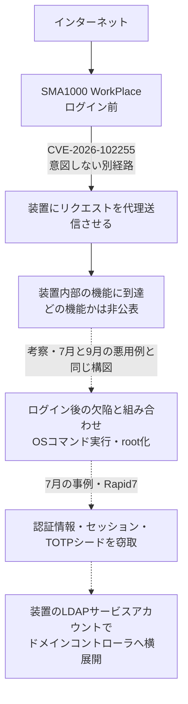

# SonicWall SMA1000 CVE-2026-102255 ― ログイン前の「意図しない別経路」から内部機能に届くSSRF、今年3度目のCVSS 10.0

## 要点

### 影響バージョン

- 対象はSMA1000の6210・7210・8200v。12.4.3系は 12.4.3-03526 以前、12.5.0系は 12.5.0-02952 以前が影響を受け、12.4.3-03670 以降、12.5.0-03082 以降のplatform-hotfixで修正（SonicWall、The Hacker News）。
- 9月1日に悪用中のゼロデイの修正版として案内された 12.4.3-03526 と 12.5.0-02952 も影響を受ける。9月に更新しただけの装置は、もう一度更新が必要（The Hacker News）。
- SonicWallファイアウォールのSSL-VPNとSMA 100シリーズは影響を受けない（SonicWall）。回避策は示されていない（The Hacker News）。

### 今すぐやること

- MySonicWallから修正版のhotfixを入手して適用する。適用後に装置は再起動する（The Hacker News）。
- （考察）7月・9月のゼロデイの修正を当てる前にインターネットに公開していた装置は、当時SonicWallが示した侵害の痕跡（IoC）の確認をあらためて行う。痕跡があれば、再イメージ化、全利用者・管理者のパスワード変更、TOTPのリセットを行う（SonicWallの7月・9月の案内による）。

## 概要

- SonicWallは2026年10月6日（米国時間）付のアドバイザリ SNWLID-2026-0017 で、SMA1000の4件の脆弱性を修正するhotfixを公開した。最も深刻な CVE-2026-102255 は、利用者がログインするポータル「WorkPlace」の認証前SSRFで、CVSSは10.0。
- 「意図しない別のアクセス経路」があるため、認証のない攻撃者が装置に自分の代わりのリクエストを送らせ、内部の機能に届いて不正な操作ができる。どの内部機能かは公表されていない。
- SonicWallは悪用の証拠はないとしている。ただし、WorkPlaceの認証前SSRF（CVSS 10.0）の修正はこれが今年3度目で、前の2回はいずれもゼロデイとして悪用されていた。

> この記事では、ベンダー・公的機関・研究者・報道で確認できた内容を「事実」、筆者の推測や意見を「考察」として分けて書いています。

## 何が起きたか（時系列）

| 日付 | 出来事 |
| --- | --- |
| 2026-07-14 | SonicWallが CVE-2026-15409（WorkPlaceの認証前SSRF、CVSS 10.0）と CVE-2026-15410 を公表。悪用を確認（SonicWall、Rapid7） |
| 2026-09-01 | SonicWallが CVE-2026-83548（WorkPlaceの認証前SSRF、CVSS 10.0）と CVE-2026-83549（管理コンソールのOSコマンドインジェクション）を公表。「1件の悪用事例」を調査したとし、12.4.3-03526／12.5.0-02952 で修正（The Hacker News） |
| 2026-10-06（米国時間） | SonicWallがアドバイザリ SNWLID-2026-0017 で4件を公表し、hotfixを公開（SonicWall、BleepingComputer） |
| 2026-10-07 22:07（日本時間） | CVE-2026-102255 のCVEレコードが公開される（CVE Program） |
| 2026-10-07 | The Hacker News、BleepingComputer が報道。Shadowserverはインターネットから見えるSMA1000を400台超観測（BleepingComputer） |

## 技術的な問題点（根本原因）

**事実（SonicWall、CVE Program）**

4件の内訳は次のとおり。

| CVE | 種類 | 場所 | 必要な権限 | CVSS |
| --- | --- | --- | --- | --- |
| CVE-2026-102255 | SSRF（CWE-918）、意図しない代理（Confused Deputy、CWE-441） | WorkPlace | なし | 10.0 |
| CVE-2026-102256 | OSコマンドインジェクション（遠隔コード実行につながる） | 装置（部位は非公表） | 管理者でログイン | 7.8 |
| CVE-2026-102257 | Zip Slip（細工したアーカイブで想定外の場所にファイルを展開、遠隔コード実行につながる） | 管理コンソール（AMC） | ログイン | 7.2 |
| CVE-2026-102258 | 蓄積型XSS | 管理コンソール（AMC） | 管理者でログイン | 5.5 |

（CVSSはThe Hacker Newsが伝えたSonicWallの値）

- CVE-2026-102255 の説明は「意図しない別のアクセス経路により、WorkPlaceに認証前のSSRFが存在する。この経路を悪用すると、認証のない遠隔の攻撃者が装置に自分の代わりにリクエストを出させ、内部の機能に到達して不正な操作を行える可能性がある」というもの。
- CVEレコードに付いた米CISAの評価（SSVC）は、悪用「なし」、自動化「可能」、技術的影響「全面的」。
- 発見者は、CVE-2026-102255 と 102256 がAnthropicのBenoît Sevens氏、102257 と 102258 がDigitalCanion SAのBrian Mariani氏（うち1件はTrend MicroのZero Day Initiative経由）。7月と9月のペアはSonicWallの社員が見つけていた（The Hacker News）。

**事実（Rapid7、7月の CVE-2026-15409 について）**

- WorkPlaceの `/wsproxy` にあるWebSocketのプロキシ機能が、URLのパラメータで指定した任意のホスト・ポートへのTCPトンネルを張れるようになっていた。宛先にlocalhostを指定すると、外から見えないはずの装置内部のサービス（localhost:1050 のErlangアプリケーション、localhost:8188 のctrl-serviceなど）と直接やり取りできた。
- 続く CVE-2026-15410 は、localhost:8188 の内部サービスに届く攻撃者が、パストラバーサルを使った `remove_hotfix` の処理でroot権限のOSコマンドを実行できるものだった。

**考察**

今回の CVE-2026-102255 で、どの経路からどの内部機能に届くのかは公表されていない。ただ、「認証前のSSRFで装置内部の機能に届く」という説明と「意図しない別のアクセス経路」という分類は、7月の `/wsproxy` の件と同じ構図を示している。SMA1000は、外向きのWorkPlaceの背後に、装置の中でだけ使う前提の管理用サービスを抱えている。そこへの到達を防ぐ仕組みは、WorkPlaceの入り口の確認に頼っている。その確認を回り込む「別の道」が、今年だけで3本見つかったことになる。

また、7月・9月はいずれも「認証前SSRF＋コマンド実行につながるもう一つの欠陥」のペアとして公表された。7月はRapid7が2件の連鎖による悪用を確認し、9月も連鎖させた悪用とみられている（The Hacker News）。今回もSSRF（102255）とログイン後のコマンドインジェクション（102256）が同じ研究者から同時に報告されている。SonicWallは4件を組み合わせられるかどうかを明らかにしていないが、運用者は組み合わせで装置を乗っ取られる前提で優先度を決めるべきだと考える。

## 攻撃・侵入経路

**事実（Rapid7、7月の悪用について）**

- 攻撃者は境界の装置を目立たない初期侵入口として使い、足場を作ると、価値の高い認証情報、有効なセッションのデータベース、TOTP（ワンタイムパスワード）のシード設定を系統的に抜き出した。標準的なネットワーク側の復旧作業の後も使い続けられる長期のアクセスを狙ったものだった。
- その後、装置の内部IPアドレスから、装置に設定されたLDAPサービスアカウントで、VPNを経由しないActive Directoryへの認証がドメインコントローラに対して行われた。クライアント名は `kali` など社内の台帳にない名前だった。

**事実（BleepingComputer）**

- 7月の2件のゼロデイは数週間にわたって悪用され、CISAはランサムウェア集団との関連を指摘した。CISAは過去4年でSonicWallの脆弱性19件をKEVに追加しており、うち13件はランサムウェア攻撃にも使われている。

**考察**

今回の4件は悪用が確認されていないが、7月の例が示すように、SMA1000を奪われると被害は装置にとどまらない。リモートアクセス装置は、利用者の認証情報とMFAの秘密、社内ディレクトリへの接続権限を一か所に集めている。装置のパスワードを変えるだけでは足りず、TOTPのリセットまで求められていたのはこのためだ。

## なぜ防げなかったか・構造的要因の考察

ここからは筆者の考察である。

1. **「中からしか届かない」前提の内部サービス**: 7月の件で、localhostで待ち受ける管理用サービスは、外からは届かない前提で作られ、強固でなかったとRapid7は指摘している。入り口のポータルに一つでも代理送信の経路があれば、その前提は崩れる。今回も「内部の機能に到達」とされており、同じ設計上の弱点が残っている可能性がある。入り口の欠陥を個別に塞ぐだけでなく、内部サービス自体に認証を求める多層化が必要だが、それはベンダー側でしか直せない。
2. **修正版が次の脆弱版になる**: 9月にゼロデイの修正版として案内された 12.4.3-03526／12.5.0-02952 が、1か月後には影響を受けるバージョンになった。「緊急パッチを当てたから安全」という判断は、同じ部位で欠陥が続く製品では長持ちしない。
3. **外部の研究者の目が入り始めた**: 7月と9月のペアは社内で見つかったが、今回の4件はすべて外部の研究者の報告だ。直前の2回の悪用で、この製品のWorkPlace周りが研究者の注目を集めていると考えられる。研究者が見ている場所は攻撃者も見ている。修正の差分から攻撃方法を割り出されるまでの時間は短いと見ておくべきだ。
4. **台数は少なくても標的としての価値は高い**: Shadowserverの観測は400台超と、ほかのVPN製品に比べれば少ない。しかしBleepingComputerによれば、SMA1000は政府機関やMSSP、大企業が社内アプリへの入り口として使う製品で、1台あたりの価値が高い。

## 運用者向けの具体的な対策と検知ポイント

**対策**

- 12.4.3-03670 以降、または 12.5.0-03082 以降のplatform-hotfixへ更新する。9月に 12.4.3-03526／12.5.0-02952 へ更新した装置も対象（SonicWall、The Hacker News）。
- （考察）更新の前に、装置のログと設定のバックアップを保全しておく。更新後の再起動で消える情報があるため。
- （考察）WorkPlaceとは別に、管理コンソール（AMC）がインターネットから届かないことを確かめる。今回の4件のうち3件はログイン後の欠陥で、2件はAMCにある。
- （考察）装置に設定しているLDAP／ADのサービスアカウントは権限を最小限にし、ドメインコントローラ側でそのアカウントの利用元を装置の通常の動作に限って監視する。

**検知ポイント**

- （考察）ドメインコントローラで、SMA1000の内部IPアドレスからの、VPNセッションと対応しない認証、`kali` など台帳にないクライアント名からの認証を探す。7月の悪用で観測された特徴（Rapid7）。
- （考察）SMA1000に、身に覚えのない管理者アカウント、設定の変更、hotfixの適用・削除の履歴がないかを確かめる。
- 7月・9月のアドバイザリでSonicWallが示したIoCの確認手順を、まだ実施していない装置は実施する。今回のアドバイザリには、IoCの確認や再イメージ化の指示はない（The Hacker News）。

## 参考リンク

- SonicWall: [SNWLID-2026-0017（SMA1000の4件の脆弱性）](https://psirt.global.sonicwall.com/vuln-detail/SNWLID-2026-0017)
- CVE Program: [CVE-2026-102255](https://www.cve.org/CVERecord?id=CVE-2026-102255) / [CVE-2026-102256](https://www.cve.org/CVERecord?id=CVE-2026-102256) / [CVE-2026-102257](https://www.cve.org/CVERecord?id=CVE-2026-102257) / [CVE-2026-102258](https://www.cve.org/CVERecord?id=CVE-2026-102258)
- The Hacker News: [SonicWall Patches CVSS 10.0 Pre-Authentication SSRF Flaw in SMA1000 Appliances](https://thehackernews.com/2026/10/sonicwall-patches-cvss-100-pre.html)
- BleepingComputer: [SonicWall warns of max severity SSRF flaw in SMA1000 gateways](https://www.bleepingcomputer.com/news/security/sonicwall-warns-of-max-severity-ssrf-flaw-in-sma1000-gateways/)
- The Hacker News: [Attackers Exploit Two SonicWall SMA 1000 Zero-Days That May Form an Attack Chain](https://thehackernews.com/2026/09/attackers-exploit-two-sonicwall-sma.html)
- Rapid7: [Rapid7 MDR Team Discovers New SonicWall SMA1000 Zero Days being Actively Exploited (CVE-2026-15409, CVE-2026-15410)](https://www.rapid7.com/blog/post/etr-rapid7-mdr-team-discovers-new-sonicwall-sma1000-zero-days-being-actively-exploited-cve-2026-15409-cve-2026-15410)
