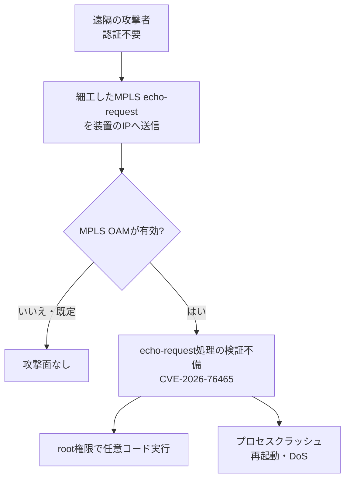

# Cisco NX-OS CVE-2026-76465 ― MPLS OAMのecho-request検証不備で認証なしroot実行、Nexus 3000/9000の診断機能が攻撃面に

## 要点

### 影響バージョン

- 影響を受けるのは、脆弱なCisco NX-OSを動かし、かつ **MPLS OAM機能が有効** な次の製品（Cisco）。
  - Nexus 3000 Series Switches
  - Nexus 9000 Series Switches（スタンドアロンNX-OSモード）
- Silicon One ASICのNexus 9000はMPLS OAMを有効にできず、本件の影響を受けない（Cisco）。
- MPLS OAMはNexus 3000／9000で **既定無効**（Cisco）。
- 同じ10月7日のNX-OSセキュリティ強化リリース群では、スタンドアロンNX-OSのNexus 3000／9000向け修正版として 10.3(10)／10.4(8)／10.5(6)／10.6(4) が示されている（Cisco NX-OS Security Hardening Release: October 2026）。個別の版判定はCisco Software Checkerを使う（MPLS OAMアドバイザリ）。

### 今すぐやること

- `show feature | include mpls_oam` でMPLS OAMが有効か確認する。不要ならグローバル設定で `no feature mpls oam` を実行し攻撃面を外す（Cisco）。
- すぐ更新できない場合は、一時緩和としてLive Protectシールド lp00037 を検討する。恒久対策は修正版へのアップグレード（Cisco）。
- 修正版へ更新する。回避策（workaround）はなく、機能無効化とLive Protectは緩和にすぎない（Cisco）。

## 概要

- Ciscoは2026年10月7日 16:00 GMT付で、Nexus 3000およびスタンドアロンNX-OSのNexus 9000におけるMPLS OAMのリモートコード実行脆弱性 CVE-2026-76465（CVSS 9.8）を公表した。
- 原因は、MPLS echo-requestパケット処理時の検証不備。認証のない遠隔の攻撃者が、装置のIPアドレス宛に細工したecho-requestを送ると、root権限での任意コード実行や、プロセスクラッシュによる再起動・DoSが起きうる。
- Cisco PSIRTは悪用の公表や悪意ある利用は把握していないとしている。社内セキュリティテストで見つかった。同日、NX-OS全体のセキュリティ強化リリースもまとめて公開されている。

> この記事では、ベンダー・公的機関・研究者・報道で確認できた内容を「事実」、筆者の推測や意見を「考察」として分けて書いています。

## 何が起きたか（時系列）

| 日付 | 出来事 |
| --- | --- |
| （非公表） | Ciscoの社内セキュリティテストで欠陥を発見（Cisco） |
| 2026-10-07 16:00 GMT | Ciscoがアドバイザリ cisco-sa-moam-rce-uBTzYV7（CVE-2026-76465）を公開。同日、NX-OS Security Hardening Release（複数CVEをCWE単位で束ねた強化版）も公開（Cisco） |
| 2026-10-07 | Live Protectシールド lp00037 のリリースノートでも同CVEの一時緩和が案内される（Cisco） |
| 2026-10-07〜08 | CVE Briefなどの集約サイトが、同日のCisco NX-OS関連の重大CVE群として取り上げる |

## 技術的な問題点（根本原因）

**事実（Cisco）**

- MPLS OAMは、MPLSネットワークのデータプレーン障害をMPLS ping／tracerouteで調べる診断機能である。
- 脆弱性は「影響を受ける装置がMPLS echo-requestを処理するときの検証不備」による。攻撃者は、影響装置上のIPアドレス宛に細工したMPLS echo-requestを送る。
- 成功すると、root権限での任意コード実行に加え、プロセスクラッシュから装置再読み込み・DoSにつながりうる。
- CVSS 3.1は 9.8（AV:N/AC:L/PR:N/UI:N/S:U/C:H/I:H/A:H）。ネットワーク到達・低複雑度・権限不要・利用者操作不要で、機密性・完全性・可用性すべてHigh。
- 回避策はない。ただし機能自体が不要なら無効化で攻撃ベクトルを除去できる、とCiscoは緩和策として示している。
- Live Protectシールドは、更新までのつなぎであり、最終的にはFixed Softwareへの更新が必要。

**事実（同時公開の強化リリース）**

- 同日の「Security Hardening Release」は、社内レビュー（既存のテストに加えfrontier AIモデルも利用）で見つかった複数欠陥を、CWE単位に束ねてCVEを付与したもの。悪用は確認されていない。MDS／Nexus 7000／ACIモード／UCS Fabric Interconnectなども対象に含むが、本件CVE-2026-76465の影響製品はMPLS OAMアドバイザリ側の定義に従う。

**考察**

MPLS OAMは「障害切り分け用の診断」であり、常時オンにする機能ではない。既定無効であることは防御側に有利だが、有効にした瞬間に、認証なし・ネットワーク到達だけでrootまで届く面が開く。診断機能は運用者の利便のために装置の深い権限で動くことが多く、入力検証の欠陥がそのまま高権限のRCEになる。境界ファイアウォールの外側からMPLS echo-requestが届く経路があるかどうかは環境次第だが、CVSSは「届く前提」で最大近くまで振られている。データセンター内の到達可能性だけで評価せず、管理・監視セグメントからの到達も含めて見る必要がある。

## 攻撃・侵入経路

**事実（Cisco）**

- 悪用の公開や実際の悪意ある利用は、公表時点でPSIRTは把握していない。
- 有効かどうかの確認コマンド例：`show feature | include mpls_oam`（有効時は `mpls_oam 1 enabled` のように出る）。

## なぜ防げなかったか・構造的要因の考察

ここからは筆者の考察である。

1. **診断機能＝低リスク、という思い込み**: ping／traceroute系は「見るだけ」に見えやすいが、実装は特権プロセスでパケットを深くパースする。OAM系は過去にもネットワーク機器の攻撃面になってきた。
2. **「使っている機能」の棚卸し不足**: 既定無効でも、過去のMPLS導入試験やベンダー手順書のコピーで有効のまま残ることがある。今回の最初のアクションが「機能の有無確認」になっているのはそのためだ。
3. **パッチと一時盾の二段構え**: Live Protectは更新ウィンドウを稼げる一方、「盾を当てたから更新しなくてよい」と誤解されやすい。Cisco自身が恒久対策はFixed Softwareだと繰り返し書いている。
4. **同日に大量の強化CVE**: 運用者は「どれが自分のトポロジに効くか」を切り分ける必要がある。本件は「MPLS OAM有効のスタンドアロンNexus 3000／9000」という条件がはっきりしており、優先度判断の軸にしやすい。

## 運用者向けの具体的な対策と検知ポイント

**対策**

- 対象装置でMPLS OAMの有効／無効を確認し、不要なら `no feature mpls oam` で無効化する（Cisco）。
- Cisco Software Checkerで自装置の版とFirst Fixedを確認し、該当する修正版（スタンドアロンNexus 3000／9000では強化リリース表の 10.3(10)／10.4(8)／10.5(6)／10.6(4) など）へ計画更新する（Cisco）。
- 更新までの間、対応するLive Protectシールド（lp00037）の適用可否を検討する（Cisco）。
- （考察）MPLS OAMが必要な区間でも、管理外セグメントから装置の該当IPへMPLS OAM関連パケットが届かないよう、到達経路を絞る。

**検知ポイント**

- （考察）想定外のMPLS echo-request／OAM関連トラフィックの急増、MPLS OAMプロセスの異常終了や想定外の装置リロード。
- Live Protect適用環境では、シールドヒット時のsyslog（`%APPMGR-2-NXSECURE_CRIT_THREAT` など、lp00037のリリースノートに例示）を監視する（Cisco）。
- 設定監査で `feature mpls oam` が残っていないかを定期確認する。

## 参考リンク

- Cisco: [Cisco Nexus 3000 and 9000 Series Switches MPLS OAM Remote Code Execution Vulnerability（CVE-2026-76465）](https://sec.cloudapps.cisco.com/security/center/content/CiscoSecurityAdvisory/cisco-sa-moam-rce-uBTzYV7)
- Cisco: [Cisco NX-OS Software Security Hardening Release: October 2026](https://sec.cloudapps.cisco.com/security/center/content/CiscoSecurityAdvisory/cisco-sa-hardening-nxosw1-cWzSbtR)
- Cisco: [Release Notes for NX-OS Live Protect Shield-LP00037](https://www.cisco.com/c/en/us/td/docs/dcn/nx-os/nexus9000/106x/release-notes/nxos-live-protect-shield-lp00037.pdf)
- Tenable / OpenCVE: [CVE-2026-76465](https://www.tenable.com/cve/CVE-2026-76465)
