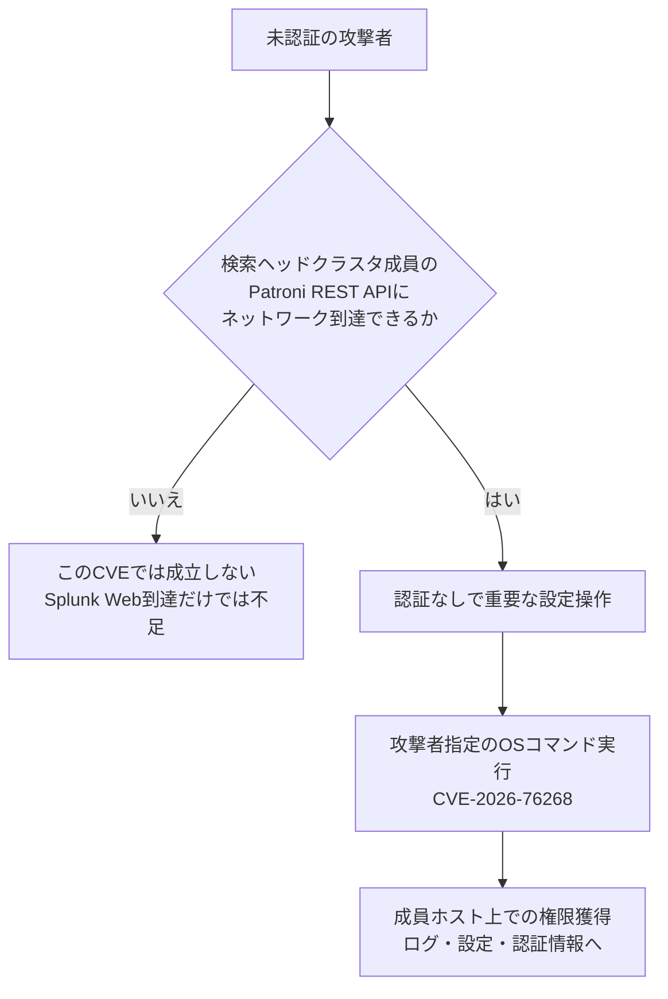

# Splunk Enterprise CVE-2026-76268 ― 検索ヘッドクラスタのPatroni REST APIが認証なし、到達できればOSコマンド実行

## 要点

### 影響バージョン

- **CVE-2026-76268**（CVSS 9.8）: Splunk Enterprise **10.4.0〜10.4.2** および **10.2.0〜10.2.6**。修正は **10.4.3** および **10.2.7**（Splunk SVD-2026-1001）。
- **10.0.x と 9.4.x は、このCVEの影響を受けない**（Splunk）。
- 条件は、検索ヘッドクラスタ（search head cluster）成員上の **Patroni REST API にネットワーク到達できること**。Splunk Webに届くだけでは足りず、このインターフェースへの到達が必要（Splunk、CyberPress）。
- 同アドバイザリ全体では 10.0.10／9.4.15 なども含む17件を修正しているが、本件クリティカルは上記ブランチに限る。

### 今すぐやること

- 検索ヘッドクラスタ成員を 10.4.3 または 10.2.7（以降）へ更新する（Splunk）。
- Edge Processor・OpAmp・SPL2データパイプラインを使っていないなら、`$SPLUNK_HOME/etc/system/local/server.conf` の `[postgres]` で `disabled = true` とし、再起動してPostgreSQLサイドカー（＝Patroni面）を止める（Splunk）。
- （考察）Patroni／サイドカー用ポートがクラスタ外やインターネットから見えていないか、セキュリティグループとホストファイアウォールで確認する。

## 概要

- Splunkは2026年10月7日付の脆弱性開示 SVD-2026-1001 で、Enterpriseの複数欠陥を修正した。最高スコアは CVE-2026-76268（CVSS 9.8）。
- 欠陥は、検索ヘッドクラスタ成員のPatroni REST APIで、重要な設定操作に認証が付いていないこと（CWE-306）。未認証の利用者が、そのAPIにネットワーク到達できれば、攻撃者が指定したOSコマンドを実行できる。
- 発見者はSplunkのGabriel Nitu氏。アドバイザリ時点で、悪用の確認や公開PoCの記述はない（CyberPressがアドバイザリを要約）。

> この記事では、ベンダー・公的機関・研究者・報道で確認できた内容を「事実」、筆者の推測や意見を「考察」として分けて書いています。

## 何が起きたか（時系列）

| 日付 | 出来事 |
| --- | --- |
| （非公表） | SplunkのGabriel Nitu氏が欠陥を発見（Splunk） |
| 2026-10-07 | Splunkが SVD-2026-1001 を公開。CVE-2026-76268 ほか計17件（Critical 1・High 1・Medium 15）（Splunk） |
| 2026-10-08 | CyberPressなどが未認証のOSコマンド実行として報道 |

## 技術的な問題点（根本原因）

**事実（Splunk）**

- CVE-2026-76268の説明: Enterpriseの 10.4.3／10.2.7 未満で、検索ヘッドクラスタ成員のPatroni REST APIにネットワーク到達できる未認証利用者が、攻撃者制御のOSコマンドを実行できる。重要な設定操作に認証が求められないため。
- Splunkはサイドカー設定（Sidecar configuration settings）のドキュメントを参照するよう案内している。緩和策は、Edge Processor／OpAmp／SPL2データパイプラインを使わない場合にPostgreSQLサイドカーを無効化すること。
- 分類は CWE-306（Missing Authentication for Critical Function）。CVSS 3.1ベクトルは AV:N/AC:L/PR:N/UI:N/S:U/C:H/I:H/A:H。

**事実（同アドバイザリの周辺）**

同日の開示には、例えば次も含まれる（いずれも本件ほど優先度は高くないが、更新時にまとめて潰せる）。

| CVE | 概要 | スコア |
| --- | --- | --- |
| CVE-2026-76266 | Linuxパッケージ更新時、既存インストール内容を信用してrootでコマンドが走るローカル権限昇格 | 7.7 |
| CVE-2026-76269 | 他ユーザーのサーチジョブ（クエリ・結果など）をREST経由で読める | 6.5 |
| CVE-2026-76274 | Observability CloudアプリのSSRFでAPIトークン漏えい | 6.5 |
| CVE-2026-76265／76272／76280 | Secure Gatewayの認可・署名・KV Store書き込みの不備（別途Secure Gatewayの更新が必要） | 最大6.5 |

**考察**

PatroniはPostgreSQLの高可用性を担う制御プレーンで、クラスタの構成変更やフェイルオーバーに関わる操作を持つ。それを「サイドカーとして製品に内蔵し、かつ重要な操作を認証なしで受け付ける」と、Splunk本体のRBACとは別の、より生に近い管理APIが装置の横に生える。運用者が意識している守りはSplunk WebとSplunkのRESTであることが多く、サイドカーの待ち受けは棚卸しから漏れやすい。CVSSが9.8になるのは、「アカウント不要」と「OSコマンド」が直結しているためで、到達経路さえあれば初期アクセスとして完結する。

## 攻撃・侵入経路

**事実（Splunk、CyberPress）**

- 攻撃条件はPatroni REST APIへのネットワークアクセスであり、単にSplunk Webへ届くことではない。
- アドバイザリは悪用や公開PoCを示していない。

## なぜ防げなかったか・構造的要因の考察

ここからは筆者の考察である。

1. **製品に同梱された「別プロセス」の認証境界**: 本体のログインと、サイドカーの管理APIの認証が別物だと、片方だけ固めても穴が残る。クラスタ機能を足すほど、この種の補助プロセスは増えやすい。
2. **「クラスタ内部通信」前提の露呈**: Patroni APIが成員間やループバックだけのつもりでも、バインドアドレスやセキュリティグループの設定次第で広く見える。クラウドの検索ヘッドでは特に起きやすい。
3. **機能フラグと攻撃面の連動**: PostgreSQLサイドカーはEdge Processor等のための部品であり、使っていなければ止められる、とベンダー自身が書いている。機能を有効にしたまま使っていない状態が、いちばん危ない。
4. **バージョン枝による当たり外れ**: 10.0.x／9.4.xは本件対象外。同じ「Enterprise」でも枝ごとにサイドカーの有無や実装が違う。インベントリを「Splunkがある」ではなく「何系の何機能か」まで落とす必要がある。

## 運用者向けの具体的な対策と検知ポイント

**対策**

- 検索ヘッドクラスタ成員を **10.4.3** または **10.2.7**（以降）へ更新する（Splunk）。
- Edge Processor・OpAmp・SPL2データパイプラインを使わない環境では、`server.conf` の `[postgres]` に `disabled = true` を入れ、再起動する（Splunk）。
- 同アドバイザリの他CVEも、可能ならまとめて修正版へ。Secure Gateway関連はアプリ側の 3.10.11／3.9.25／3.8.72 以降も必要（Splunk）。
- CVE-2026-76264は更新後に `limits.conf` の `[lookup]` で `scripted_lookup_raw_write_enforcement = block` を設定して再起動、という追加手順がある（Splunk）。
- （考察）Patroni／サイドカーの待ち受けをクラスタ成員間に限定し、管理VLANやインターネットから閉じる。

**検知ポイント**

- （考察）検索ヘッド上で、Patroni／PostgreSQLサイドカー宛の想定外のHTTPリクエスト、未知のプロセス起動、Splunkサービスアカウント以外からのコマンド実行。
- （考察）セキュリティグループ・ホストFWの変更履歴と、サイドカー用ポートの外部公開スキャン結果。
- 悪用IoCはベンダーから示されていないため、公開後のスキャナ動向（突然のPatroniポート探査）を脅威インテリジェンス側で追う。

## 参考リンク

- Splunk: [SVD-2026-1001 — Security Vulnerabilities in Splunk Enterprise - September/October 2026](https://advisory.splunk.com/advisories/SVD-2026-1001)
- Splunk Docs: [Sidecar configuration settings](https://help.splunk.com/en/data-management/splunk-enterprise-admin-manual/10.2/splunk-sidecars/sidecar-configuration-settings)
- OpenCVE / Rapid7: [CVE-2026-76268](https://app.opencve.io/cve/CVE-2026-76268)
- CyberPress: [Critical Splunk Enterprise Vulnerability Lets Unauthenticated Attackers Execute OS Commands](https://cyberpress.org/critical-splunk-enterprise-vulnerability/)
