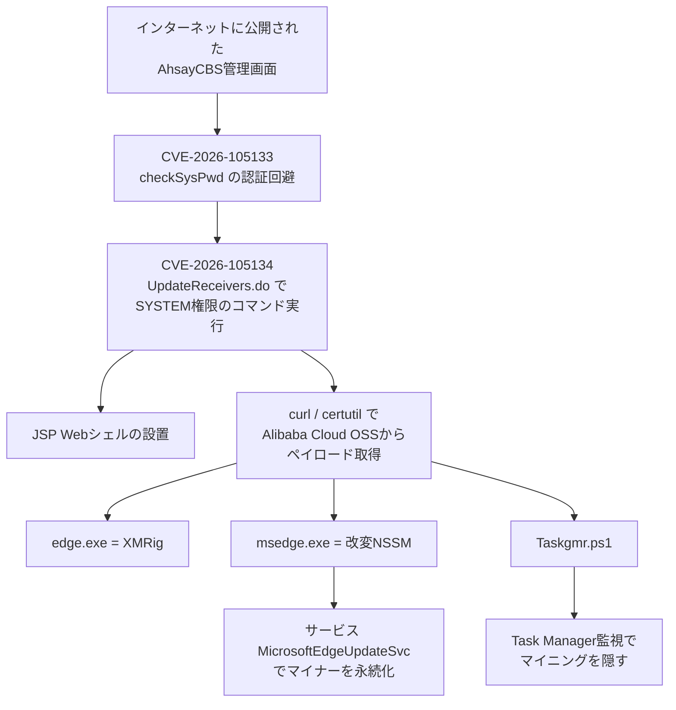

# AhsayCBS CVE-2026-105133／105134 ― 認証回避とコマンド注入の連鎖でバックアップ管理コンソールが奪われ、最新版もまだ直っていない

## 要点

### 影響バージョン

- 対象はAhsay Systemsのクラウドバックアップ管理コンソール **AhsayCBS**（Managed Service Providerやシステムインテグレータがよく使う製品）（Huntress）。
- NVDは「10.3.2までが影響を受け、10.3.4への更新で緩和／解決できる」と書いている（NVD、VulDB）。一方Huntressは、**最新の10.3.4も影響を受ける**と再調査し、ベンダーへ連絡したと述べている（Huntress、2026年10月9日前後の更新）。
- CVE-2026-105133（CVSS 3.1で7.3、CWE-287）: APIの `checkSysPwd`（`ApiStructsAction.java`）で、引数 `random` を操作すると認証が正しく行われない（NVD）。
- CVE-2026-105134（CVSS 3.1で10.0、CWE-77／78）: レプリケーション受信側の `/rps/api/json/UpdateReceivers.do` で、同じ `random` の操作からOSコマンドインジェクションに至る。Huntressによると、ランダムなトークンを正規の資格情報の代わりに使える認証回避があり、悪用後はSYSTEM権限でのリモートコード実行になる（NVD、Huntress）。
- 回避策として公開されているのは、管理画面へのアクセスを信頼できるIPに限定するかVPN経由にすること。Huntressが観測した時点で、有効な修正版はない（Huntress）。

### 今すぐやること

- AhsayCBSの管理画面（Webアプリ）をインターネットから閉じ、信頼できるIPアドレスだけに限定するかVPN経由にする（Huntress）。
- Huntressが公開したIoCとSigmaルールで、侵害の痕跡を探す。見つかったら、信頼できるバックアップからの再イメージ化を検討する（Huntress）。
- （考察）MSPとして顧客のバックアップを預かっている場合、自分の管理コンソールが侵害されると顧客側のバックアップ方針や資格情報にも影響しうる。顧客への連絡と、レプリケーション受信側の設定の見直しも同時に進める。

## 概要

- 2026年10月4日、NVDにAhsayCBSの2件のCVEが登録され、その時点で攻撃コードが公開されていると書かれた。10月7日23時20分（UTC）ごろから、Huntressは悪用によるリモートコード実行を観測し始めた。
- 攻撃者は認証回避（105133）とコマンド注入（105134）を連鎖させ、JSPのWebシェルを置き、Microsoft Edgeに見せかけたXMRigマイナーと、Task Managerを監視してマイニングを隠すPowerShellスクリプトを落とす。
- 2026年8月5日付のリリースノートで案内されている最新版10.3.4でも、Huntressは欠陥が直っていないと確認した。NVDの「10.3.4で直る」という記述と食い違っており、当面は露出を減らすしかない。

> この記事では、ベンダー・公的機関・研究者・報道で確認できた内容を「事実」、筆者の推測や意見を「考察」として分けて書いています。

## 何が起きたか（時系列）

| 日付 | 出来事 |
| --- | --- |
| 2026-08-05 | AhsayがAhsayCBS（DIY）v10.3.4のリリースノートを公開（Ahsay）。セキュリティ修正についての記載は見当たらない |
| 2026-10-04 | NVDがCVE-2026-105133とCVE-2026-105134を公開。攻撃コードが公開されており、10.3.2までが対象、10.3.4への更新を勧めると記載（NVD／VulDB） |
| 2026-10-07 23:20:15（UTC） | Huntressが、悪用によるリモートコード実行とWebシェルの設置を観測し始める（Huntress） |
| 2026-10-08時点 | 少なくとも5組織が標的になった。Huntressは10.3.4も影響を受けると更新し、Ahsayへ連絡したと述べる（Huntress） |
| 2026-10-09 | BleepingComputer、The Hacker News、SecurityWeekが報道 |

## 技術的な問題点（根本原因）

**事実（NVD／VulDB）**

- CVE-2026-105133は、APIの `checkSysPwd` で引数 `random` を操作すると認証が正しく行われない欠陥（CWE-287）。リモートから開始でき、CVSS 3.1は7.3。
- CVE-2026-105134は、レプリケーション受信側の `/rps/api/json/UpdateReceivers.do` で、同じく `random` の操作からOSコマンドインジェクションに至る欠陥（CWE-77／78）。CVSS 3.1は10.0（スコープ変更あり）。
- どちらも「攻撃コードが公開されている」と書かれている。参照先はVulDBと、10.3.4のリリースノートである。

**事実（Huntress）**

- 攻撃者はまず105133で認証を迂回し、次に105134でコード実行を得る、という連鎖を使っている。
- 105134については、APIに「ランダムなトークンを正規の資格情報の代わりに使える」認証回避があり、悪用後に悪意のあるレプリケーション受信側を設定して、CBSが配信するディレクトリへJSPのWebシェルを置いている。実行権限は NT AUTHORITY\\SYSTEM。
- NVDが「10.3.4で直る」と書いたあと、Huntressは10.3.4も影響を受けると確認した。

**考察**

レプリケーション受信側のAPIが、バックアップデータの受け取りという「運用のための口」でありながら、認証の代わりに `random` という操作しやすい引数を信じている、というのが両方の欠陥に共通している。バックアップ製品は、災害復旧や顧客環境の集中管理のためにインターネットから届くことが多く、管理コンソールの露出と、レプリケーションという別の攻撃面が重なる。

NVDの「10.3.4で直る」と、Huntressの「10.3.4でも直っていない」の食い違いは、VulDB経由の記述がベンダーの実際の修正内容を正しく反映していなかった可能性が高い。Ahsayの10.3.4のリリースノート（2026年8月5日）には、これらのCVEや認証まわりの修正は見当たらない。CVEの登録日（10月4日）より前のビルドを「修正版」として案内している時点で、運用者はベンダーの案内と第三者の再現結果の両方を見る必要がある。

## 攻撃・侵入経路

**事実（Huntress）**

- 初期アクセス後、いくつかの事件ではすぐにWebアプリのディレクトリへ `.jsp` のWebシェルが置かれた。別の事件では、`cbssvcX64.exe` から子プロセスが生まれ、`%TEMP%` へ `Taskgmr.ps1`、`msedge.exe`、`edge.exe`、`config.json` が落とされた。取得元は `imagefiles-backup.oss-ap-southeast-7.aliyuncs[.]com`。
- `edge.exe` はXMRigで、マイニングプール `xmr.kryptex[.]network:8029`（例: 51.195.127[.]124:8029）へ接続した。
- `msedge.exe` は正規のNSSM（Non-Sucking Service Manager）を改変したもので、サービス `MicrosoftEdgeUpdateSvc`（本物のEdge Updateは `edgeupdate`）としてSYSTEM権限で動かし、マイナーを再起動させる。
- `Taskgmr.ps1` はコメントの書き方からAIの支援で書かれたとHuntressは見ている。Task Managerが開いている間はマイニングサービスを止め、閉じたら再開する。18時ちょうどや、夜間に1時間以上開きっぱなしのときにもTask Managerを終了させる。時刻はホストのローカル時刻（`Get-Date`）を使う。
- 少なくとも1件で、`certutil.exe` により脆弱なカーネルドライバ `WinRing0x64.sys` がTEMPへ落とされた。Huntressは、マイナーにハードウェアへの広いアクセスを与えるためとみている（セキュリティ製品の無効化が主目的ではなさそう、と述べている）。

## なぜ防げなかったか・構造的要因の考察

ここからは筆者の考察である。

1. **バックアップ製品が持つ「集中管理」の魅力と危険**: MSP向けのバックアップ管理コンソールは、多数の顧客環境を1か所から扱うためにインターネットへ開きやすい。侵害されると、バックアップ方針の改ざん、資格情報の窃取、顧客側への横展開の足場になる。
2. **CVE登録と修正版の食い違い**: 「公開された攻撃コードがある」と書かれた翌日ではなく、その3日後に悪用が始まっている。一方で「直った」と案内されたビルドが直っていなかったため、更新した運用者も安心できない。第三者の再現結果が出るまで、信頼できる緩和は露出の削減だけになる。
3. **マイニングに特化した隠蔽**: Task Managerを監視して止める、サービス名をEdge Updateに似せる、正規ツール（NSSM、certutil、curl）を使う、という組み合わせは、エンドポイント検知の「変なプロセス」より「いつもの名前のサービス」に紛れやすい。バックアップサーバはCPUが高いことも多く、マイニングのノイズに気づきにくい。
4. **レプリケーションAPIという忘れられやすい口**: 管理画面のログインだけを守っても、レプリケーション受信側のAPIが別経路でSYSTEMまで届くなら、入口は閉じきれていない。製品の「機能の口」を棚卸しする必要がある。

## 運用者向けの具体的な対策と検知ポイント

**対策**

- 管理画面のWebアクセスを、信頼できるIPアドレスだけに限定するか、VPN経由にする（Huntress）。攻撃はホスト上で外部から届くWebアプリを狙っている。
- IoCが見つかった場合は、信頼できるバックアップからのフル再イメージ化を検討する。攻撃者が二次的な裏口を残している可能性がある（Huntress）。
- （考察）パッチが出るまで、レプリケーション受信側をインターネットに公開している構成がないかを確認し、必要な通信だけに絞る。
- （考察）Ahsayからの正式な修正版の案内を待ち、NVDやVulDBの「修正済み」表記だけを信じない。

**検知ポイント**

- `cbssvcX64.exe` から `curl` や `certutil` が生まれること（Huntress）。
- サービス `MicrosoftEdgeUpdateSvc`、またはTEMP配下の `edge.exe`／`msedge.exe`／`Taskgmr.ps1`／`WinRing0x64.sys`（Huntress）。
- TEMPやAppData配下から `xmr.kryptex[.]network:8029` や 51.195.127[.]124 への通信（Huntress）。
- Huntressが公開した4本のSigmaルール（[huntresslabs/threat-intel の 2026/2026-10/AhsayCBS_XMRig_Miner](https://github.com/huntresslabs/threat-intel/tree/main/2026/2026-10/AhsayCBS_XMRig_Miner)）。
- 送信元として挙げられたIPの例: 123.202.208[.]37 ほか（HuntressのIoC表を参照）。

## 参考リンク

- Huntress: [Threat Actors Exploit Critical AhsayCBS Flaws to Drop Webshells and XMRig Cryptominer](https://www.huntress.com/blog/ahsaycbs-flaws-exploit)
- NVD: [CVE-2026-105133](https://nvd.nist.gov/vuln/detail/CVE-2026-105133) / [CVE-2026-105134](https://nvd.nist.gov/vuln/detail/CVE-2026-105134)
- Ahsay: [AhsayCBS (DIY) v10.3.4 Release Notes](https://www.ahsay.com/en/support/help-centre/release-notes/cbs/v10.3.4)
- Huntress threat-intel: [AhsayCBS_XMRig_Miner Sigmaルール](https://github.com/huntresslabs/threat-intel/tree/main/2026/2026-10/AhsayCBS_XMRig_Miner)
- BleepingComputer: [Unpatched AhsayCBS flaws exploited to deploy webshells, mine crypto](https://www.bleepingcomputer.com/news/security/unpatched-ahsaycbs-flaws-exploited-to-deploy-webshells-mine-crypto/)
- The Hacker News: [Attackers Exploit AhsayCBS Flaws to Deploy XMRig Miners Disguised as Microsoft Edge](https://thehackernews.com/2026/10/attackers-exploit-ahsaycbs-flaws-to.html)
- SecurityWeek: [Unpatched AhsayCBS Vulnerabilities Exploited in the Wild](https://www.securityweek.com/unpatched-ahsaycbs-vulnerabilities-exploited-in-the-wild/)
