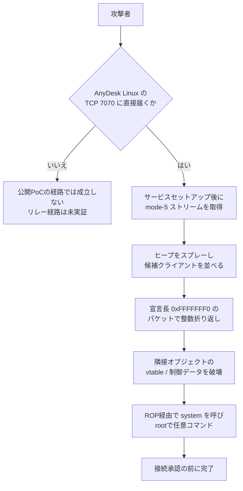

# AnyDesk Linux AnyPwn ― 「クラッシュ修正」とだけ書かれたヒープオーバーフローに、認証前rootの攻撃コードが公開された

## 要点

### 影響バージョン

- 公開された攻撃コードが対象にしているのは **AnyDesk Linux 8.0.2**（ビルドのSHA-256: `62ee04ad48dc039dd9c927f998e56143c87a9c5e12d28654f78c7f6340394f5a`）（V12）。
- **8.0.3で修正済み**。最新は **8.1.0**（The Hacker News、V12）。WindowsとmacOSは影響を受けない、とAnyDeskは6月に述べている（The Hacker Newsが伝えるAnyDeskの説明）。
- CVEは、2026年10月9日時点で割り当てられていない。6月の修正は変更履歴の「クラッシュにつながる不具合の修正」だけで、正式なセキュリティ情報は出ていない（The Hacker News、V12）。
- 公開PoCは **直接のTCP接続（ポート7070）** で動く。研究者はリレー経由でも同じ脆弱な経路に届くことをFridaで確認したが、リレーでの完全な攻撃は示していない（V12）。AnyDeskは6月、「Linuxの直接接続に限る」と説明している（The Hacker News）。

### 今すぐやること

- AnyDesk Linuxを **8.0.3以上**（できれば最新の8.1.0）へ更新する（V12、The Hacker News）。
- すぐ更新できない場合は、TCP 7070への到達を制限する（V12、The Hacker News）。
- （考察）CVEがないため、脆弱性スキャナのCVEフィードだけでは拾えない。AnyDesk Linuxの実バージョンと、7070の公開有無をインベントリで確認する。

## 概要

- 2026年10月8日、V12セキュリティチームがGitHubで「AnyPwn」を公開した。AnyDesk Linuxのセッションプロトコルに、接続を承認する前にrootで任意コマンドを実行できるヒープバッファオーバーフローがある、とする攻撃コードである。
- 欠陥は6月22日に公表され、翌23日にAnyDeskが認めて8.0.3で直した。しかし変更履歴は「クラッシュにつながる不具合の修正」にとどまり、CVEもセキュリティ情報もないまま約3か月半が過ぎた。
- Linuxではサービスがrootで動くことが多く、成功すればデスクトップの操作許可を待たずに管理者権限を得られる。PoCはヒープ配置に依存する確率的なもので、オフセットは8.0.2専用である。

> この記事では、ベンダー・公的機関・研究者・報道で確認できた内容を「事実」、筆者の推測や意見を「考察」として分けて書いています。

## 何が起きたか（時系列）

| 日付 | 出来事 |
| --- | --- |
| 2026-04-01 | AnyDesk Linux 8.0.2がリリースされた、とThreatWireなどの二次情報がまとめている（ThreatWire） |
| 2026-06-22 | V12のRick de Jager氏らが欠陥を公表（V12、The Hacker News） |
| 2026-06-23 | AnyDeskが認めて8.0.3を出し、変更履歴に「クラッシュにつながる不具合の修正」とだけ記した（The Hacker News、V12） |
| （6月以降） | 正式なセキュリティ情報やCVEは出ないまま推移（The Hacker News） |
| 2026-10-08 | V12が公開リポジトリにAnyPwn（攻撃コード）を追加（GitHubのコミット日時は2026-10-08 21:19 UTC） |
| 2026-10-09 | The Hacker Newsが報道。ダウンロードページから8.0.2が消えている、と研究者は述べている（The Hacker News） |

## 技術的な問題点（根本原因）

**事実（V12のREADME）**

- セッションプロトコルの **mode-5** ストリームパケットの処理で、宣言されたペイロード長を検証する前に信じている。
- 確保する領域の大きさは「宣言された長さ + 16バイトのヘッダ」を **32ビット算術** で計算する。オーバーフローの検査はない。
- AnyPwnは宣言長を `0xFFFFFFF0` にする。`0xFFFFFFF0 + 0x10` は32ビットでは0に折り返すため、確保されるのはごく小さなバッファなのに、オブジェクトは元の大きな長さを覚えたままになる。本文を1バイトコピーしただけで、確保領域の外へ書き込む。
- 外側のフレームは小さくてよく、巨大な4ギガバイトのデータを送る必要はない。
- サービスはLinuxでは通常rootで動くため、成功すればrootでのコマンド実行になる。接続の承認（デスクトップ操作の許可）より前に成立する。

**事実（The Hacker Newsが伝えるAnyDeskの説明）**

- 影響は「Linuxの直接接続（リレーを経由しない接続）に限る」。WindowsとmacOSは対象外。

**考察**

整数の折り返し自体は古典的な欠陥だが、リモートデスクトップ製品では「相手が送ってきた長さ」を信頼しやすい。クラッシュとして直しても、攻撃者から見れば同じ経路はコード実行の候補である。変更履歴を「クラッシュ修正」とだけ書くと、運用者のパッチ優先度の判断材料が消える。CVEがないと、資産管理やスキャナのルールにも載らない。

公開PoCが8.0.2専用のオフセットとヒープスプレーに依存しているのは、防御側には時間を稼げる材料である。ただし経路の説明と整数折り返しの条件は十分に具体的で、別ビルド向けの移植は「演習問題」として研究者自身が読者に委ねている。

## 攻撃・侵入経路

**事実（V12）**

- 公開PoCの手順はおおむね次のとおり。(1) サービスのセットアップを終え、割り当てられたストリームを得る。(2) 通常のプロファイルオブジェクトを送り、mode-5の経路に入る。(3) サイズを段階的に変えたmode-5オブジェクトでヒープを整え、候補となるクライアント接続を10本開く。(4) 宣言長 `0xfffffff0` のパケットで折り返しを起こし、隣接オブジェクトのディスパッチ関連フィールドを書き換える。(5) 大きなROPオブジェクトを繰り返し置いてピボットの着地点を増やす。(6) 壊れたクライアントの処理が進むと、ピボットからROPへ移り、`system()` のPLTを呼ぶ。
- ヒープの並びが想定どおりでないと、コマンド実行ではなくサービスのクラッシュになる。
- リレー経由では、同じ脆弱な経路に届くことをFridaの最小トリガで確認したが、完全な攻撃は示していない。

## なぜ防げなかったか・構造的要因の考察

ここからは筆者の考察である。

1. **「クラッシュ修正」というラベルの効果**: セキュリティ情報もCVEもないと、変更履歴を日常的に読んでいる運用者以外は、リモートコード実行の欠陥だったと気づけない。パッチの優先度も、通常の不具合修正と同じ扱いになりやすい。
2. **リモート支援ツールの常時待ち受け**: AnyDeskのような製品は、支援のためにポートを開けたまま、サービスとして常駐することが多い。Linuxではそのプロセスがrootで動くことも多く、「誰かが接続を承認するまで安全」という利用者の感覚と、実際の攻撃面がずれている。
3. **直接接続とリレーの境界**: ベンダーは「直接接続に限る」とし、研究者は「リレーでも経路には届くが完全な攻撃は示していない」とする。運用者から見ると、どちらが正しいかを検証する手段は限られる。安全側に倒すなら、バージョンを上げ、不要な7070の公開をやめる、の両方である。
4. **PoC公開までの空白**: 6月の修正から10月のPoC公開まで約3か月半ある。その間に8.0.2のまま残っているホストは、いま公開された手順の標的になる。ゴールデンイメージや古い検証用マシンに古いビルドが残っていないかの確認が要る。

## 運用者向けの具体的な対策と検知ポイント

**対策**

- AnyDesk Linuxを8.0.3以上（推奨は最新の8.1.0）へ更新する（V12、The Hacker News）。
- 更新までの間、TCP 7070への到達をファイアウォールで制限する（V12、The Hacker News）。
- （考察）社内のリモート支援ポリシーで、AnyDesk Linuxの許可バージョンを8.0.3以上に固定し、パッケージ配布やゴールデンイメージを更新する。
- （考察）CVEがない前提で、SBOMやソフトウェアインベントリに「AnyDesk Linuxの実バージョン」を載せ、スキャナのCVEマッチだけに頼らない。

**検知ポイント**

- （考察）AnyDeskサービスプロセスの突然のクラッシュや再起動の繰り返し（ヒープ配置が合わないときのPoCの挙動）。
- （考察）社内で許可していない送信元からTCP 7070への接続試行。
- （考察）AnyDeskサービスから、想定外の子プロセスや `system` 経由とみられるコマンド実行。
- 公開PoCのリポジトリ: [v12-security/pocs の anydesk](https://github.com/v12-security/pocs/tree/main/anydesk)（防御側の検証用。攻撃目的での利用は想定されていない）。

## 参考リンク

- V12: [AnyPwn — AnyDesk Pre-auth Heap Buffer Overflow RCE（GitHub）](https://github.com/v12-security/pocs/tree/main/anydesk)
- V12: [v12.sh](https://v12.sh/)
- The Hacker News: [Researchers Publish Working Exploit for Pre-Auth AnyDesk Linux Flaw That Gives Root Access](https://thehackernews.com/2026/10/researchers-publish-working-exploit-for.html)
- ThreatWire: [AnyPwn AnyDesk Linux 8.0.2 pre-auth root exploit, fixed in 8.0.3](https://www.threatwire.tech/research/anydesk-linux-anypwn-exploit-targets-fixed-pre-auth-bug)
