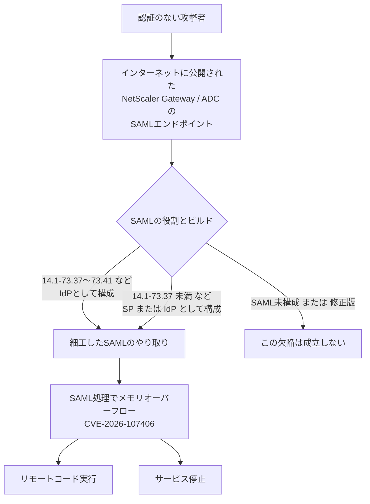

# Citrix NetScaler CVE-2026-107406 ― SAML処理のメモリオーバーフローでRCEのおそれ、先週のゼロデイ修正版もSAML IdPなら対象

## 要点

### 影響バージョン

- 顧客が自分で運用するNetScaler ADC／NetScaler Gatewayのうち、**SAMLのSP（サービスプロバイダ）またはIdP（IDプロバイダ）として構成したもの**が対象（Citrix CTX697191）。
- **14.1-73.37〜14.1-73.41、13.1-64.23〜13.1-64.28**（14.1-FIPSは73.37〜73.41 FIPS、13.1-FIPS／NDcPPは13.1-37.279〜37.282）は、**SAML IdPとして構成している場合だけ**影響を受ける（Citrix）。9月27日の緊急パッチと、10月3日のCVE-2026-88779の修正版がこの範囲に入る。
- それより前のビルド（14.1-73.37未満、13.1-64.23未満など）は、**SAML SPかIdPのどちらか**として構成していれば影響を受ける（Citrix）。
- 修正版は **14.1-73.46**、**13.1-64.29**、**14.1-73.46 FIPS**、**13.1-37.283**（13.1-FIPS／NDcPP）以降（Citrix）。
- Secure Private Access のハイブリッド構成で使うNetScalerも対象。Citrixが管理するクラウドサービスとAdaptive AuthenticationはCitrixが更新する（Citrix）。
- CVSS v4.0 は 9.5（攻撃の難しさは「高」、認証不要）、CWE-119。公表時点で悪用の確認はなく（Citrix）、CISAのKEVカタログ（2026年10月8日版）にも載っていない。

### 今すぐやること

- `ns.conf` に `add authentication samlAction`（SP）または `add authentication samlIdPProfile`（IdP）があるかを確認する（Citrix）。
- 該当すれば上記の修正版へ更新する。**先週CVE-2026-88779の対応で 14.1-73.41／13.1-64.28 にした機器も、IdPとして使っていればもう一度更新が必要**。
- （考察）9月27日のパッチ（CVE-2026-88771／88772）をまだ当てていない機器は、今回の修正版でまとめて塞ぐ。更新前にログと設定を保全する。

## 概要

- Citrix（Cloud Software Group）は2026年10月8日、NetScaler ADC／Gatewayの重大な脆弱性 CVE-2026-107406 のセキュリティ情報 CTX697191 を公開した。SAMLの処理にかかわるメモリオーバーフローで、構成によってはリモートコード実行かサービス停止（DoS）につながる。
- 影響を受ける条件はビルドによって違う。9月末以降の緊急パッチを当てた機器ではSAML IdPとしての構成だけが対象で、それより古い機器ではSPでもIdPでも対象になる。
- NetScalerでは、9月27日にCVE-2026-88771／88772、10月3日にCVE-2026-88779と、悪用されたゼロデイの修正が続いた。SAMLを使う機器は、2週間で3度目の更新になる。

> この記事では、ベンダー・公的機関・研究者・報道で確認できた内容を「事実」、筆者の推測や意見を「考察」として分けて書いています。

## 何が起きたか（時系列）

| 日付 | 出来事 |
| --- | --- |
| 2026-09-27 | CitrixがCVE-2026-88771／88772（悪用を確認）などを修正。修正版は14.1-73.37、13.1-64.23など。[既存記事](/security-notes/notes/2026-10-01-citrix-netscaler-cve-2026-88772-88771/)で扱った |
| 2026-10-03（米太平洋時間） | CitrixがSAML処理のゼロデイCVE-2026-88779を修正。修正版は14.1-73.41、13.1-64.28など。CISAは10月4日にKEVへ追加。[既存記事](/security-notes/notes/2026-10-05-netscaler-saml-cve-2026-88779-reboot-trigger/)で扱った |
| 2026-10-08 | CitrixがCTX697191でCVE-2026-107406を公表し、同日にブログで「できるだけ早く更新するよう強く求める」と呼びかけ（Citrix、BleepingComputer） |
| 2026-10-09 | BleepingComputer、The Hacker News、SecurityWeekが報道。Shadowserverは、NetScalerの特徴を持つIPアドレスを2万1000以上観測（Gateway約1500、ADC約2万）。ただし、どれだけが更新済みか、対象の構成かは不明（BleepingComputer） |

## 技術的な問題点（根本原因）

**事実（Citrix CTX697191）**

- 説明は「リモートコード実行またはサービス停止につながるメモリオーバーフロー」。分類はCWE-119（メモリバッファの範囲外への操作）。
- CVSS v4.0 のベクトルは `AV:N/AC:H/AT:N/PR:N/UI:N/VC:H/VI:H/VA:H/SC:H/SI:H/SA:L`。ネットワーク経由で、認証も利用者の操作もいらないが、攻撃の難しさ（AC）は「高」とされている。
- 前提条件はSAML SPまたはSAML IdPとしての構成で、14.1-73.37〜73.41／13.1-64.23〜64.28 ではIdPだけが対象になる。
- 発見者として、JPMorgan ChaseのXORチームのJoshua Foote氏、Michael Tucker氏、Eugene Lim氏が挙げられている。
- どの関数・どのバッファで起きるのかといった技術的な詳細は、セキュリティ情報に書かれていない。

**事実（ThreatWire）**

- CVE-2026-88779（CTX697174）とは別のCVE・別のセキュリティ情報で、どちらもCWE-119とSAML SP／IdPの前提条件を持つ。Citrixは両者の関係や、88779の修正が不完全だったのかどうかを説明していない。

**考察**

ビルドによって対象の役割が変わる書き方から、SAMLの処理には少なくともSPとIdPで別の経路があり、9月27日のビルド（14.1-73.37など）以降はSP側の経路では成立しなくなっている、と読める。9月27日のリリースは8件の脆弱性をまとめて直したもので、そのときの変更でSP側の経路が塞がったのかもしれないが、Citrixは説明していない。

同じSAMLの処理で、10月3日にはDoSのゼロデイ（CVE-2026-88779）が直されたばかりである。そのときBeazley Securityは、認証デーモン `nsaaad` が署名の正規化の設定を処理する途中で落ちると分析していた。今回の欠陥が同じプロセスにあるかは公表されていないが、SAMLのメッセージはログイン前に外部から送られ、署名の検証より前にXMLとして解析される。この「ログイン前に、攻撃者が作ったXMLを、メモリ安全でない言語で解析する」部分が、短い間に続けて欠陥を出している。

## 攻撃・侵入経路

**事実（Citrix、BleepingComputer）**

- 攻撃の条件はSAML SPまたはIdPとしての構成で、認証は要らない。セキュリティ情報の公開時点で、Citrixは悪用を把握していない。
- 公開されたPoC（検証コード）は報じられていない（ThreatWire）。

**考察**

SAMLのIdPは利用者がログインする入口そのもので、SPもログインの途中でIdPからの応答を受け取る。どちらも「利用者がインターネットから届く」ことが役割上の前提なので、アクセス制御で入口を閉じる、という緩和はとりにくい。攻撃の難しさが「高」なのは、実際のコード実行にメモリ配置の調整などが必要なためと考えられる。ただしNetScalerでは、9月のCVE-2026-88772、10月のCVE-2026-88779と、メモリの範囲外操作（CWE-119）の欠陥がゼロデイとして悪用された例が続いており、「難しいから狙われない」とは考えにくい。

## なぜ防げなかったか・構造的要因の考察

ここからは筆者の考察である。

1. **ログイン前の複雑な解析**: SAMLは署名付きのXMLで、名前空間や正規化など仕様の幅が広い。それをログイン前に、外部からの入力として解析するのがエッジ装置の宿命で、メモリ安全でない実装だと、境界のチェック漏れが即座に認証前の欠陥になる。
2. **緊急パッチの連鎖**: 9月27日、10月3日、10月8日と、SAMLを使う機器は2週間足らずで3回の更新を求められた。そのたびに保守時間を取り、冗長構成を切り替える運用では、どこかで「先週当てたから大丈夫」という思い込みが生まれやすい。今回、先週の修正版がIdPとしてはそのまま対象に残っているのは、その思い込みを直撃する。
3. **ビルドごとに条件が違う書き方**: 「このビルド範囲ではIdPだけ」「それより前はSPもIdPも」という条件の書き分けは正確だが、自分の機器の役割とビルドの組み合わせを正しく確かめないと、対象外と誤認しやすい。結局は「SAMLを使っていれば修正版へ」で揃えるのが安全である。
4. **攻撃者の関心が集中している製品**: BleepingComputerによると、CISAは2021年11月以降、Citrixの脆弱性27件を悪用確認済みとして登録し、うち7件はランサムウェアに使われた。今年もNetScalerでは悪用が続いており、新しい欠陥の詳細が分析されるのは時間の問題とみるべきである。

## 運用者向けの具体的な対策と検知ポイント

**対策**

- `ns.conf` で `add authentication samlAction`（SP）と `add authentication samlIdPProfile`（IdP）の有無を確認する（Citrix）。Beazley Securityが88779の際に示した確認例は `grep -qE '^add authentication saml(Action|IdPProfile)' /flash/nsconfig/ns.conf`。
- SAMLを使っていれば、14.1-73.46／13.1-64.29／14.1-73.46 FIPS／13.1-37.283 以降へ更新する（Citrix）。Secure Private Access のハイブリッド構成のNetScalerも忘れない（Citrix）。
- （考察）セキュリティ情報には回避策が示されていない。更新までの間は、SAMLを使わない構成にできる機器があるかを確認し、使っていないSAMLの設定は削除しておく。
- （考察）更新の前に、仮想アプライアンスならスナップショットを取り、`/var/log/ns.log*` や `/var/log/messages*` を保全する。9月以降の欠陥で侵害されていた場合、更新しても攻撃者の足場は残るため。

**検知ポイント**

- （考察）SAMLの処理を担うプロセスの異常終了や、機器の予期しない再起動。88779の悪用では、`nsaaad` のクラッシュが繰り返し記録された（BleepingComputer、Beazley Securityの88779の分析）。
- （考察）SAMLエンドポイントへの、異常に大きいSAMLメッセージや、短時間に同じ送信元から繰り返される認証要求。
- 9月の悪用（CVE-2026-88771／88772）で示された侵害の痕跡（Webシェル、追加された管理者など）の確認を、まだ実施していない機器は実施する（[既存記事](/security-notes/notes/2026-10-01-citrix-netscaler-cve-2026-88772-88771/)参照）。

## 参考リンク

- Citrix: [Citrix NetScaler ADC and Citrix NetScaler Gateway Security Bulletin for CVE-2026-107406（CTX697191）](https://support.citrix.com/external/article/CTX697191/citrix-netscaler-adc-and-citrix-netscale.html)
- Citrix: [Protecting Customers: Immediate Guidance for CVE-2026-107406 in NetScaler ADC and NetScaler Gateway](https://community.citrix.com/techzone-blogs/110_security-updates/protecting-customers-immediate-guidance-for-cve-2026-107406-in-netscaler-adc-and-netscaler-gateway-r1631/)
- BleepingComputer: [Citrix warns admins to patch new NetScaler RCE flaw immediately](https://www.bleepingcomputer.com/news/security/citrix-warns-admins-to-patch-new-netscaler-rce-flaw-immediately/)
- The Hacker News: [Citrix Patches Critical NetScaler Flaw That Could Enable RCE in SAML Deployments](https://thehackernews.com/2026/10/citrix-patches-critical-netscaler-flaw.html)
- SecurityWeek: [Citrix Urges Immediate Patching of Critical NetScaler Vulnerability](https://www.securityweek.com/citrix-urges-immediate-patching-of-critical-netscaler-vulnerability/)
- ThreatWire: [CVE-2026-107406 NetScaler SAML memory overflow, CVSS 9.5](https://www.threatwire.tech/cve/cve-2026-107406)
